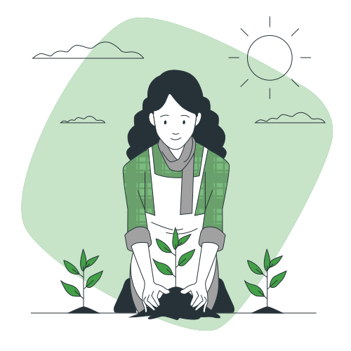
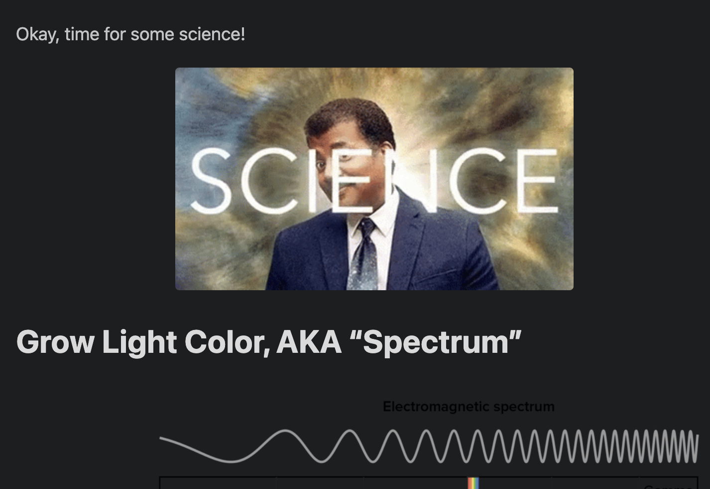
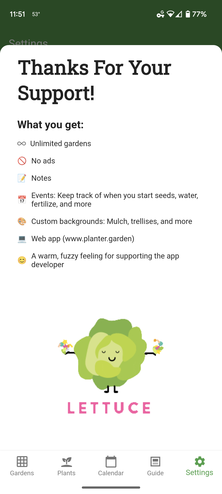
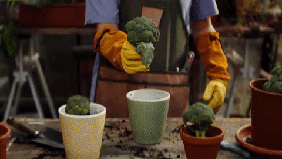

+++
draft = false
title = "Editorial Guidelines"
slug = "editorial-guidelines"
date = 2023-04-14T18:14:57.625Z
author = "Peter Keefe"


[cover]
relative = true
image = "new-entries-rafiki.svg"
alt = "Person sitting happily writing a new article"
+++
# Write for us!

Are you a gardening enthusiast with an idea for a Growing Guide article? Great! We'd love to have you share your ideas with our audience. But before you sit down to write the article, you should take a moment to understand our audience and read our guidelines for writing a successful article.

# Target Audience Personas

### Anna Carlson

* Age: 32
* Location: Toledo, Ohio, USA
* Experience level: Beginner
* Background: Has house plants, but this is her first time doing vegetable gardening.
* Motivation: Gardening for fun and trying to eat fresher food
* Garden: Small raised bed and several patio pots

### Leroy Jenkins

* Age: 56
* Location: Sacramento, California, USA
* Experience level: Advanced
* Background: Has had veggie gardens for 20 years, but still learning and hoping to make his garden more productive each year.
* Motivation: He gardens mostly as a hobby, but also to supplement his family’s diet.
* Garden: Half a dozen raised beds, along with a few fabric grow bags. Also has an apple and a pear tree.

# Overall Vibe

Our customers are gardening enthusiasts and so are we. We try to be positive, informative, and help gardeners learn and advance in the hobby.



# Best Practices

When writing for Planter, please follow the best practices that are outlined below.

### Use Clear Language

Write common English words, not jargon.

Examples:

* Write “use” not “utilize”
* Write “buy” not “purchase”
* Write “because” not “due to the fact that.”

### Write Short Sentences and Paragraphs

As with words, shorter sentences also promote comprehension. Short paragraphs make your piece more readable, especially on the web.

As a general guideline, keep paragraphs limited to three sentences or less.

### Write in Active Voice

Active voice makes writing shorter, clearer, and more lively. Passive voice, while sometimes necessary, tends to clutter the page and distract from the message.

Example:

* Write: “Gardeners hate weeding their gardens."  not "Weeding their gardens is the least favorite chore of gardeners."

### Get To The Point

We respect our audience’s time and we don’t want to bore them. Hence, we prefer to get to the point as fast as possible. Long, flowery introductions to the topic you’re writing about aren’t needed since our audience live busy lives.

It's OK to just use two paragraphs as a short introduction before diving in.

# Content Guardrails

Guardrails are things that we avoid or have specific rules in how we talk about them.

### Humor & Pop Culture:

Humor is good but we never want to be sarcastic or negative.

Nerdy/pop culture references are fair game. We think our audience is into that.



### Competitors:

We typically don’t mention competitors at all, or if we do, we will usually refer to them as a category (eg “gardening apps”).

For tone & voice purposes, competitors are any mobile or web apps that help gardeners plan their gardens. We don’t consider YouTube channels, influencers, blogs, or other informational sites to be competitors.

But, again, it is very rare that we would mention a competitor by name.

### Politics:

We have some pretty strong personal feelings here, but Planter as a brand doesn't.

We generally avoid using political references in our day-to-day content efforts. 

With that caveat, Planter is still happy to support specific initiatives and causes that other people might confuse as political in nature. For example, we support carbon reduction efforts through Stripe Climate, and we're proud to share that with our customers.

# Emojis

Emojis are very on-brand. 



### Emoji Frequency:

* We use emojis one at a time in headlines and body copy - we don’t stack them or cluster them like ❤️❤️❤️
* We also don’t stuff the page with too many of them. For example, the user shouldn’t be reading a blog post and see 5 sentences that all end with emoji punctuation.
* Using repeated emojis in headings through a blog post is allowed and sometimes encouraged.

Using repeated emojis in a well-structured way like a list can be OK if it’s not forced, like in the screenshot above.

# GIFs



GIFs are acceptable as long as they’re G-rated, positive, and non-political. Use them sparingly; no more than one GIF should be visible at a time.

# Advertisements and Affiliate Links

The Planter blog isn't the way we make most of our revenue, so we try to keep it focused on being informative and fun, rather than trying to sell products. However, if it makes sense in the context of the article, linking to products for sale on Amazon or other websites is okay. The site will automatically add the Planter referral code to any Amazon link. We are also enrolled in several other affiliate programs (as of writing, Bootstrap Farmer is the only program other than Amazon), so check with Peter if you're interested in adding a product from another site besides Amazon.

If you're interested in writing a guest post on behalf of a company, it cannot be a blatant advertisement for the company. Sponsored posts may be possible, so be sure to reach out to Peter if this sounds like something you're interested in. 

# Formatting and File Structure

### Format

The Growing Guide uses [Markdown](https://www.markdownguide.org/) files as the source, so any formatting that is supported by Markdown is supported. Please format headings, bolded or italicized text, and images with Markdown syntax. You can use an online [markdown editor](https://stackedit.io/app#) to make this easier.\
\
This page is written in Markdown, you can see the source code [here](https://github.com/PlanterApp/planter_blog/blob/main/content/docs/editorial-guidelines/index.md).

### File Structure

Please name your markdown file `index.md`. Put your markdown file and all images in one folder.

### Frontal Matter

At the very top of your `index.md` file, please include the following:

```yaml
+++
draft = false
title = "Article Title"
date = YYYY-MM-DDT00:00:00.000Z 
author = "First Last"


[cover]
relative = true
image = "cover_image_file_name.jpg"
alt = "Cover image alternate text for accessibility reasons"
caption = "Optional caption to display under the cover image"
+++

Your article content goes here...
```

# Submission

Growing Guide articles can be submitted in two ways:

## If you are familiar with GitHub:

1. [Fork the repo](https://github.com/PlanterApp/planter_blog/fork).
2. Create a folder for your article in [/content/posts](https://github.com/PlanterApp/planter_blog/tree/main/content/posts). Name it according to the subject of your article.
3. Place your `index.md` file and any images inside the folder.
4. Commit your changes and submit a PR to the repository!

## If you aren't familiar with GitHub:

1. Email your article to us. Click <a target="_blank" href="https://mailhide.io/e/FL2vb1ox">here</a> for our email or use the support email found within the app.

Once your article is submitted, we'll read it and let you know of any changes that need to be made. And that's it! Once it's approved and published, it should appear on the website!\
\
*Note: We reserve the right to deny any submission for any reason.*