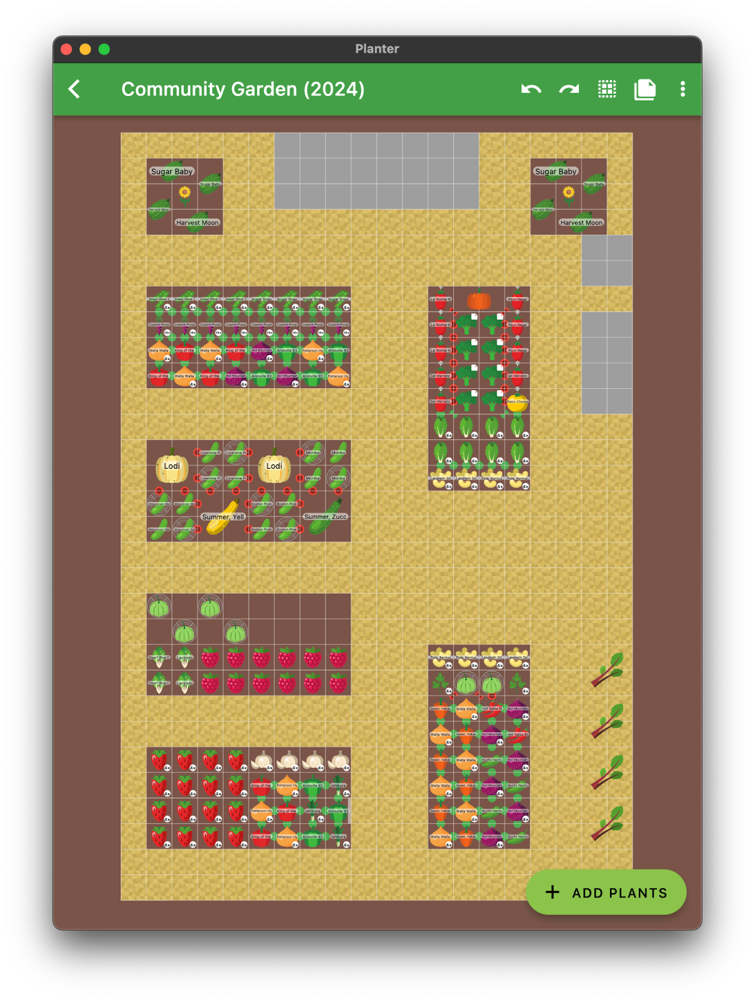
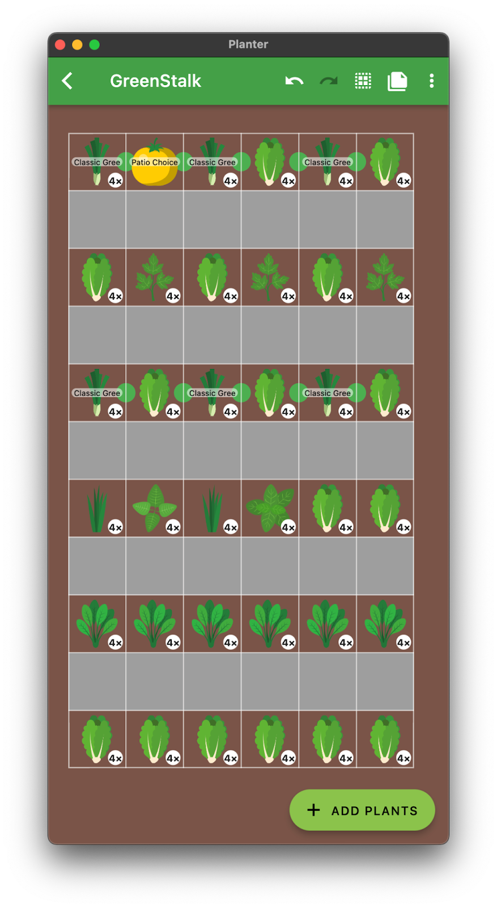
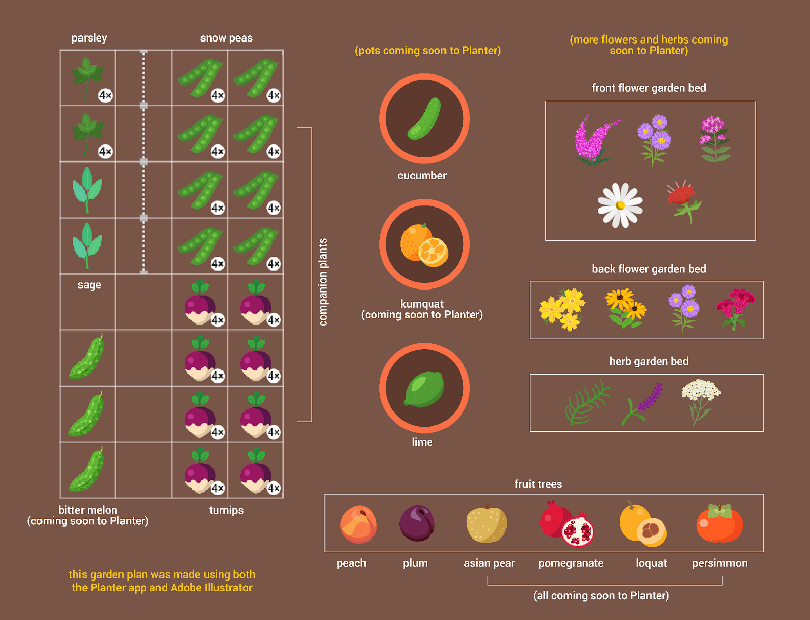
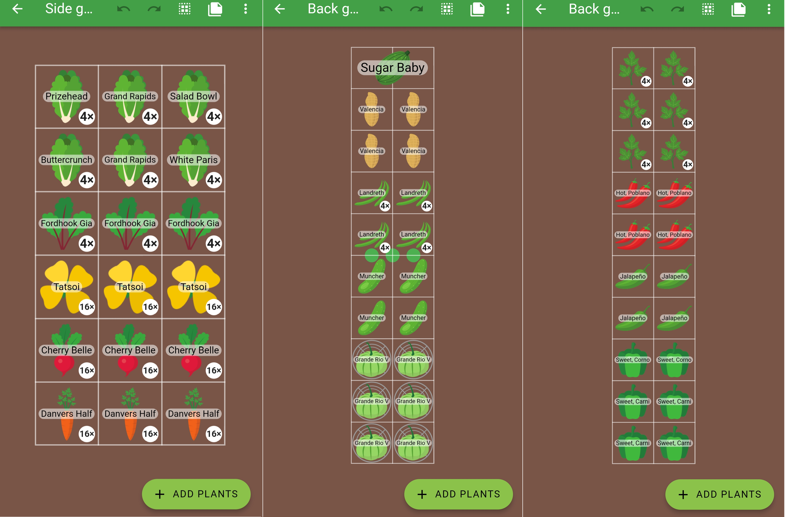
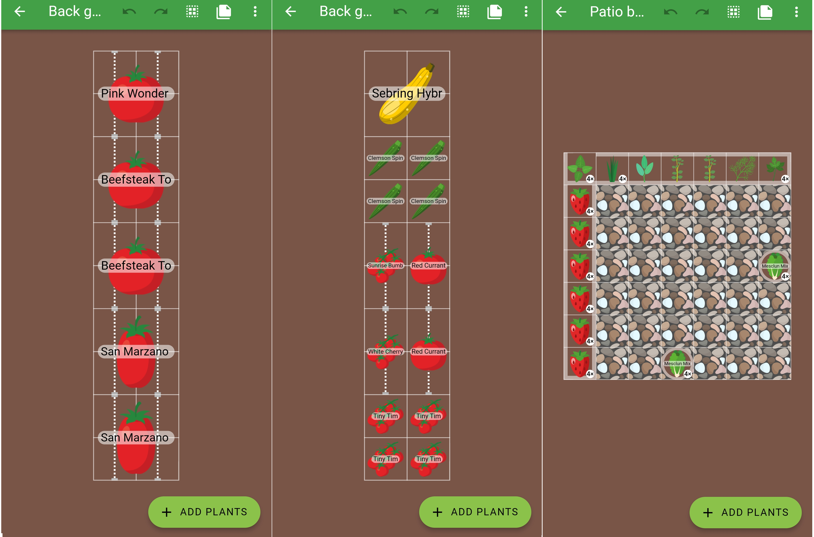
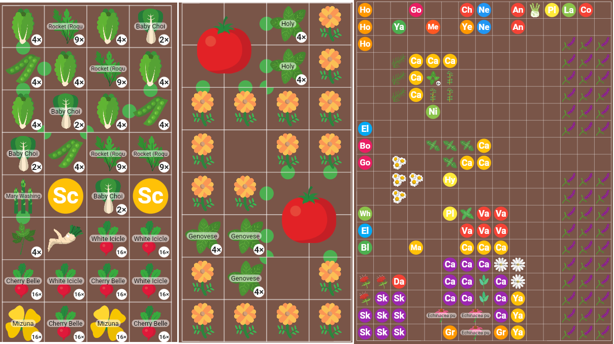

+++
draft = true
title = "Our 2024 Planter Garden Plans!"
slug = "2024-garden-plants"
date = 2024-02-01T16:32:18.728Z
author = "The Planter Team"

[cover]
relative = false
image = "peter-garden.jpg"
alt = "A view of Peter's community garden plot with several garden beds, a trellis, and a table and chairs"
+++
## Peter

My garden is a 20x30 ft community garden plot since I live in the woods and the oak trees shade out pretty much everything. This year I’m excited to be growing many new varieties. I’m most excited about the Habanada peppers, which supposedly have some of the flavor of a Habanero pepper without the spice. Another variety I’m excited to try is the Cosmic Purple carrots. Up to this point, I’ve only ever eaten orange carrots. Finally, I’m trying four new cucumber varieties, all bred specifically for pickling. Last year I tried pickling some regular cucumbers and was disappointed in the texture. Hopefully at least one of these varieties will do well in my garden. I’ve positioned the cucumbers and squash in one single bed so that I can cover it to prevent the cucumber beetle and squash bugs from taking over. This bed will also have all-new soil since something wasn’t quite right with the old soil (3 years of bad harvests).\
\
I also plan to rip out the dwindling asparagus bed and put in 2 more raised beds for vining plants like watermelon and pumpkins. In between those beds will be a large garden tool chest that I’ll build to store my shovels and garden supplies.

Back at my home in the woods, I have a GreenStalk. It’s situated on my deck in the sunniest part of the yard, although it still only gets enough sunlight during the spring before the trees get their leaves. This year I’m testing the limits by planting a Patio Choice Yellow Tomato on the GreenStalk, although I doubt I’ll get many tomatoes from it. The rest of the GreenStalk is devoted to low-light veggies like lettuce, spinach, green onions, and herbs. We don’t have proper GreenStalk support in Planter (yet), but I approximated it as you can see in the screenshot. Each layer holds 6 plants and there are 6 layers. The gray boxes indicate the gaps between each layer.

## Wren

I’m fortunate to have a large yard, but I’m unfortunate to have a deer problem so my gardens haven’t expanded as much as I’d like them to. Once we have the funds to create a fully fenced in garden that’ll be a different story, but for now I stick to what I can (hopefully) protect from the deer. In my veggie garden box this year I’ll be growing parsley, sage, snow peas, turnips, and bitter melon! I don’t like to eat bitter melons, but my mother in law does, so I grow them for her. Plus they attract a lot of pollinators with their beautiful yellow flowers and deer don’t much care for them at all, so they make a good natural wall to protect my other vegetables.

\
I often grow produce in pots as well. I have a Kumquat tree and a Lime tree that will stay in a pot their whole life because of their small size. I’m going to try growing cucumbers in a pot this year to see if it will help me stay on top of the pests better (last year's melons and gourds got obliterated).

\
I’m very passionate about pollinators and local flora and fauna so I have many flower beds with native plants (many not featured in the garden plan above). I also have a young fruit orchard that will hopefully become full fruit bearing trees one day. The deer definitely make that a fighting challenge, even with tree cages. It’s my goal to one day make my yard a thriving ecosystem for both me and the animals and bugs.

## Erin

I’m working with a small suburban yard so the main challenge with garden planning is always trying to cram too many plants into a small space! In addition to packing plenty of herbs and plants into my patio containers, I have a small side yard garden and four in-ground beds in the backyard to work with. The side garden receives partial sun so I’ve selected plants that won’t mind a bit of shade (the carrots will get the most sun). The four backyard garden beds receive full sun (or close to it) so this is where I’ve added sun-loving plants. Most of these plants are old favorites but I plan to try a few ‘experiments’- this year it's watermelon, peanuts, and okra!

## Samantha

This year I’m focusing on the vegetables that my family loves to eat. I have two children who love salads, so I’m letting them help out with the lettuce and radishes. Peas are always a favorite. Bok choy is a new addition.  We love salsa so there will be plenty of tomatoes, jalapenos, cayenne, and tomatillos. You can never have enough pesto either, so I am planning on lots of basil as well. I always have a couple of pumpkins in the patch too.

I put most of my energy towards my beloved medicinal herb garden and I have quite a few plants to keep track of. A lot of plants in this garden are perennials, or they self-sow, so I don’t have to do a whole lot except to keep it weeded. A short list of some of my herbs: bee balm, echinacea, yarrow, valerian, feverfew, and skullcap. I have “weeds” like plantain, dandelion, chickweed, goldenrod, and nettles. I’ll be starting some holy basil and toothache plants soon. I am adding more catnip because my dog ate them all last year! I’m a lover of lavender and I will be adding a couple of new varieties. I have typical fruit trees such as apple and pear, but this year I want to add a quince to the collection.  They are supposed to smell amazing!