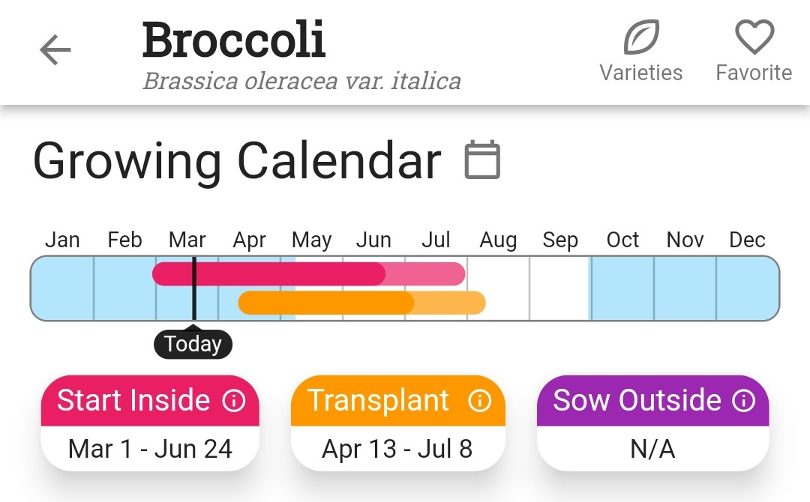
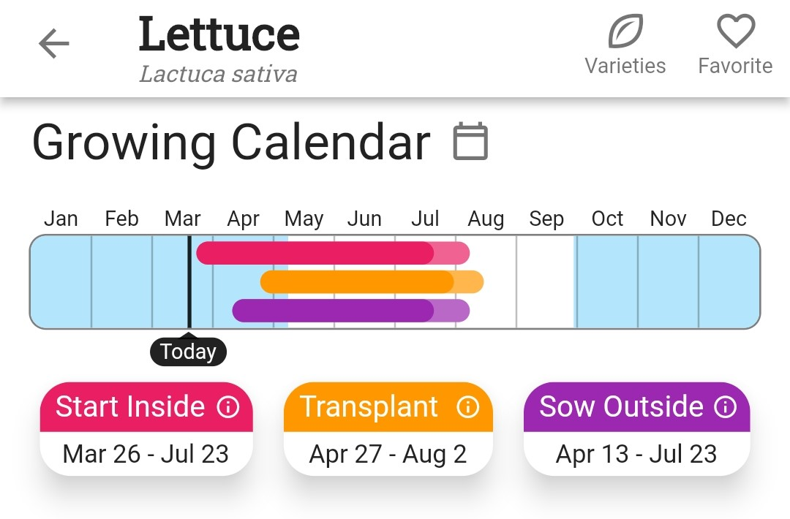
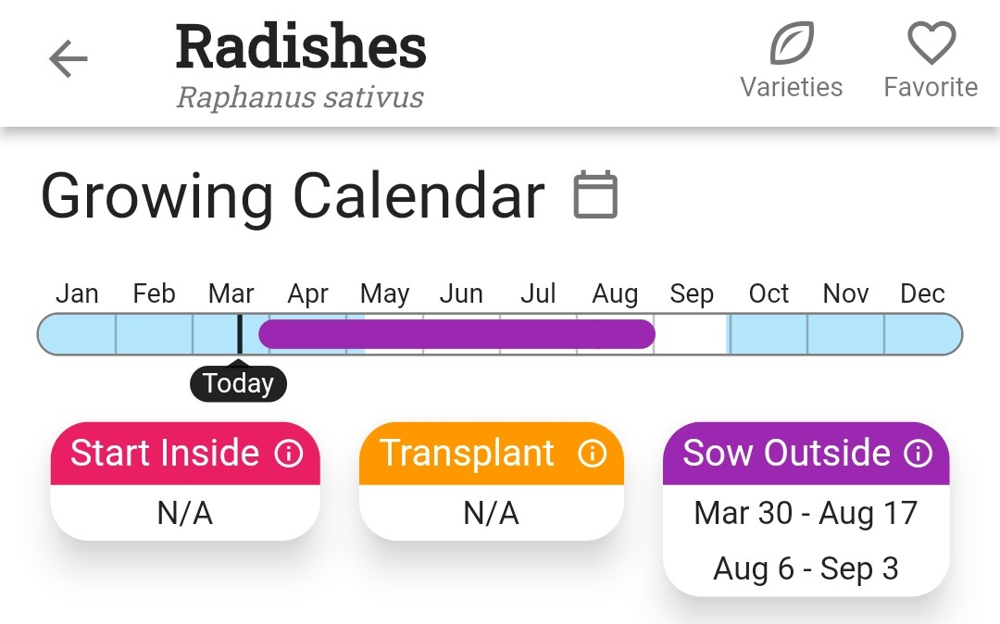

+++
draft = false
title = "All About Starting Seeds Indoors"
date = 2023-03-22T00:40:06.031Z
author = "Erin Thomson"
series = ["Seed Starting"]

[cover]
relative = true
image = "indoor-seedlings.jpg"
alt = "Young seedlings growing in a foil tray"
caption = "Young seedlings started indoors"
+++
*This is the third article in our [Seed Starting](../../series/seed-starting/) series.*

It can seem like a hassle to start seeds indoors- why bother if you can plant seeds directly in the garden? For some plants, starting seeds indoors is not just a nice-to-do, it’s a must-do! In this article we’ll cover the whys, whens, and hows of starting seeds indoors.

### Why Start Seeds Indoors?

The main benefit of starting seeds indoors is extra time. Some plants take more time to reach maturity than you have in your growing season. These plants must be started indoors so they have enough time to produce a harvest before the frost comes in fall. For other plants, starting indoors is optional but it gives them a head start so you can harvest from them sooner! 

Buying seedlings from the garden center is an option if you don’t want to start seeds indoors, but the cost really adds up and you won’t find as many plant varieties to choose from.

Another benefit of starting seeds indoors is being able to control the environment and tend the plants more easily. Seeds that are direct sown outdoors are exposed to potential inclement weather and pests right away. It's easier to micro-manage sensitive seedlings indoors versus having them exposed in the garden.

### How to know which seeds to start indoors

Now that we know the reasons for starting seeds indoors, how do we know which seeds need to be started indoors?

* Plants where the number of ‘days to maturity’ are about the same or greater than the number of days in your growing season must be started indoors. 
* Plants where the days to maturity are less than the number of days in your growing season can be started indoors to get a head start on the season, with a few exceptions (see below).
* There are some plants that don’t do well if started indoors and then transplanted. Common examples are root crops such as carrots and radishes (although some gardeners do start beets indoors). Corn, beans and peas are also not typically started indoors (although it can be done!)

The [Growing Calendar](https://info.planter.garden/growing-calendar/how-to-use/) in [Planter](https://planter.garden/) helps you determine which plants should be started indoors and which should be sown outside, e.g.:

**Broccoli** should be started inside then transplanted (direct sowing outside is not recommended)

**Lettuce** can be started indoors then transplanted, or direct-sown outside

**Radishes** should be direct sown outside (starting indoors is not recommended)

### When to start seeds indoors

To find out when to start seeds indoors, first check the [Growing Calendar](https://info.planter.garden/growing-calendar/how-to-use/) in [Planter](https://planter.garden/). The Growing Calendar gives a good indication of when that plant should be started indoors, based on your [local frost dates](https://info.planter.garden/getting-started/frost-dates/).

If the seed packet gives specific instructions on when to start seeds indoors you should follow them, as dates can vary for different varieties of the same plant. If the packet says “Start indoors 6-8 weeks before last frost”, count backwards 6-8 weeks from your [Spring frost date](https://info.planter.garden/getting-started/frost-dates/) in [Planter](https://planter.garden/) to determine when to start those seeds indoors.

Starting seeds indoors too early can be almost as problematic as starting too late. Space and light start to become scarce as the seedlings get bigger, and they can be more prone to issues such as legginess and becoming root-bound. Resist the urge to plant earlier than recommended!

### How to start seeds indoors

Starting seeds indoors involves a few basic steps:

* Pre-moisten your seed starting mix (don’t use regular garden soil!)
* Fill your containers or seed trays with the moistened mix and pat down gently.
* Place the seeds into the containers or cells. Gardeners often plant multiple seeds per cell as insurance in case one doesn’t germinate.
* Poke the seeds down into the soil to the depth recommended on the seed packet or in the [How to Grow](https://info.planter.garden/plant-information/how-to-grow/) info in [Planter](https://planter.garden/) (you might need to use a pencil or another tool for smaller seeds). Ensure they are covered over with soil.
* Label the containers so you know which seeds are where (this is very important!)
* Place the containers in a flat tray that can collect water.
* Place trays on heat mats and under grow lights if you’re using them (check out [All About Grow Lights](https://blog.planter.garden/posts/grow-lights/) and [Heat Mats for Starting Seeds](https://blog.planter.garden/posts/heat-mats/) for more info!)
* Keep the seed starting mix consistently moist but not soggy until you see germination (many gardeners prefer to [bottom water](https://blog.planter.garden/posts/the-ups-and-downs-of-bottom-watering/) seed starts).
* Point a fan at the seed starts and turn it on a gentle setting for at least a few hours each day to help strengthen the seedlings and prevent disease.

As the seedlings grow you’ll need to continue watering and start fertilizing them. You might also need to ‘thin them out’ and ‘pot them up’. We’ll cover seedling care and troubleshooting in an upcoming post!

Having the ability to start seeds indoors will take your garden to the next level! It might seem intimidating, but over time you’ll hone in on a seed-starting approach that works for you. The time and investment is more than worth it to kick-start your gardening season!