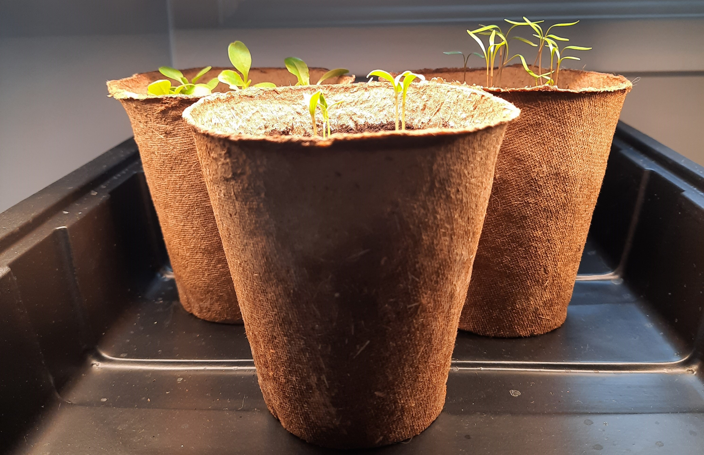
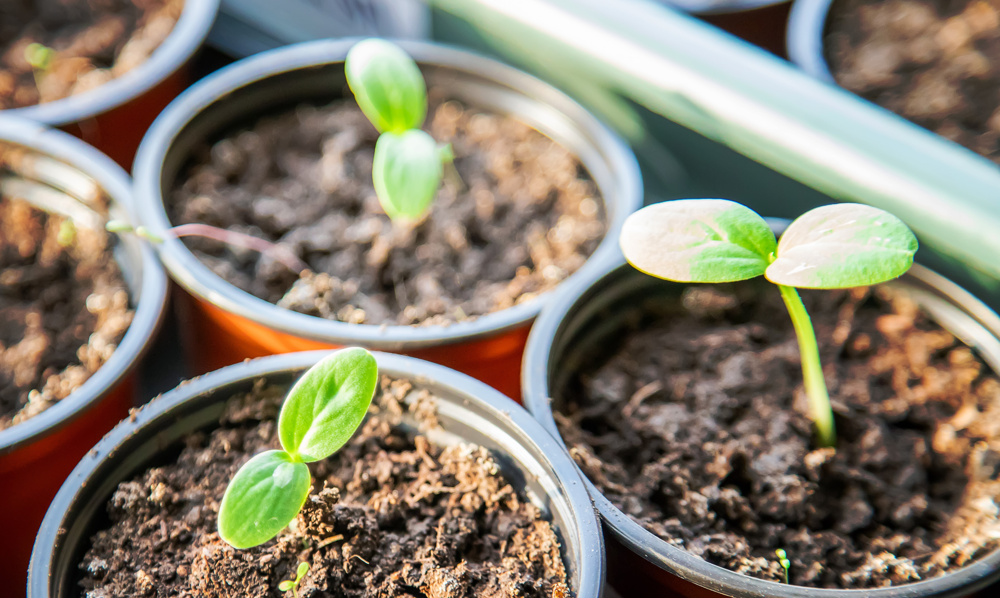

+++
draft = true
title = "All About Starting Seeds Indoors"
date = 2023-03-22T16:00:00.000Z
author = "Erin Thomson"
weight = 5

[cover]
relative = true
linkFullImages = true
image = "indoor-seedlings.jpg"
alt = "Young seedlings growing in a foil tray"
caption = "Young seedlings started indoors"
+++
Have you ever wondered why gardeners start seeds indoors? It seems like a lot of hassle when you can just plant seeds in the garden. But starting seeds indoors for some plants is not just a nice-to-do, it is a must-do– unless you plan to buy transplants from the garden center. Read on to learn the whys and hows of seed starting indoors.

### Why Start Seeds Indoors?

Starting seeds indoors is more than just a way to kill time in winter. The main benefit to starting seeds indoors is time. When the growing season is limited you want to get the most productivity you can out of your plants. For some plants it is absolutely necessary to get started indoors before the last frost date, to ensure they will have enough time to reach maturity and start producing before the first frost comes in fall to kill them off.

Buying seedlings from the garden center is certainly an option as well if you don’t want to start seeds indoors but just be aware that they will be more expensive and you might not find the extensive variety selection that you have when you start your own seeds.

Other than buying time, there are some other benefits to starting seeds indoors such as being able to control the environment - as seeds that are direct sown outdoors are exposed to the weather, pests, and diseases right away, and time as it's much easier to water and fuss over young tender seedlings that are concentrated in one spot in the comfort of your house rather than scattered all over the garden.

### How to know which seeds to start indoors

Now that we know the reasons why to start seeds indoors, how do we know which seeds need to be started indoors? Which can be started indoors? And which should not be started indoors?

* Plants where the days to maturity are close to or longer than the number of days in your growing season must be started indoors (or otherwise purchased as transplants). To calculate the number of days in your growing season refer to your frost dates in Planter and then Google the number of days between those two dates. Compare this with the days to maturity listed on the seed packets - Planter gives an estimate in the How to Grow information but there can be dramatic differences in days to maturity between different varieties of the same plant. If there are not enough days for the plant to mature, you’ll need to start it indoors. Onions, tomatoes and peppers are common examples of plants that can have a long growing season (depending on the variety) and may need to be started indoors.
* Plants where the days to maturity are less than the number of days in your growing season can be started indoors, with a few exceptions (noted below). Why would you want to start these plants indoors if you have enough time to grow them? Primarily to get a jump start on the season so you can start harvesting earlier than you otherwise would! Lettuce, herbs, cucumbers, and squash are examples of plants that can be started indoors, but often can also be direct-seeded outside.
* Some plants typically do not perform well if started indoors and then transplanted outside. Common examples are root crops such as carrots where the transplanting process disturbs the root that we like to eat (opinions are mixed on beets)- not to mention you’d have to transplant one plant per carrot. Beans and peas are also often-cited examples of seeds that are typically best direct-sown, although rules are meant to be broken and it can be done!

By looking at the Growing Calendar in Planter you’ll be able to get an idea of which plants should be started indoors, which can be started indoors, and which should be sown outside- again bear in mind there are some variations based on the variety you’re growing so be sure to check the seed packet and research as needed.

### How to start seeds indoors (and when)

