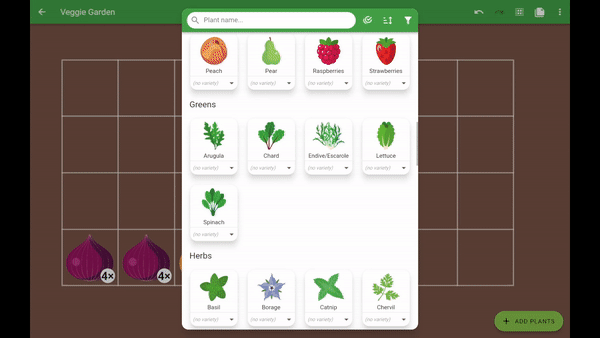
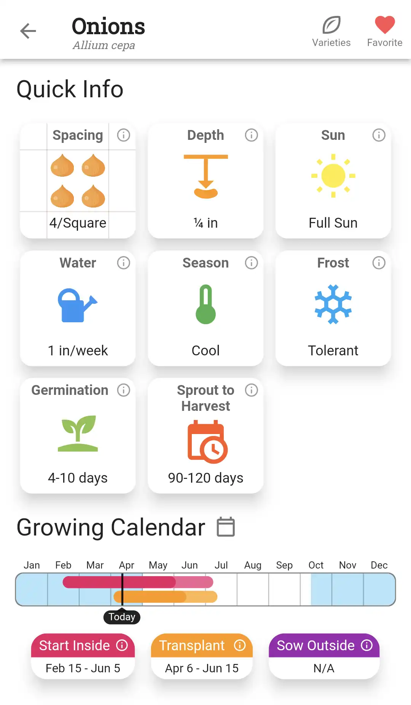
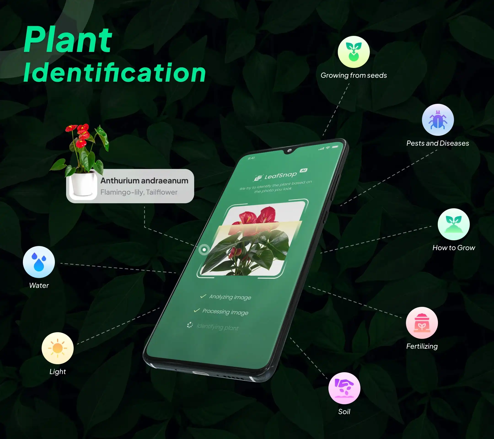
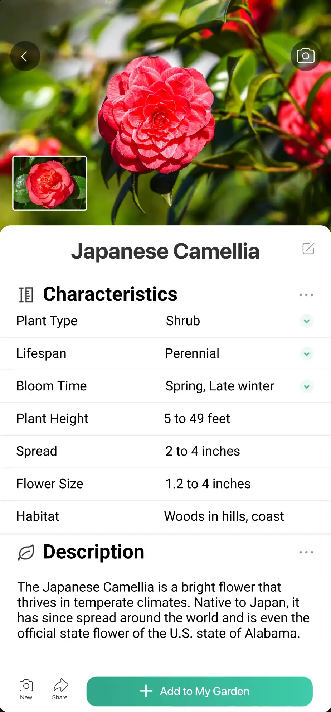
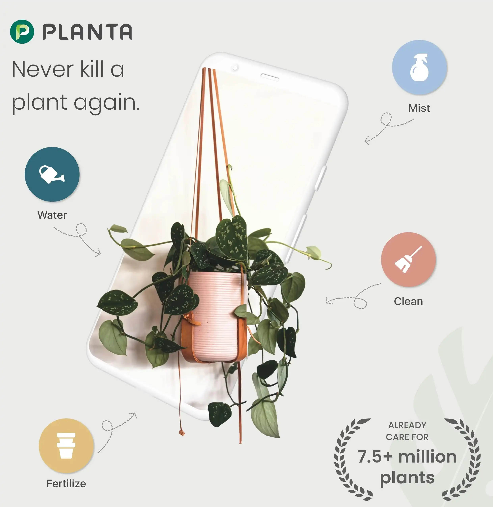
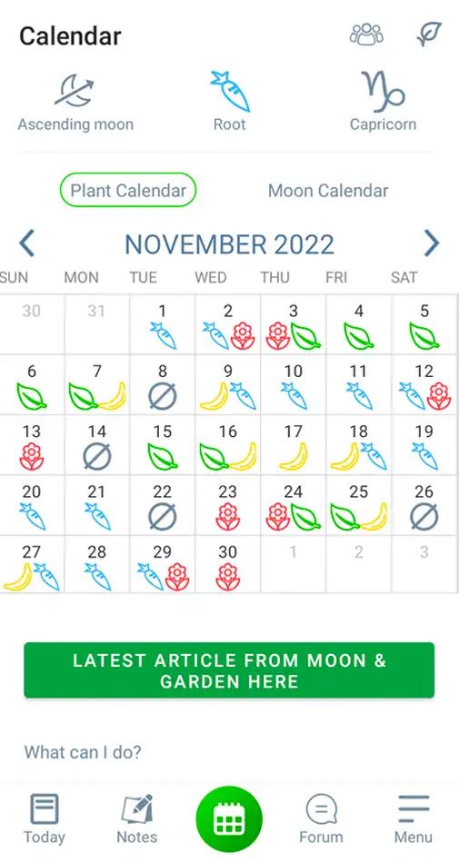
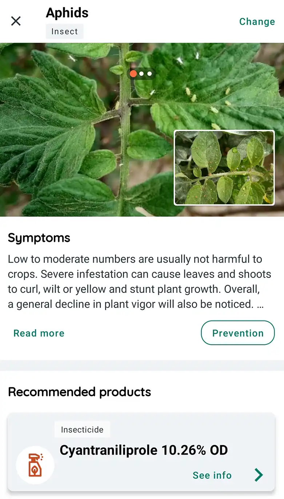

+++
author = "The Planter Team"
date = 2023-02-19T05:00:00Z
draft = false
override_position = false
plants = []
title = "Apps that Every Gardener Needs to Know About"
weight = 5
[cover]
alt = ""
caption = ""
image = "/posts/apps/images/smartphone_garden.jpg"

+++
Gardening is one of the oldest hobbies in the world, and it's always been a very hands-on, low-tech pursuit. But with the advent of mobile technology, gardening apps have become a popular tool for green thumbs everywhere. Who would have thought that you could use a smartphone to help you grow plants and veggies? It may seem a bit strange, but these apps can actually make gardening easier and more fun. Whether you're a seasoned gardener or a newbie, these apps can help you identify plants, plan your garden, and keep track of watering schedules. So, let's take a look at the best gardening apps and indoor plant apps out there!

## Planter



This garden planner app helps you arrange your garden and learn how to grow veggies. With its intuitive drag-and-drop interface, you can arrange your veggie garden in minutes. One of our favorite features is that it highlights companion and combative plant information right there, with green (companion) or red (combative) circles. Planter uses the square foot gardening technique for easy spacing, but everything about plants, including spacing, is customizable. It has over 80 fruits and vegetables, but you can always add a custom plant if your favorite isn’t included. On top of that, it has thousands of seed varieties so you can differentiate between your jalapeño and bell peppers.

The app also contains a gardening schedule for planting or transplanting times. With Planter, you'll know exactly when to start seeds indoors, transplant seedlings, or start seeds outdoors in your garden.

*Planter is available on [Android](https://play.google.com/store/apps/details?id=com.perculacreative.peter.gardenplanner&hl=en_US&gl=US), [iOS](https://apps.apple.com/us/app/planter-garden-planner/id1542642210), and [web](https://planter.garden).*

## LeafSnap



A plant identification app that uses visual recognition software to identify trees and plants in seconds. The app has a vast database of plants, including over 90% of all known species. You can take a photo of a plant, and the app will identify the species, provide detailed information about the plant, and even suggest similar-looking plants.

The app also has indoor houseplant care information, so once you know what you've got, you can care for it.

*LeafSnap is available on [Android](https://play.google.com/store/apps/details?id=plant.identification.snap&hl=en_US&gl=US) and [iOS](https://apps.apple.com/us/app/leafsnap-plant-identification/id1487972880) .*

## PictureThis



Another plant identification app that uses AI to recognize and identify plants, flowers, and trees. You can take a photo of a plant, and the app will provide detailed information about the species, including its name, description, and care tips.

*PictureThis is available on [Android](https://play.google.com/store/apps/details?id=cn.danatech.xingseus&hl=en_US&gl=US) and [iOS](https://apps.apple.com/us/app/picturethis-plant-identifier/id1252497129).*

## Planta



An indoor plant care app that provides customized care instructions, watering reminders, and identification features. The app features a vast database of over 20,000 plants and provides personalized care advice based on your plant's specific needs. The app also has a plant identification feature that allows you to take a photo of a plant and receive information about the species, care tips, and potential problems.

*Planta is available on [Android](https://play.google.com/store/apps/details?id=com.stromming.planta&hl=en_US&gl=US) and [iOS](https://apps.apple.com/us/app/planta-plant-care-reminders/id1410126781).*

## Moon and Garden



Taking a different approach, this gardening app offers gardening advice according to the lunar cycle. The app provides a lunar calendar that shows the best dates for sowing, pruning, and harvesting based on the moon's phases. The app also provides a list of plants that are favorable to each lunar phase and includes tips on gardening techniques such as composting, irrigation, and pest control. There is a also a nice community feature to ask and answer questions.

*Moon and Garden is available on [Android](https://play.google.com/store/apps/details?id=com.cs.biodyapp&hl=en_US&gl=US) and [iOS](https://apps.apple.com/us/app/moon-garden/id1038475934).*

## Plantix



A plant disease identification app that uses machine learning and image recognition to identify and diagnose plant health problems. The app has a database of over 90 plant diseases and pests and can diagnose a problem by analyzing a photo of the affected plant. The app also provides treatment recommendations and prevention tips to help you maintain healthy plants. Plantix focuses on the most common food crops and farmers, so it doesn't contain every veggie a home gardener might grow, but it's great for common veggies.

*Plantix is available on [Android](https://play.google.com/store/apps/details?id=com.peat.GartenBank&hl=en_US&gl=US).*

## That's a wrap

So there you have it, the best gardening apps for iOS and Android! These apps are perfect for those who want to make gardening more accessible and fun, whether you're an experienced gardener or just starting out. With features like plant identification, garden planning, and care tips, these apps have everything you need to cultivate a bountiful garden or care for your indoor plant babies. So download your favorites and get ready to dig in! Happy gardening!