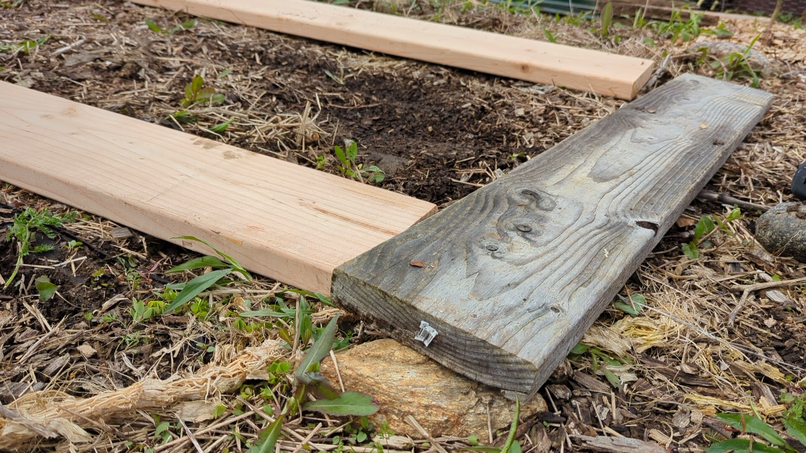
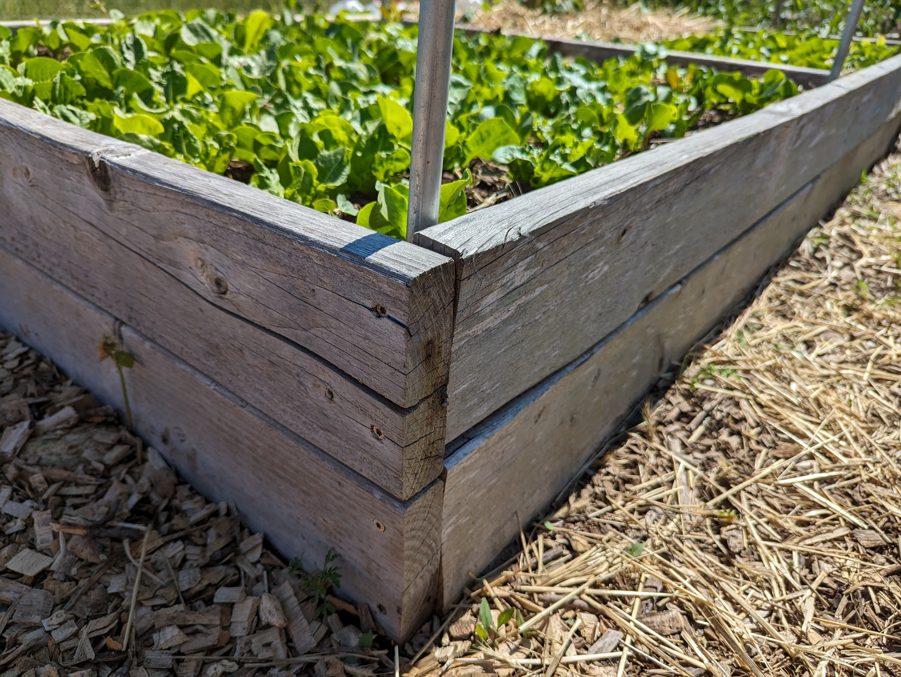
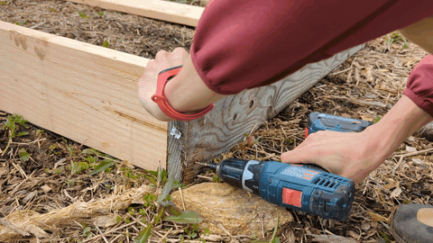
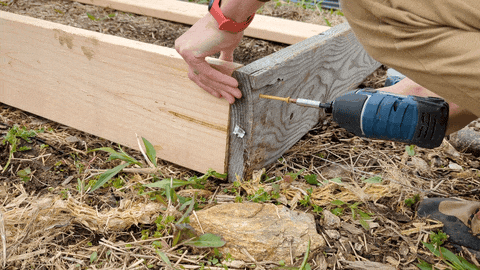
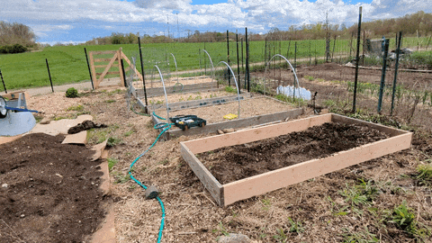
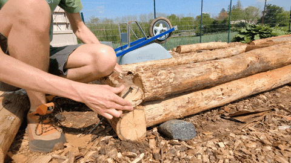

+++
draft = false
title = "How to Build a Raised Bed"
slug = "build-raised-bed"
date = 2023-06-01T00:00:00.000Z
author = "Peter Keefe"
weight = 5

[cover]
relative = true
image = "pxl_20230530_194134162.jpg"
alt = "Raised bed filled with dirt and tomatoes"
+++
A raised garden bed is a great way to grow your own veggies! It's also a great way to improve the drainage and fertility of your soil. And with this method, it's super easy to build.

I've got 6 raised beds in my garden, and 4 of them use this exact method. It works! And it's easy and cheap.

## Materials Needed:

* 3 2"×8"×8' regular pine boards (or 2×6, 2×10, 2×12. See our article on [soil depth requirements](../soil-depth-requirements/))

* Exterior-grade wood screws. I used these [deck screws](https://www.amazon.com/Deck-Plus-Screws-Exterior-48416/dp/B0100ICU22).
* Drill, drill bit, and driver bit for screws.
* Saw
* Level
* Tape measure

## Regular vs Pressure-Treated Wood

Some people suggest using cedar boards or pressure-treated boards. Both of these options will certainly last longer than regular, kiln-dried pine. However, cedar boards can be hard to find and expensive. And pressure-treated boards are treated with chemicals that could potentially end up being absorbed by your plants. And like cedar, they're more expensive. 

I prefer to use the safer and cheaper option: untreated kiln-dried pine, which is what you'll find at your local hardware store. My oldest raised bed is 5 years old and is holding up well, with no obvious signs of rot or decay. I'm guessing I could get another 5 years out of it, and that's good enough for me. 

How long your raised bed lasts depends primarily on moisture. I live in New England where we get a decent amount of rain and some humidity. In drier climates, your raised bed may last even longer!

## Instructions:

1. Choose a level, sunny spot for your raised bed. If the spot has grass or weeds, lay down some cardboard to prevent the weeds from growing up through the raised bed. The cardboard will decompose after a season or two.
2. Use a saw to cut one of the boards in half. Afterward, you should have two 8-foot boards and two 4-foot boards. 
3. Arrange the boards so that the 4-foot boards are on the ends. 
4. Put 2 screws in each corner. It's best to pre-drill the screw holes so that the wood doesn't split.

   > **Tip:** Make sure to screw through the short boards into the end of the long boards. The reason behind this is there is more pressure from the soil pushing on the long boards than the short boards. Along with that, screws are more likely to pull out of decaying wood than they are to break from shear force.

5. Check that your raised bed is approximately level. It doesn't need to be precise. You can dig out some soil or raise corners with some rocks until it's level.
6. [Fill your raised bed with soil](../soil-options-for-raised-bed-gardening/) and start planting!

## Other Materials

This is just one way to make a raised bed. Raised beds can also be constructed of many other materials, including [corrugated metal](https://www.amazon.com/VEGEGA-Zinc-Aluminum-Magnesium-Stainless-Planting-Vegetables/dp/B09WGLSLB7), cinder blocks, bricks, timbers, and more. If it can hold back soil, you can probably make a raised garden bed with it. I won't go in-depth for each of these materials, but I will show you the *other* raised beds I constructed:

### Logs

I live in the forest, and in that forest there are a lot of dead, fallen pine trees. So I decided to build two raised beds from these pine trees!

To put them together, I used [8" long timber screws](https://www.amazon.com/FastenMaster-TimberLok-Coat-Structural-Screws/dp/B07TNQ3MCY). At nearly $3 each, these screws were kinda pricey, which nearly negated the cost savings from using free lumber. But the end result is so cool, I think the effort was worth it.\
\
For the bottom logs, I notched the end pieces so that the logs rested flush against each other. This also let the screws go further into the wood.

I filled them with a mixture of soil, compost, and a little peat. I think they turned out great!

