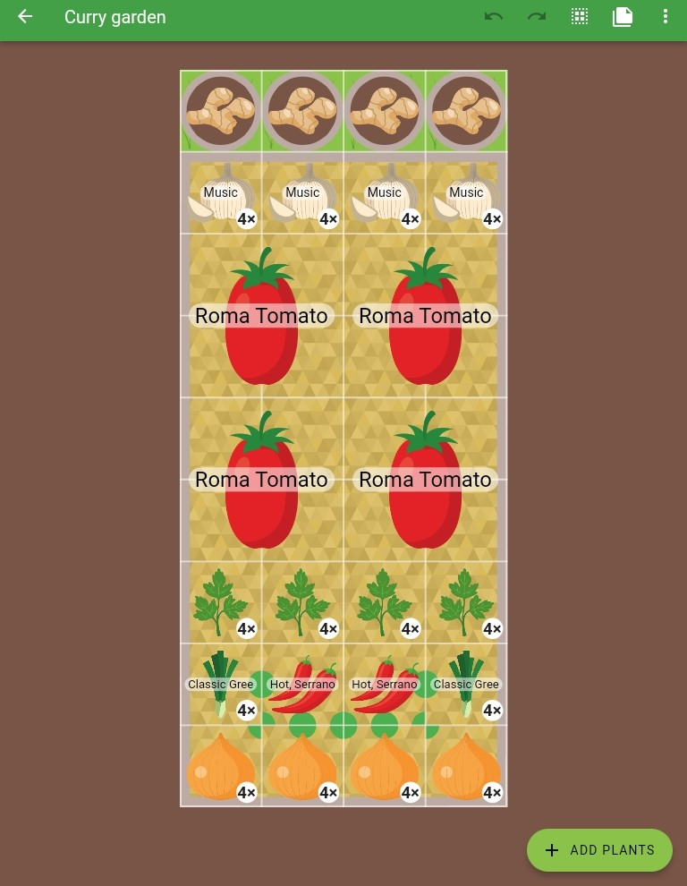
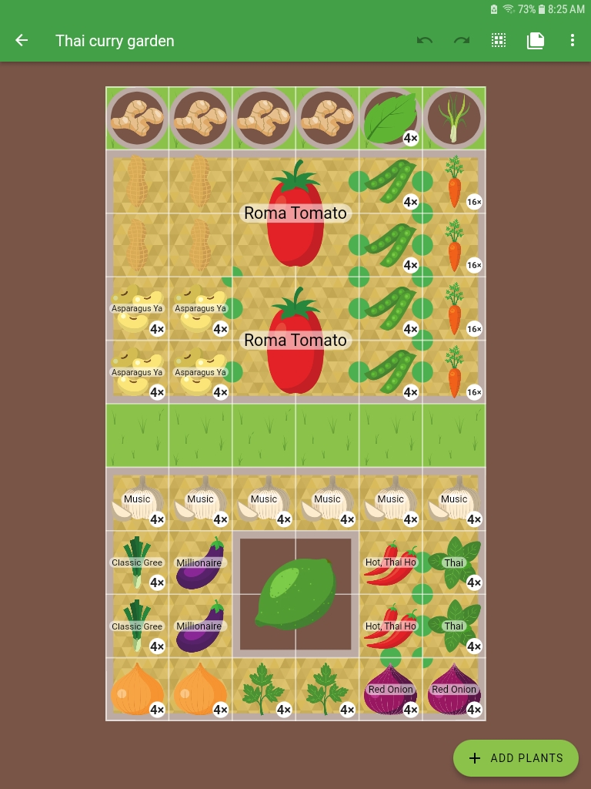

+++
draft = true
title = "Plan Your Curry Garden"
slug = "curry-garden-plan"
date = 2023-11-27T22:10:30.621Z
author = "Erin Thomson"
series = ["Plan Your Garden"]
tags = ["Planning"]

[cover]
relative = false
image = "curry-ingredients-plan.jpg"
caption = ""
alt = "A plate with a curry dish surrounded by fresh vegetables and a tablet showing the Planter app"
+++
While there are many factors to consider when planning a garden, it's important to plan based on the types of dishes you and your family enjoy preparing. If you and your family enjoy cooking food with a global flair, you might want to consider planning a ‘curry garden’.

‘Curry’ is actually a loose, catch-all term that doesn’t properly refer to any specific dish. In its originating culture, each dish would have its own unique name. That being said, many dishes that could be loosely grouped as ‘curry-style’ dishes can be created using many of the same core plants in the garden. <Add intro to plans>

## Curry garden base plan

Our sample curry garden base plan is filled with uber-versatile plants that form the backbone of great curry dishes:

* Garlic
* Ginger
* Cilantro
* Chilies
* Tomatoes
* Onions

Garlic and cooking onions were placed on the outside because they are slow growers and need to be harvested by pulling or forking them out of the soil. Two hot pepper plants might not seem like a lot, but they’ll likely be prolific enough to provide your family with ample chili harvests (of course if you’re major spice lovers feel free to add more!) While cilantro is associated with cuisines from some of the hotter parts of the world, it actually can’t take the heat all that well and has a tendency to bolt and go bitter. Because of this, you might want to plan to plant your cilantro in [successions](https://blog.planter.garden/posts/succession-planting-for-nonstop-harvests/).

Roma tomatoes were chosen because they are a nice meaty tomato that tastes delicious cooked into sauces. Ginger is separated in containers because a) it has a long growing season and needs to be started indoors well in advance if you live in a cooler climate and b) the containers can be moved and positioned around the garden so the plants receive dappled sun (they love the heat but not direct, scorching sunlight).

When choosing locations for these plants in your own plan, be sure to position them so they’ll be easily accessible for harvesting and where they won't shade each other out unintentionally. 

If you have a bit more garden space to play with, consider branching out into some more specific cuisines:

## Thai curry garden plan

Thai food is vibrant and features an array of different veggies. To prepare some tasty Thai dishes, the following plants were added to the plan:

* Peas
* Eggplant
* Carrots
* Lemongrass
* Thai Basil
* Thai Mint
* Peanuts
* Dwarf Lime

The Thai curry garden plan incorporates most of the plants from the base curry garden plan. Serrano chiles were swapped for Thai chiles, and more garlic and onions were added. A pathway was left between the two garden areas to allow for access to tend and harvest the plants. Lemongrass is included as a unique container plant- be sure to give it a head start indoors if you’re growing in a cooler climate. Mint was also kept in a container to prevent it from spreading and taking over the entire garden! Basil plays more nicely so its OK to incorporate right into the garden bed. If possible, try to find Thai varieties of mint and basil to offer a more authentic flavor. 

For something slightly more adventurous peanuts and a dwarf lime were added to the plan. Peanuts can grow well even in northern climates as long as you select an appropriate variety and ensure they are planted with enough time to mature. Limes on the other hand are frost sensitive, but dwarf varieties can be grown as container plants that can be brought inside over winter. If this is too much work, forgo the lime and plant something else instead- just be sure not to fill the middle of the garden with plants that will be hard to reach.

## Indian curry garden plan

Flipping over to a different cuisine entirely, the Indian curry garden plan still works off the same base garden, but includes some additional ingredients favored in Indian cooking:

* Turmeric
* Cauliflower
* Potatoes
* Okra
* Kidney beans
* Mustard seed
* Spinach

Turmeric is a rhizomatous plant that grows similarly to ginger. Since turmeric isn’t available in Planter (yet!) I’ve taken the easy way out and just created a ‘variety’ of ginger called turmeric. Like ginger, the turmeric is grown in pots so it can be started well in advance and moved around in the garden to capture the perfect balance of sun and shade.

Cauliflower and potatoes are included in the plan as core ingredients in the popular and delicious ‘aloo gobi’ dish. Okra is added as a key component of ‘bhindi masala’, and kidney beans are added to create delicious ‘rajma’. With drying beans you’ll want to have several plants to get a yield that is substantial enough to make a bean-based dish like rajma. Rounding out the list we have spinach and mustard- spinach can be used to make a mouth-watering ‘saag paneer’ and along with mustard and other greens in delicious ‘saag’ curries. If your mustard goes to seed no worries- mustard seed also features as a key spice in many Indian dishes.

We hope these curry garden plans have provided some inspiration to plan a fun and practical cuisine-themed garden! Having all the veggies at hand to create a whole range of dishes is important to be able to make the best use of your garden produce in the kitchen. The best part is [Planter](https://planter.garden/gardens) makes the process of playing around with all the different garden design possibilities easy and fun!