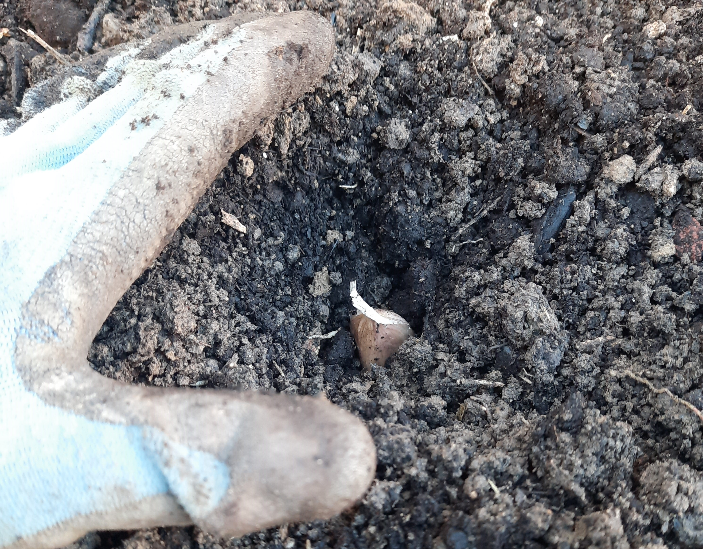

+++
draft = true
title = "Plant Garlic Now(ish) for Next Year!"
slug = "fall-garlic-planting"
date = 2023-10-09T14:37:11.529Z
author = "Erin Thomson"
plants = ["garlic"]

[cover]
relative = false
image = "garlic-cloves.jpg"
caption = ""
alt = "A hand arranging garlic cloves on the soil surface"
+++
Garlic is a crop that can be a bit tricky if you’ve never grown it before. It’s not too hard to grow, but it's easy to miss the optimal planting window. In general, if you’re growing in a cold climate you’ll want to get your garlic in the ground in fall for a harvest the following season. The exact timing to plant garlic can vary and you’ll want to keep an eye on the weather forecast- both for the best growth and so you don’t have to plant in miserable weather! Garlic is typically the first crop  that gardeners plant for the upcoming season, so planting garlic means you already have something to look forward to in the garden next year!

### Choosing a garlic variety

When it comes to choosing garlic varieties it's important to look for varieties that are adapted to your region. Generally speaking, ‘softneck’ garlic varieties tend to be grown in warmer climates where ‘hardneck’ varieties tend to be grown in colder climates, as they require a prolonged period of cold temperatures to grow properly. You might also come across ‘elephant garlic’ which is technically a leek even though it forms bulbs and can be grown and used similarly to garlic.

Aside from deciding whether to grow softneck or hardneck varieties, you’ll want to consider other traits. Some garlic varieties are hardier in extreme cold and of course there are different flavor profiles and varying levels of garlicky intensity. Some hardneck garlic varieties have purple papery skins and many say they have a unique flavor. Ask seasoned gardeners in your area which garlic varieties they prefer, or otherwise you’ll have to do some experimentation to find your favorites!

While you can technically plant garlic from grocery store bulbs, this is not recommended as you can’t select an appropriate variety for your region, the cloves tend to be old and dry from transport and sitting around, and if it's not organic the garlic might be treated with an anti-sprouting agent. For the best shot at success you’ll want to source ‘seed garlic’ from your local garden center, big box store, or online. Also be sure to plan your garlic planting in [Planter](https://planter.garden/gardens) so you’ll know roughly how much seed garlic to buy for the area you intend to plant.

### When to plant garlic

There’s a plethora of different recommendations for the best time to plant garlic. Essentially you’re trying to balance two factors: you want to get the garlic in the ground before the soil freezes and with enough time that the garlic can start to set roots to survive winter, however you don’t want to get garlic in the ground so early that it gets confused and pushes out a lot of new leaf growth before winter. While a bit of green poking out of the soil should be fine, you don’t want your garlic to put a lot of energy into new leaf growth that could potentially suffer from frost damage. As a rough guideline, garlic should be planted at least two weeks before your first frost date in fall. However, this isn’t a hard-and-fast rule- if the weather is unseasonably warm you may want to hold off until cooler temps start rolling in. On the other hand if the cold is setting in extra-quick, you might want to hustle to get your garlic in.

In a pinch garlic can also be planted as soon as the soil is workable in spring, just be aware that the bulbs will be smaller and it may take longer for your garlic to be ready to harvest. You’ll also want to ‘vernalize’ the seed garlic by putting it in a baggie in the fridge so it feels like it has gone through a winter.

### How to plant garlic

To plant garlic you’ll want to separate the bulbs into individual cloves, leaving the papery skins on each clove. Plant each clove with the pointed end up and flat end facing down.

How deep to plant your garlic is also a topic with some conflicting advice. It depends on where you live, your soil type, and whether you plan to add a layer of mulch on top. In very cold climates gardeners may plant garlic up to 4” deep to protect it from winter chill, but in less extreme regions 2-3” is sufficient. If you’re planting into a heavier clay soil you may not want to plant your garlic as deeply so the cloves don’t rot over winter. Gardeners often mulch their garlic to help protect it from temperature extremes in winter- if you’re going to be applying a thick layer of mulch you won’t need to plant your garlic quite as deep.

While you can grow garlic in containers you’ll need to take steps to prevent it from completely freezing and dehydrating over winter. You’ll want to consider mulching, and bringing the container into a cold garage where it won’t be exposed to extreme freezing temperatures.

Once you have your garlic planted, you’ll want to avoid watering it (unless you’re experiencing an unusual fall drought) or fertilizing it until the coming year. Excess water can cause the cloves to rot and fertilizing can stimulate garlic to start putting on new growth that you don’t really want until the following spring.

If you haven’t grown garlic before, it might seem like a pain in the *neck* 🙂. But growing garlic is totally worthwhile even if it means you have to go out on a chilly, windy day and dig around in cold wet soil! You’ll be amply rewarded with your garlic harvest next year…you might even be able to skip buying garlic from the store completely!

