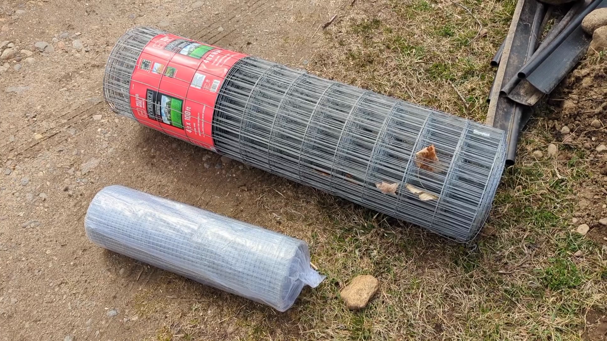
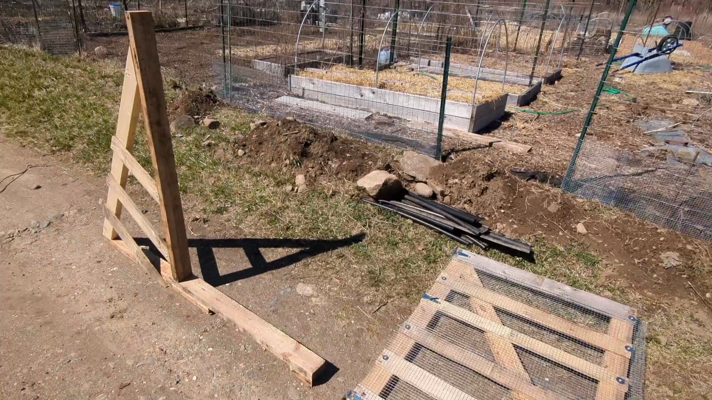
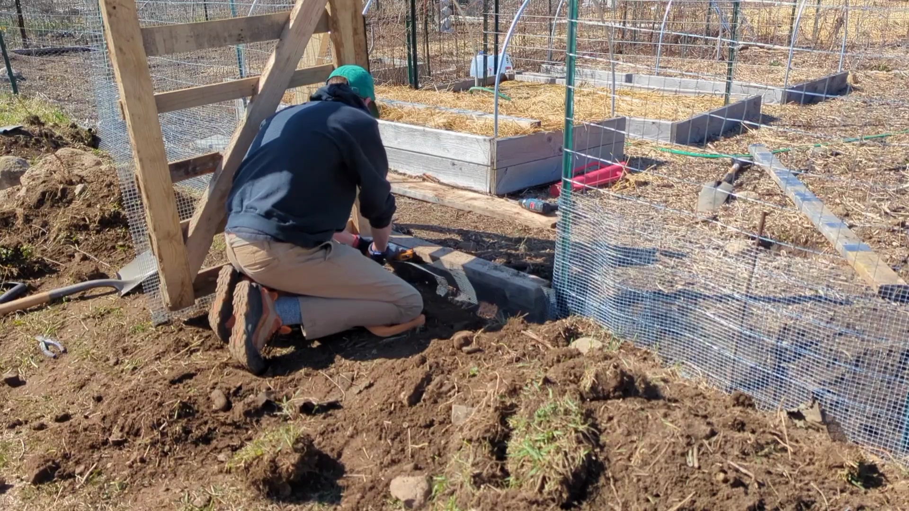
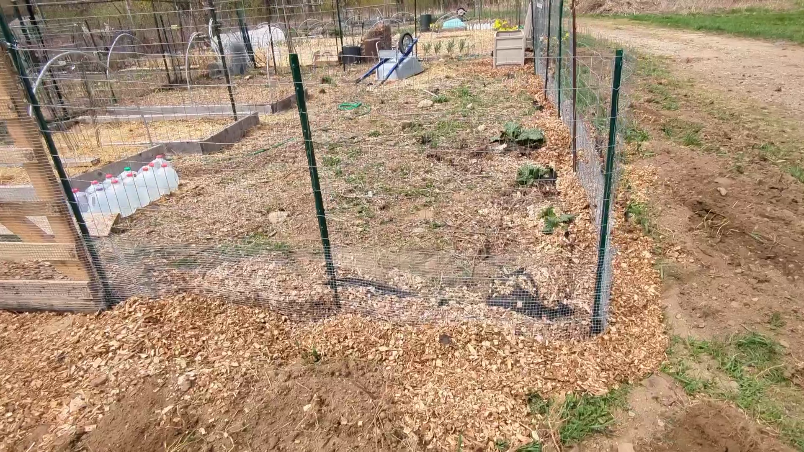
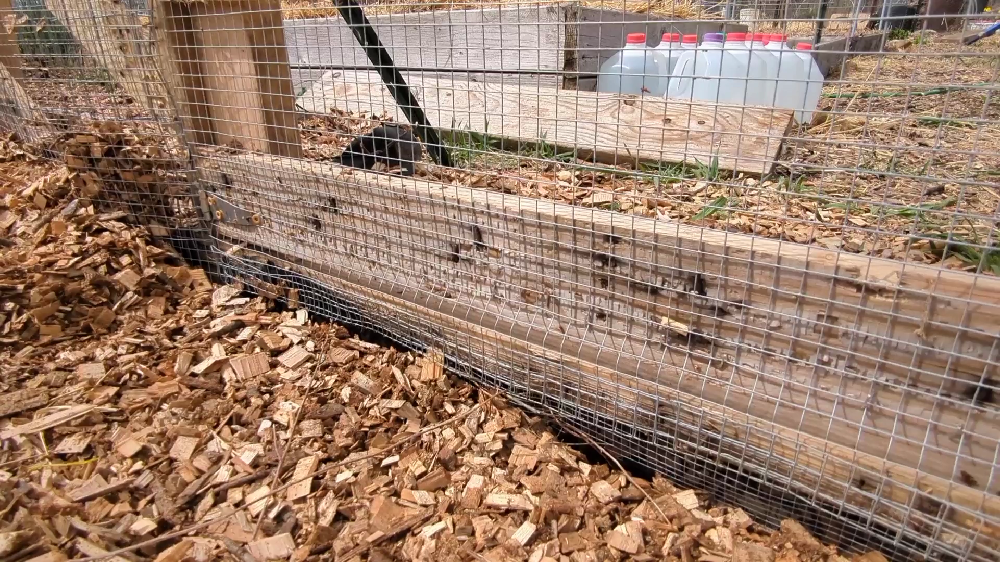

+++
draft = false
title = "Rabbit Proof Your Garden"
slug = "garden-fence"
date = 2023-04-21T20:00:09.094Z
author = "Peter Keefe"

[cover]
relative = true
image = "fence-youtube-thumbnail-1-.png"
alt = "Two bunnies hanging around some soon-to-be-eaten lettuce."
+++
Last year, the rabbits won. They ate my sugar snap pea seedlings. They ate my corn seedlings. They even nibbled through the green bean stalks, leaving the rest of the previously flourishing plant to wilt and die. I had a pet rabbit as a kid, and I love them. But **not in my garden**!

So this year, I set out to fix the problem by ripping out the old, dilapidated garden fence and replacing it with a brand-new, (hopefully) rabbit-proof fence. Check out the YouTube video below or keep reading if that's your learning-style.



In my research, one thing I learned fast is that rabbits love to dig, so putting the bottom of the fence right at ground level won't do much good. Rather, it's suggested to bury the bottom of the fence, as deep as you can (or as deep as the rocks let you!).\
\
But that *still* won't stop all critters from getting into your garden. Some will still dig under the buried fence. To solve this problem, the key is to bend the bottom of the fence into an L shape, so that the bottom of the L splays out and away from your garden. This way, critters that dig down along the fence will hit the horizontal portion of your fence and be stopped.

\
The other big thing to consider is how big the holes in the fence are. Bunnies can squeeze through holes as small as one inch, and full-grown rabbits can fit through holes as small as 2-3 inches. To counter this, I chose two fences; the larger fence has gaps 2 inches wide by 4 inches tall. This is the sturdier of the two fences and is 4 feet tall. Hopefully, this will deter any larger animals such as deer from getting into the garden (although deer can jump higher than this, it's certainly better than nothing). 

At the bottom of the fence, I chose hardware cloth with half-inch square gaps. Not even the tiniest of bunnies would be able to squeeze through. However, mice and other small rodents will still be able to get through, but trying to stop mice would be a very tough task.

I secured the hardware cloth to the larger garden fence with galvanized wire. You can also use zip ties or string for this, it doesn't matter.\
\
The next important thing is the gate. After all, I still need a way to get into the garden. My old gate was simply a portion of garden fencing, and it didn't do anything to keep rabbits out.

\
I decided to construct the new gate from a pallet I had lying around. I also fashioned a sturdy frame for it to swing on. I used the knowledge I gained from my mechanical engineering degree when designing it. The diagonal board is key to keeping the bottom corner of the gate from sagging. Likewise, the diagonal 2x4 on the gate's frame is key to keeping the pivot board vertical.

I also hammered a fence post at a 45-degree angle to keep the entire gate structure vertical when the gate is opened.

The gate frame has a continuous board on the bottom. I stapled hardware cloth to this board and buried it, similar to the rest of the fence. No rabbit will be digging under the gate!

By now, I had the new fence in the trench and a spiffy gate! All I need to do is fill in the trench and be done...

While the trench is dug, I might as well try to make my least-favorite gardening chore a little easier. You know what I'm talking about: weeding. Weeding is the worst, and getting weeds out from a fence is nearly impossible.\
\
So I cut up some landscape fabric, doubled it up and slid it underneath the fence. Then I covered it with some of those rocks and a whole bunch of woodchips. Hopefully this will keep the weeds from growing around the fence.

")

That was a lot of work, and I didn't even re-do the other two sides of the garden. Luckily, my garden neighbors (I garden at a community garden plot) have pretty solid fences, so I'll probably take my chances with it this year and reinforce those fences if I encounter any issues.

If you liked this post/video, please subscribe to us on YouTube! This is the first video I've shot of my personal garden, so if you like this type of content, please let us know with a 👍 and subscription on YouTube!