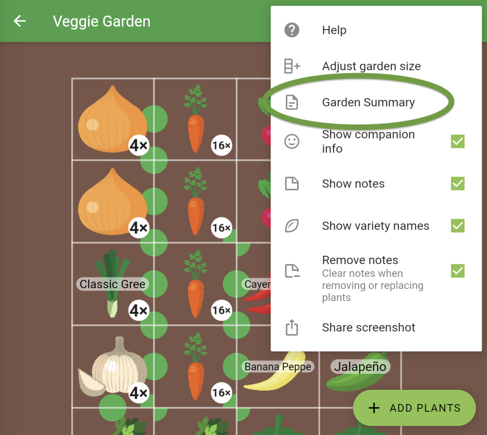
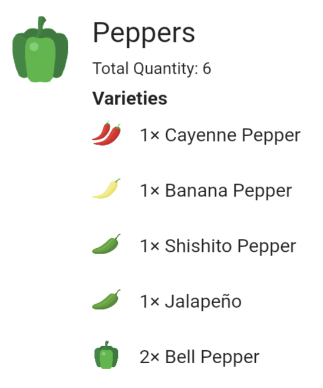
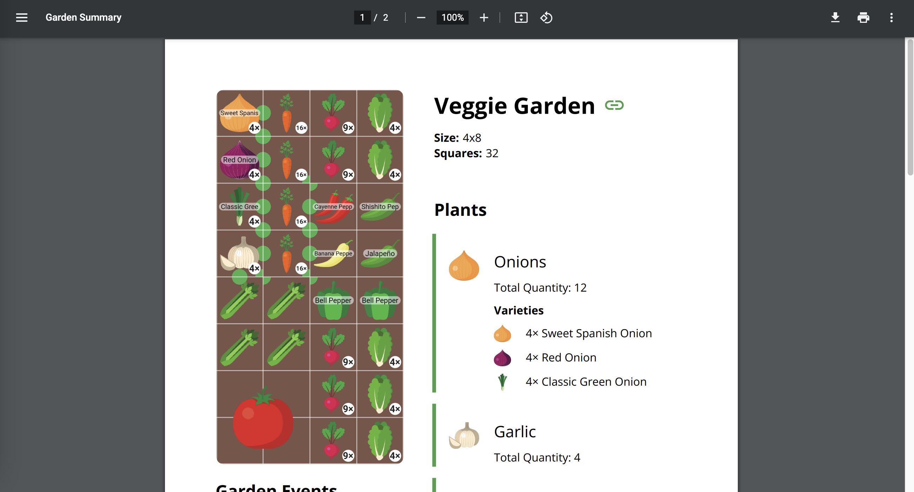

+++
draft = true
title = "New Feature and Behind-the-Scenes Conversation with Gardener Scott"
slug = "garden-summary-gardener-scott"
date = 2023-06-06T19:54:20.858Z
author = "Peter Keefe"
weight = 5

[cover]
relative = true
image = "screenshot-2023-06-06-at-4.10.42-pm.png"
caption = "The new Garden Summary feature."
alt = "The new Garden Summary feature."
+++
Hey there, fellow gardeners! Today, I'm thrilled to share some exciting news with you about our latest feature: the Garden Summary. But first, let me tell you about an incredible conversation we had with none other than Gardener Scott. 

If you don’t know who Gardener Scott is, you should go straight to his [YouTube channel](https://www.youtube.com/@GardenerScott) right now and subscribe. He has great videos about pretty much anything you might want to know about veggie gardening. We (Gardener Scott, Erin Thomson, and myself) met up on a rainy day to discuss his feature requests and the top requests from the Planter community, a brief history of the app, and, of course, our brand-new Garden Summary feature. So be sure to check out the interview video **\[insert link to Gardener Scott's YouTube video]**.

## The Garden Summary: What and How Much

As passionate gardeners ourselves, we understand the challenges of planning and managing a garden. To make this a bit easier, we wanted a way to view everything in the garden, quickly and easily.

So, what does the Garden Summary do? 

### Plant Quantity Breakdown:

Ever found yourself in a nursery, scratching your head, wondering how many plants or seeds to buy? Worry no more! With the Garden Summary, we provide you with the exact quantity of each plant and variety in your garden bed. It takes the guesswork out of your shopping list, making sure you get just the right number of plants to thrive in your garden.

### Notes and Events:

Keeping track of all the important notes and reminders for your garden can be overwhelming. Fear not! The Garden Summary compiles all of your garden’s notes, allowing you to have a quick and comprehensive overview.

### Export and Share:

*(Planter Premium feature)*

We know how important it is to have your garden plans and data easily accessible. That's why we've included the ability to export your Garden Summary to PDF or CSV format. You can print it, save it on your device, or share it with friends and fellow gardeners. 

## Next Steps

### Multiple Bed Compilation:

We never stop improving Planter, and a future update will allow you to compile multiple beds into one summary. This means you can manage larger garden spaces effortlessly, no matter how many garden beds you have.

But that's not all! We're actively listening to your feedback and ideas, like the ones shared by Gardener Scott during our interview.

Whether it's managing your seed inventory, enhancing the calendar with reminders and planting tips, or exploring other exciting possibilities, we're committed to evolving Planter into the ultimate gardening companion. 

So stay tuned for future updates, and if you want to hear more about our conversation with Gardener Scott, be sure to check out his captivating interview video **\[insert link to Gardener Scott's YouTube video]**. Happy gardening!