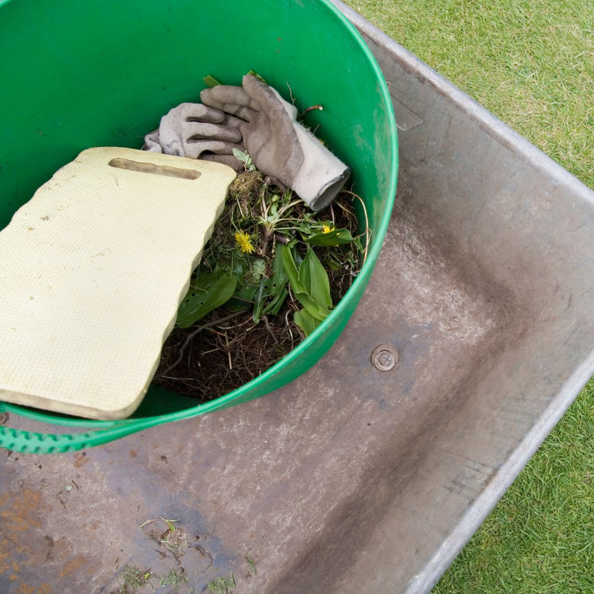
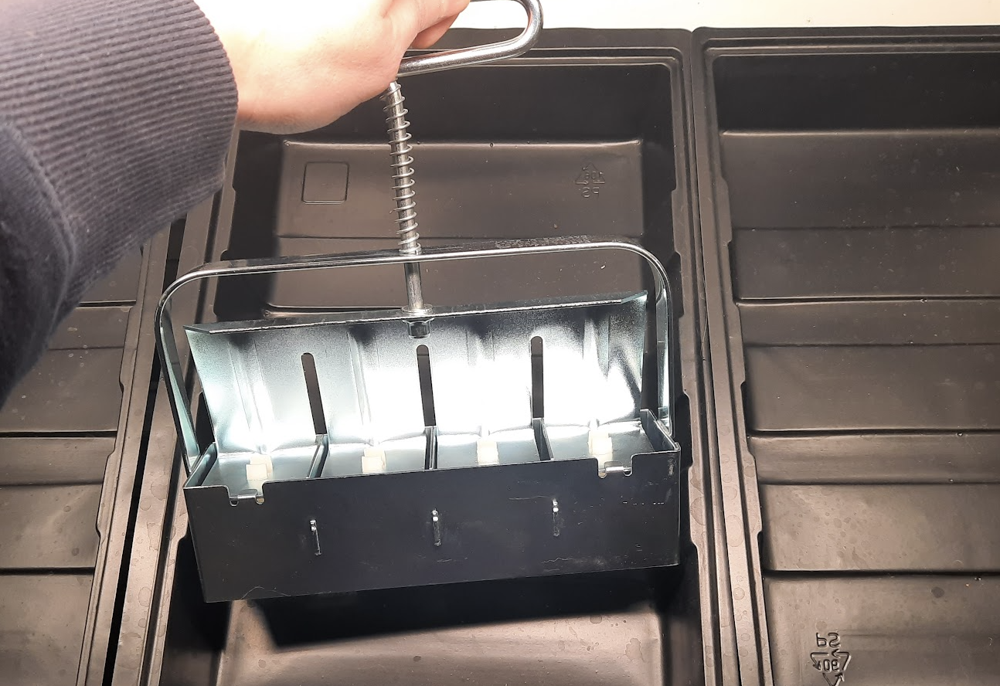

+++
draft = true
title = "Upgrade your Gardening Toolset!"
date = 2023-03-24T00:06:02.556Z
author = ["Jessalyn Krenicki"]
series = ["Garden Tools"]
weight = 5

[cover]
relative = true
linkFullImages = true
image = "man-watering-flower-seedlings.jpg"
+++
\[intro]

## **Let's take a look at some more tools!**

### Loppers

Much like large pruning shears, these are good for cutting thicker stems or thin branches. They’re particularly useful for hedges, if you’re the landscaping type!

### Pruning Saws

Pruning saws fit a niche between handsaws and loppers: they’re good for cleaning up some trees or woody bushes, but sacrifice precision, and don’t quite cut through large woods quite as easily as a handsaw might. For your garden variety landscaping (pun intended), it may do the trick!

### Edger

* Not to be confused with a lawn edger, which is used for cleaning up your lawn rather than plotting out your dirt!

An edger is pretty simple; it has a wide and squat shovel-like blade, and it’s used to mark straight lines in your garden! It’s great for helping to visualize your square foot gardening, to bring your Planter garden plans to life! 

### Hori-Hori Garden Knives

Hori-hori knives are a fairly new edition to the western gardening scene, but its versatility has made it a popular addition to many a gardener's toolkit! This small, flat, polished blade resembles something between a trowel and a knife, and can be used for either function; it’s great for use as a small trowel for digging, or as a knife for cutting roots or weeds, making harvesting a breeze!

### Kneelers

This one’s in the name! There are a couple of types of kneelers; the most common type is a thick foam piece that supports your knees when you're getting down into the dirt of your garden. Some are collapsible stools, made lightweight but sturdy for use in the garden for sitting or kneeling on! It could make a good tool table too, if you’re not afraid of staining the knees of your pants.

### Watering Wands

Watering wands, used in conjunction with a good long hose, can make watering hanging pots or flower boxes easy! They’re similar to a shower head, which makes them great for reaching higher-up plants.

### Soil Monitors

This handy soil sensor is great if you’re growing less hardy vegetables! Depending on what kind you get, these can give all sorts of information such as the pH of the soil, how moist the soil is, or how many hours of sunlight that it’s getting!

### Soil Blocker

Used to create seed blocks, these tools are becoming more popular due to their reduction in waste! Soil blockers reduce the waste caused by fragile plastic seed trays, by making any tray a receptacle for seeding blocks.

### Flamethrower

* Use these with extreme caution, if at all! Make sure your area allows them! These aren’t for playing around with!

Flamethrowers may be a surprise on a list for gardeners, but used correctly they can save a lot of time! Used mostly to burn off weeds, they could be used just before seeds germinate if you’re careful, or to just clean up weeds on dirt or stone. Not for use on any sort of wood mulch, naturally- don’t use a flamethrower on anything too flammable!

\[conclusion]