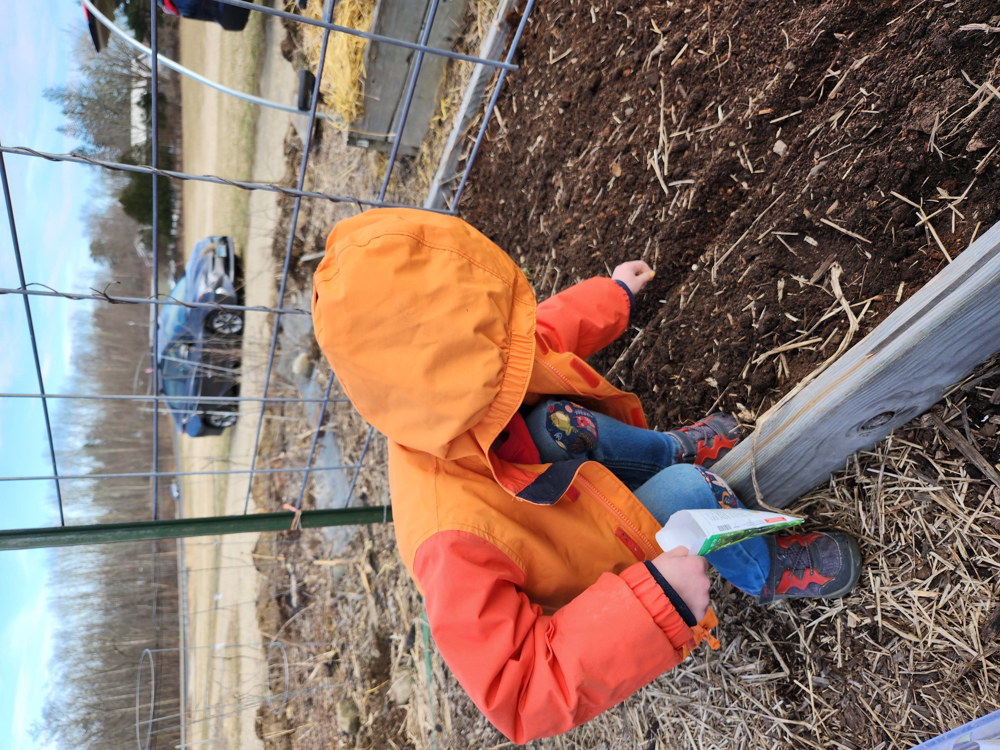
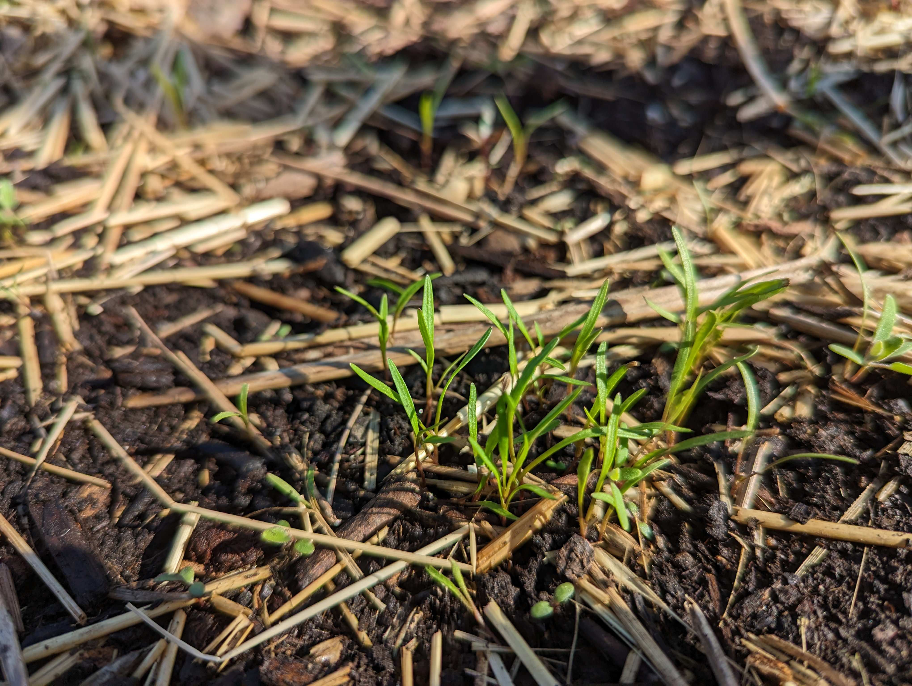
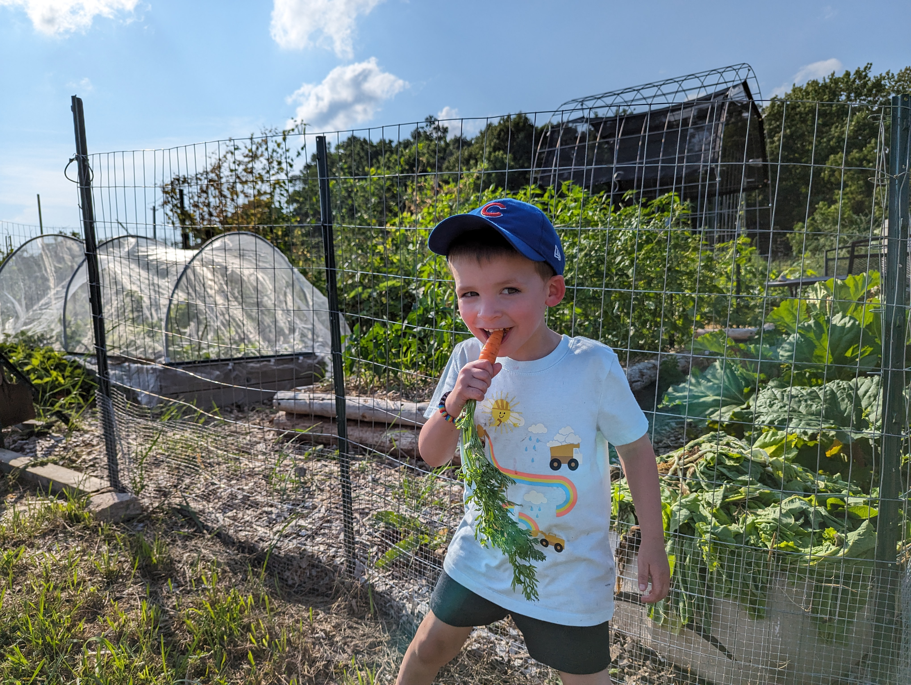

+++
draft = false
title = "Gardening With Kids"
slug = "gardening-with-kids"
date = 2023-07-17T05:03:00.000Z
author = "Peter Keefe"
weight = 5

[cover]
relative = true
image = "20230322_163927_2.png"
alt = "My son sowing pea seeds in the garden."
caption = "My son sowing pea seeds in the garden."
+++
One of the best things we can do as gardeners is pass along our love of gardening to our children. When I was a kid, my mom would let me and my two brothers each pick a corner of the garden to plant cucumbers. As the season went along, we’d watch excitedly as our cucumbers grew and jump at the chance to harvest them (it was also a bit of competition between us siblings to see whose plants grew the most cucumbers 😉).Now that I’m grown and have my own kids “helping” me in the garden, I thought I’d share some tips that I've learned along the way.

### Patience: Cultivate Patience in the Garden

Gardening with kids requires an abundance of patience. As any parent knows, tasks that seem simple and quick can often turn into extended adventures when children are involved. It's important to set realistic expectations and remember that gardening with kids is about having fun, not just the end result. Like our [gardening shirts](https://store.planter.garden/listing/romaine-calm-green) say, "Romaine Calm, Lettuce Carrot On". Embrace the slower pace, and use this opportunity to teach children the virtue of patience.

### Select Kid-Friendly Seeds

Kids love getting their hands dirty and sowing seeds. To make it easier for them, choose seeds that are large and easy to handle. Peas, beans, and seeds from the squash family are perfect choices. Their size and shape make them convenient for little fingers to hold and place in the soil, increasing the chances of successful planting.\
\
We learned this lesson the hard way this year; first we planted peas which went super well. I dug a trough for the seeds and my son was able to plant them every couple inches and they grew super well! However, next to the peas we planted carrots, and nearly a hundred seeds ended up in the same spot.

### Designate a Digging Spot

Kids love digging in the dirt, but that can sometimes pose a challenge in the garden. They might accidentally dig up your carefully planted seeds or seedlings. Rather than fight their natural digging nature, create a designated digging spot just for the kids. This can be a small section within the garden or even a separate container filled with loose soil. Now, they can dig to their heart's content without worrying about affecting the main vegetable plots.

### Give Each Child Their Own Garden Space

When I was a kid, my brothers and I each had a corner of the garden where we were in charge of growing cucumbers. It was great to see the whole process from sowing seeds to harvesting cucumbers. 

Kids love having a sense of ownership and responsibility. Give each kid their own little spot in the garden where they can grow what they like. Friend-of-the-app Ben Gardner of the [Backyard Gardens podcast,](https://www.backyardgardenstv.com/backyard-gardens-podcast.html) does just that. This year he gave his son an entire garden bed to grow what he wanted, and he chose potatoes. This is a great way to let kids grow their independence and gain an appreciation for gardening.

### Discover Garden Critters

Kids *love* bugs. Whether they're poking rolly pollies or try to burn ants with a microscope, they're all about the bugs. But us gardeners....not so much, especially the ones that munch on all of our plants. But we can teach them about [beneficial insects](https://blog.planter.garden/posts/16-of-your-garden-s-local-pest-hunters/) like ladybugs, bees, and earthworms.

### Celebrate Harvest Time

Harvesting is perhaps the most exciting part of gardening for kids (and adults!). Involve them in the process of picking ripe veggies. Encourage them to taste their freshly harvested produce (after a quick rinse, of course) and try out simple, kid-friendly recipes. This hands-on experience teaches them where their food comes and it might even help a picky kid try something new. 

### Garden Crafts and Projects

Enhance the gardening experience with creative projects. Engage kids in making garden markers using popsicle sticks or stones painted with the names of different plants. Create scarecrows together or build a birdhouse to attract feathered friends into the garden. These crafts add an element of fun and encourage children to take pride in their garden space.

### Be Safe and Sun Smart

Gardening often involves being out in the sun for extended periods. Ensure your children are adequately protected by providing them with hats, sunscreen, and comfortable clothing. Teach them about the importance of sun safety from a young age, and encourage regular breaks in the shade to stay hydrated.

### Share the Bountiful Harvest

As the gardening season comes to an end, involve your children in sharing the harvest with friends, family, or neighbors. Let them experience the joy of giving back to the community by gifting the fruits of their labor. This act of kindness reinforces the values of generosity and sharing.

Gardening with kids is a remarkable journey that fosters a love for nature and instills valuable life skills. Embrace the opportunity to slow down, bond, and create lasting memories with your kids. By following these tips, you can make gardening an enjoyable and enriching experience for the whole family. Happy gardening!