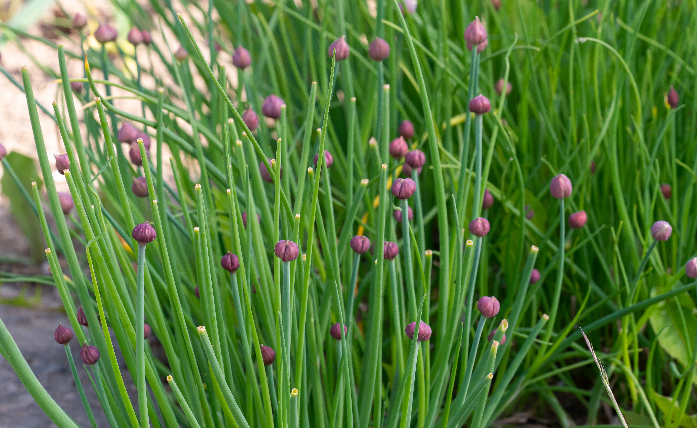
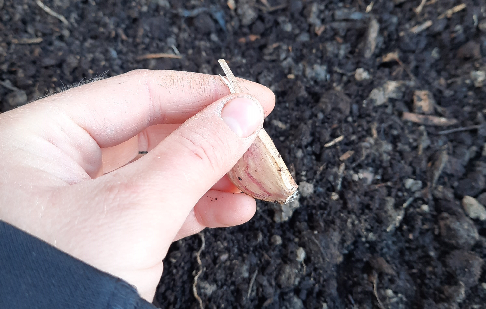

+++
draft = true
title = "Grow Amazing Alliums"
slug = "Grow-Amazing-Alliums"
date = 2023-04-22T00:23:33.055Z
author = "Erin Thomson"
plants = []
weight = 5

[cover]
relative = true
image = "white-onion.jpg"
alt = "White bulbing onions growing in the garden"
caption = "White bulbing onions growing in the garden"
+++
Alliums, that is plants belonging to the onion family, are a must-have in your garden! They are low-maintenance, resistant to many pests and diseases, and super-versatile in the kitchen. Alliums are not limited only to onions- shallots, chives, leeks, and garlic are also alliums! Even though they belong to the same plant family, each of them have unique requirements and culinary characteristics. Whether you're a gardening newbie or growing a gourmet garden, there's an allium for everyone!

### Onions (and Shallots)

Onions can be harvested as ‘bulbing onions’- including what we think of as yellow onions, white onions, and red onions- and ‘bunching onions’ which are onions that are harvested for their green tops.

To grow bulbing onions, it's critical to determine whether to grow ‘long-day’ onions, ‘short-day’ onions, or ‘intermediate-day’ ‘day neutral’ onions. This depends on where you live and how many hours of daylight your garden receives in the summer:

* **Short-day onions** form the best bulbs in southern regions with 11-12 hours of sunlight each day
* **Intermediate-day onions** work well in regions that receive 12-14 hours sunlight
* **Long-day onions** will form bulbs in northern regions with 14 or more hours of sunlight

Research to find bulbing onion varieties that are well-suited for your area.

Onions can be grown from ‘sets’ which are small bulbs sold in bags, ‘starts’ which are small pre-started onion plants, or from seed. Sets are easy to work with but they may not produce bulbs as large as onions grown from starts and seeds. Starts are also easy to grow, however if you’re comfortable [starting seeds indoors](https://blog.planter.garden/posts/all-about-starting-seeds-indoors/) give onion seeds a try!

Onions can be planted outdoors before your last frost date, once the soil is workable. They should be planted about 1-1.5” deep into loose soil that will allow the bulbs to expand. Some gardeners advocate “spooning” onions - scooping some soil out from around the bulb to encourage it to grow outwards. This is not necessary, but if you have the time go for it!

Onions are ready to harvest once the leaves start to flop over. Pull the onions out of the ground, snip off the leaves and roots, gently wipe off any surface dirt, and leave them to dry for two weeks before storing.

### Chives

If you’re looking for the easiest allium to grow, be sure to plant some chives! Chives are hardy perennial herbs that will keep coming back year after year. Chives can be grown from seeds or purchased as transplants. Or, if you have a neighbor growing chives, ask if you could divide them and take a small clump to plant!

Chives are best planted in spring, as they flourish in cooler temperatures- you may find their growth stalls in the summer only to come back again in fall. They like loose, well draining soil and while they are drought-tolerant, they do best with consistent moisture. To harvest chives, simply use [garden snips](https://www.amazon.com/s?k=garden+snips) to trim off some leaves near the base of the plant. Chives have a mild onion flavor- similar to green onion but more delicate. Later in spring chives will produce beautiful flower blooms- these are edible too and have the same subtle onion-y flavor!

### Leeks

Leeks are not as common as some of their allium family relatives, but if you haven’t tried them you have to give them a go! They are surprisingly very easy to grow and have a unique, mild sweet flavor that you just can’t find in other alliums. Leeks tend to be an expensive gourmet item in the produce aisle but you can grow them at home for next to nothing! Like onions, leeks can be grown from seeds or sets. When using leeks in the kitchen, usually long white stems are prized whereas the green parts are either discarded or used for soup stock. To get the desired white stems they need to be ‘blanched’ - that is covered and protected from the sun. There are two primary ways you can achieve this: first is by using a tool called a “dibbler” to make deep holes up to 4” into the soil - into which you can insert the tiny leek plants. You can also add mulch on top of the soil as the leeks grow to further protect the stems from the sun.

One thing to note about leeks is they take a long time to grow- plan your garden space accordingly (in Planter!) and be sure to plant them with enough time to mature.

### Garlic

If you enjoy cooking with garlic it is hugely worthwhile to add garlic to your garden. The flavor of home-grown garlic is incomparable, and you can produce quite a few bulbs in a relatively small space. For best results garlic should be planted in the fall at least two weeks before your first frost date. In a pinch garlic can also be planted once the soil is workable in spring - just be aware that the bulbs will not grow as large. When it comes to choosing garlic varieties again this tends to depend on where to grow- ‘softneck’ garlic varieties tend to be grown in warmer climates whereas ‘hardneck’ garlic tends to be grown in colder climates where it can get the required number of ‘chill hours’ over the winter (there are ways to get around this, though). 

When planting garlic be sure to separate the bulbs into individual cloves, but leave the papery skins on each clove. Plant with the pointed end up/flat end down. How deep to plant your garlic depends on where you live - in colder climates it can be beneficial to plant your garlic up to 4” deep to protect it from winter chill, whereas in warmer climates 1-2” is sufficient. Garlic can also be mulched to help protect it over the winter.

Garlic will emerge and start to grow in springtime. Hardneck garlic will shoot up a curly stem with a flower bud on top called a “scape”. Garlic scapes should be removed to allow the plant to focus energy on bulbing, however scapes are delicious and can be used in any recipe that calls for garlic!

Garlic is ready to harvest once several of its leaves start to wither and die. In some cases garlic can be pulled directly from the soil and in other cases a pitchfork might be in order! Allow garlic bulbs to completely dry before removing the tops and roots, brushing off any surface dirt, and storing them.

Alliums are some of the easiest and most useful crops you can grow! While tomatoes, peppers, and other summer favorites tend to take center stage in the garden, be sure to carve out space for some alliums. From hardy perennial chives to gourmet leeks, there is an allium suited for every gardener!