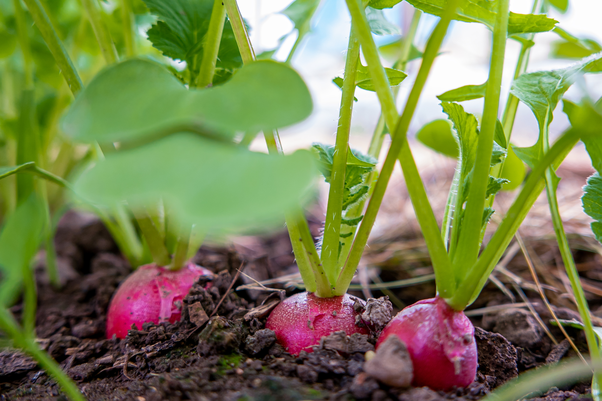

+++
draft = false
title = "Growing Vegetables in Part Shade"
slug = "Growing-Vegetables-in-Part-Shade"
date = 2023-06-26T04:00:00.000Z
author = "Erin Thomson"
plants = ["Lettuce", "Arugula", "Endive/escarole", "Spinach", "Kale", "Beets", "Chard", "Green onions", "Chives", "Broccoli", "Cabbage", "Cauliflower", "Collards", "Kohlrabi", "Mustard", "Bok choy", "Peas", "Cilantro", "Parsley", "Dill"]
series = ["Plant Picks"]
weight = 5

[cover]
relative = true
image = "lettuce-garden.jpg"
alt = "Lettuce plants in a row in a garden receiving partial sun"
+++
One of the things we first learn as gardeners is how important it is to select a full sun location for a veggie garden. Unfortunately, many of us don’t have the luxury of having an extra large yard with all-day sun exposure. Even if you’re lucky enough to have a sun-drenched backyard, you might have underutilized partially shaded areas of your yard that you wish you could grow food in. The good news is…you can in fact grow some vegetables in part shade!

### Do all veggie plants need full sun?

For the most part, vegetable plants grow and produce best in full sun (at least 6 hours of direct sun per day). Veggie plants need ample sun to be able to photosynthesize and grow as quickly as possible- a lack of sun may not outright kill them but it can severely stunt their growth. But there are some plants that will still produce a respectable harvest in partial shade (4-6 hours of sun per day). Gardening successfully in part shade comes down to being selective about what you choose to grow, and having realistic expectations about how much you’ll be able to harvest.

If your potential garden location is in near total shade and gets only a few hours of sun each day, you may want to skip down the **Alternatives to gardening in part shade** section of this article. While you can certainly have fun experimenting with growing edible plants in shade (you might even discover some non-traditional edible plants that grow well in shade), you’ll likely only be able to muster up a meager harvest.

### Veggie plants to grow in part shade

**Lettuce and leafy greens**

Lettuce and other leafy greens such as spinach, chard, and arugula are star performers in the shade. Growing them in part shade can even have some benefits as blasting summer sun can contribute to them [bolting](https://blog.planter.garden/posts/plant-bolting-a-seedy-situation/). To get the plants off to a good start you may want to consider starting them indoors then transplanting out to the shadier parts of your garden. It can be challenging to get lettuce to form full-sized heads in part-shade, but you can certainly harvest it as [cut-and-come-again](https://blog.planter.garden/posts/harvesting-how-to-and-when/#how-to-harvest-lettuce) lettuce.

**Green onions and chives**

‘Bulbing onions’ require full sun to form their large, edible bulbs, however green onions and chives are excellent shady garden plants because they are primarily harvested for their slender, pungent greens. While they will produce best in full sun, you can tuck them into shady spots and still harvest enough to make the effort worthwhile. For more information on growing these and other allium-family crops be sure to check out [Grow Amazing Alliums](https://blog.planter.garden/posts/grow-amazing-alliums/).

**Radishes**

By now you might be noticing a theme with shady-garden plant picks: they tend to be green and leafy. Radishes can add a nice burst of color to an otherwise monotone shady salad garden. Radishes can still form nice-sized roots when grown in part shade- although it might take longer than usual for the bulbs to form. Be careful not to use too much high-nitrogen fertilizer where you plant radishes, as this will stimulate them to form lush leafy tops and tiny roots. If this does happen all is not lost- radish greens are edible too!

**Beets**

Like radishes, beets are another root crop that can be grown in partial shade. The roots of shade-grown beets will likely be smaller than their full-sun counterparts, but you can always roast them whole and just call them ultra-gourmet baby beets. Don’t leave beets in the ground for an excessively long time hoping that massive roots will form- they might just turn woody and tough instead. Beet greens are also totally delicious in salads or sauteed, so if you do find the bulbs are too diminutive the greens will not disappoint!

**Brassicas (such as broccoli, cabbage, collards, kale)**

Brassicas can be grown in part-shade locations- but they must receive at minimum 4-6 hours of direct sunlight per day. If your location has dappled sun throughout the day, you may want to avoid growing brassicas there. Because brassicas, like leafy greens, are prone to [bolting](https://blog.planter.garden/posts/plant-bolting-a-seedy-situation/) under stress caused by heat and drought, growing them in shade may help to delay this. Patience is key as brassicas are already slow-growing crops and they will grow even more slowly in the shade. You likely will not be able to get super-sized heads to form on your broccoli, cauliflower, and cabbage, but it's at least possible to grow small, tender heads. Start brassicas indoors to give them the best possible chance to grow and reach maturity in the shade.

**Peas**

While peas perform best when in full sun, you can still get a harvest if they’re planted in part shade. You might even be able to trellis your climbing peas so that the plants are able to climb out of the shade to reach more sun. It is important to plant your peas with enough time for them to reach maturity before the summer heat comes. While partial shade will help keep them cooler for longer, eventually they will stop flowering and producing peas in the summer’s heat. For more info check out Grow Awesome Legumes.

**Certain herbs (such as mint, cilantro, dill, and parsley)**

While Mediterranean herbs such as rosemary and oregano prefer full sun and soil on the drier side, other herbs such as mint, cilantro, dill, and parsley don’t mind a bit of shade. The shade will help keep the soil moist and will help delay [bolting](https://blog.planter.garden/posts/plant-bolting-a-seedy-situation/). Trim (and cook with!) herbs planted in part-shade regularly to help keep the plants bushy and compact. And a special warning about mint: be sure to plant it in a container to keep it from spreading prolifically.

### Alternatives to gardening in the shade

**Container gardening**

While your yard might be submerged in shade, perhaps there’s a sunny spot on a deck or front porch that could be a great spot to grow veggies in containers. Virtually every type of veggie can be grown in a container provided the soil quality is good, the container is large enough for the crop, and you water and fertilize regularly to keep the growing medium moist and full of nutrients. Containers can also be moved around as needed to capture the most amount of sun available as the sun’s angle changes.

**Rent a community garden plot**

If your house is in the middle of the deep woods your best bet for getting a sizable garden harvest could be to rent a plot at your local community garden. Community garden plots are typically very inexpensive to rent for an entire season and will let you grow sun-loving veggies much more successfully. If you garden in a community plot be sure to set reminders to water your garden when the weather's hot and dry, as you won’t be able to check the state of your plants as easily as in a backyard garden.

**Garden with neighbors and friends**

If your neighbors and/or friends have unused backyard space that gets full sun exposure, try striking up a deal with them! If they let you use the space for gardening you can bestow them with tasty garden-grown produce throughout the season. If your friends happen to be gardening enthusiasts all the better- you can share the work, share knowledge, and share the reward!

Don’t let the semi-shaded parts of your garden be nothing more than wasted space. Maximize your harvests by growing some of these shade-tolerant plants and saving the full-sun spaces for sun-loving crops. Every harvest you can get from a shady space is a gardening win!