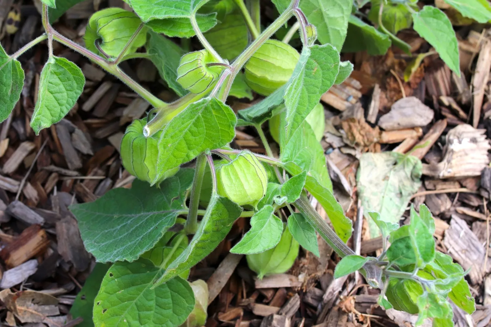
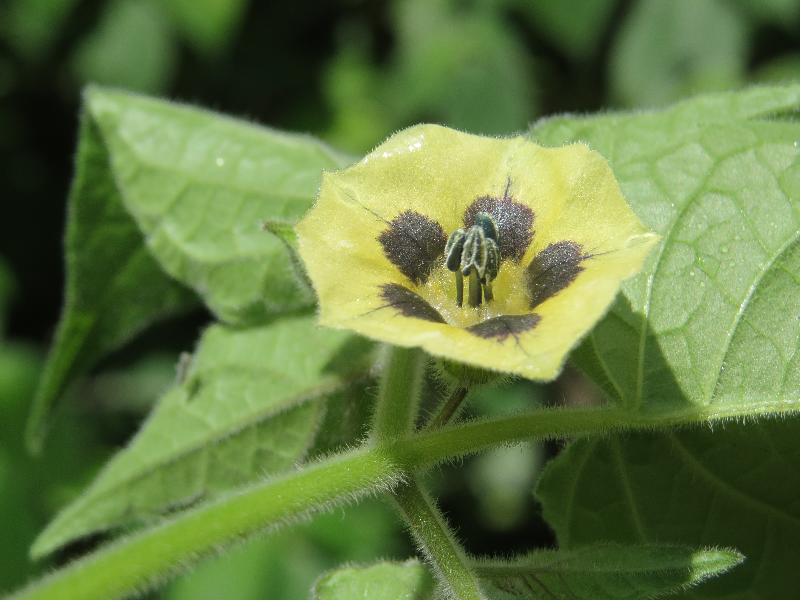

+++
draft = true
title = "Garden Gooseberry Growing - Cape Gooseberry edition"
slug = "Garden Gooseberry Growing - Cape Gooseberry edition"
date = 2023-09-10T10:12:37.559Z
author = "Elisha Redhead "
plants = []
series = ["Southern Hemisphere, Australia"]
weight = ""

[cover]
relative = false
image = "gooseberry4.jpg"
alt = "An image of a Cape Gooseberry, its protective shell peeled back. The berry is a lovely golden colour, and perfectly round."
+++
Welcome to part two of the Southern Hemisphere series!

The Cape Gooseberry plant is a large leafy plant native to Chile and Peru, and is actually a part of the Nightshade family. Unlike the Nightshade, however, the fruits of this plant are completely edible, and go great in salads! These plants grow amazingly in temperate climates, and a wonderful addition to any garden. 

### **Plant description**

The Cape Gooseberry plant has purpley-green leaves that grow in bunches. The leaves are much like that of a common tomato. Cape Gooseberry fruits grow encased in a papery packaging, that goes from green to gold as the fruit ripens. Cape Gooseberry fruit itself also goes from green to red or yellow as it ripens.

### **Finding seeds**

If you’ve collected seeds from your own Cape Gooseberry plants, you can of course use those. If you don’t, most major gardening stores tend to have Cape Gooseberry seed packets available. Specialised nursery’s may only be needed if you live in a truly cold climate where the plants aren’t expected to do well.

### **Planting**

Cape Gooseberries are a warm season crop, so its best to plant them at the beginning of your cold season. Cape Gooseberries require well drained soil with lots of organic material – so its best to weed a section of your garden and turn over the dirt before planting.

Cape Gooseberry seeds do not need to be soaked before growing.

Cape Gooseberry seeds grow best if grown in punnets or smaller containers before transplanted into the garden or larger pots. Fill your punnet or pot with a seed-raining mix, and plant the seeds roughly 4mm (0.16 inches) deep. Try to keep the soil moist but never soaking wet or absolutely dry. 

I would suggest spacing the plants 30-100cm apart (12-40 inches).

Note: Cape Gooseberries are sensitive to frost. If this is a problem in your area, please take measures against it.

### **Watering**

When it comes to watering a Cape Gooseberry, like all plants, it can be rather dependant on the heat of the sun and rate of evaporation. For instance, where it’s mid-summer in a tropical area, you might want to water your Cape Gooseberry every few days. As a general rule however, once a week should do fine.

### **Pollinating**

Cape Gooseberries are self-pollinating! So even if you have no bees in your area, you’ve no need to worry. These nifty little plants will handle themselves!

### **Stages of growth**

There are roughly seven stages of growth when it comes to Cape Gooseberries. Germination, continued leaf and shoot development, reproductive development, flowering, fruit development, fruit maturation, and deterioration.

Germination takes roughly 2-6 weeks, and is characterised by the formation of new leaves poking through the soil. At this point, the Cape Gooseberry will have its first fragile roots!

The plants should grow and mature over the following 90-120 days. As stated prior, its recommended you plant these plants at the start of the cold season, so that they have the time needed to grow and mature before producing fruit throughout Spring.

Cape Gooseberries are self-pollinating but the flowers are yellow with dark drown inner patterns.

### **Knowing when the berries are ripe**

It’s reasonably simple to tell if a Cape Gooseberry is ripe! The outer casing of the fruit tends to go from green to yellow as the fruit inside ripens. However, if you’re still unsure, you can always open the casing and have a look at the fruit inside – this will cause no harm to the fruit, just make it slightly more vulnerable to predators. The fruit, if ripe, should be a yellow or red colour. If it’s still green, leave it for a bit more time.

### **Harvesting seeds for next time**

If you’ve ever saved cherry tomato seeds, then you’re already on the right track. If not, here’s some suggestions as to how to save Cape Gooseberry seeds. It’s best to cut open the fruit and remove the seeds (warning, they are small), then place said seeds on a *dry* tissue or piece of paper towel. Leave the seeds to dry out. Once the seeds are fully dry, put them through a ‘winter cycle’ by leaving them in the fridge for a couple of days. Then remove them and put them in a paper bag or a new piece of paper towel, and they’ll all set to wait until you next plant Cape Gooseberries!

### **What you can use Cape Gooseberries in?**

Cape Gooseberries are a sour kind of fruit, and so are best to be used in salads, jams, and thick sauces. And of course, are perfectly delicious to eat fresh from the plant!

Happy gardening!