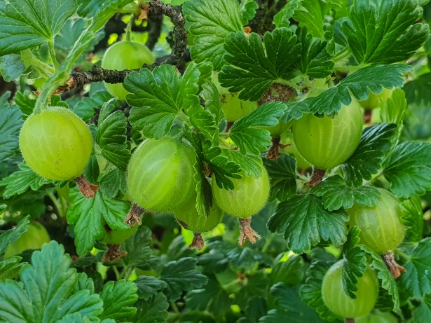

+++
draft = true
title = "Growing Great Gooseberries in your Garden"
slug = "Growing Great Gooseberries in your Garden"
date = 2023-09-10T11:49:58.020Z
author = "Elisha Redhead "
plants = ["Gooseberry"]
series = ["Southern Hemisphere"]
tags = ["Southern Hemisphere", "Australia "]

[cover]
relative = false
image = "cover2.jpg"
alt = "An image displaying three unripe Gooseberry fruits - they are spherical and pale yellow, with the husks of dead flowers still clinging to the bottom of the fruits. "
+++
Welcome back to part three of the [Southern Hemisphere](/tags/southern-hemisphere/) series!

Now, if you’re reading the title and thinking "Didn’t I just [read about those](/posts/garden-gooseberry-growing-cape-gooseberry-edition/)?" well no fear. Gooseberries, and Cape Gooseberries, are two entirely different plants, from entirely separate parts of the planet. Amazing, really, that they both ended up being called Gooseberries. But below you’ll find a guide for growing the far more difficult Gooseberry!

The Gooseberry plant is a small, stiff-stemmed plant native to Europe, and is often considered difficult to grow in temperate climates. Difficult, maybe, but most certainly not impossible! And it is certainly very rewarding.\
\
 Checkout gooseberries in [Planter](https://planter.garden/plants/gooseberries) 

###  **Plant description**

The Gooseberry plant is a small, thorny plant that provides pink flowers during blossoming season. It can grow up to 1.5m (5 feet) tall, and has edible fruit. These fruit are ovular and green.

### **Finding seeds**

It’s easiest to plant Gooseberries via cuttings, however, they can be bought from most gardening stores in colder climates. For more tropical areas, I’d advise checking online, as you may need to go to a more specialized nursery.

### **Planting**

Gooseberries do best in slightly acidic soil – it’s best to plant them in constantly moist soil, although do be careful not to drown them or leave them completely dry. I would recommend turning over the soil before planting so as to get good aeration and water drainage. Plant the seeds 6mm (0.25 inches) deep, and 4-5m (13-16 feet) apart. If you wish, you can plant the seeds in smaller punnets closer together, and transplant them into an area with more space once they have germinated. If you’re working from a cutting, plant it 5cm (2 inches) deep.

Soaking the seeds in hot water for a little, then drying them before planting, should help increase the chances of germination. Plant these seeds between Autumn to early Spring.

### **Watering**

It’s recommended you water these plants about once every 2-3 days, more if you live somewhere hot. However, I would recommend to always keep an eye on your plant for signs of wilting or overwatering, and adjust as needed.

### **Pollinating**

Gooseberries are self-pollinating! So no stress if you don’t have bees or other pollinators nearby. These nifty little guys will handle themselves!

### **Stages of growth**

In this aspect, regular Gooseberries are almost identical to Cape Gooseberries. Which in all honesty, is fascinating from a biology point of view.

There are roughly seven stages of growth when it comes to Cape Gooseberries. Germination, continued leaf and shoot development, reproductive development, flowering, fruit development, fruit maturation, and deterioration.

Germination takes roughly 2-6 weeks, and is characterized by the formation of new leaves poking through the soil. At this point, the Cape Gooseberry will have its first fragile roots!

The plants should grow and mature over the following 90-120 days. As stated prior, it is recommended you plant these plants at the start of the cold season, so that they have the time needed to grow and mature before producing fruit throughout Spring.

")

### **Knowing when they’re ripe**

The easiest way to tell if a Gooseberry fruit is ripe is to gently hold it between your fingers – if it’s slightly soft, it should be ripe.

### **Harvesting seeds for next time**

If you’ve ever saved cherry tomato seeds, then you’re already on the right track. If not, here’s some suggestions as to how to save Gooseberry seeds. It’s best to cut open the fruit and remove the seeds (warning, they are small), then place said seeds on a *dry* tissue or piece of paper towel. Leave the seeds to dry out. Once the seeds are fully dry, put them through a ‘winter cycle’ by leaving them in the fridge for a couple of days. Then remove them and put them in a paper bag or a new piece of paper towel, and they’ll all set to wait until you next plant Gooseberries!

### **What can you use Gooseberries in?**

Gooseberries are much sweeter than Cape Gooseberries, however they are still tart. As such, they’re best to be used in jellies, sweet jams, and desserts such as pies. They can obviously also be eaten just as they are! Yellow and red Gooseberries are claimed to be a sweeter variety than the green, although all are good.

Happy Gardening!