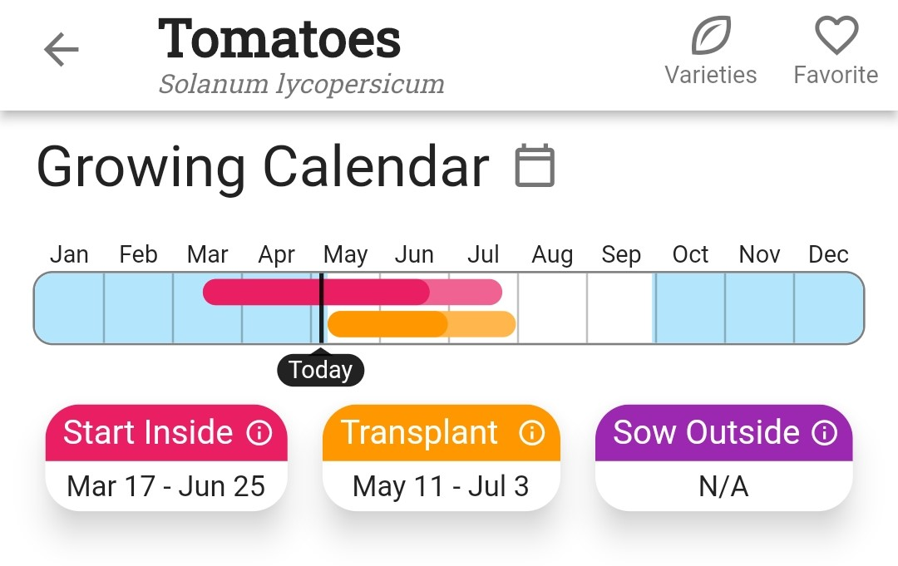

+++
draft = true
title = "Hardening Off and Transplanting"
slug = "Hardening Off and Transplanting"
date = 2022-05-04T04:00:00.000Z
author = "Erin Thomson"
series = ["Seed Starting"]
weight = 5

[cover]
alt = "Young seedlings in pots and containers outside in the shade"
caption = ""
image = "seedlings-outdoors.jpg"
+++
If you [started seeds indoors](https://blog.planter.garden/posts/all-about-starting-seeds-indoors/), at some point the itch to get them planted in the garden really starts to kick in. But without special care, the transition from growing indoors to the garden can stunt your plants’ growth and even kill them. It's important to ‘harden off’ seedlings and transplant them properly, to give them the best possible start in the garden.

### What Is Hardening Off?

‘Hardening off’ seedlings is the process of gradually getting them acclimated to growing outdoors. Hardening off is especially important for seeds started indoors, as they have been growing in unnatural conditions their whole lives. Seedlings grown indoors take some time to build up their defenses to cope with more extreme sunlight, wind, temperatures, and drought outdoors. Hardening off is most crucial for seedlings raised indoors, but if you have enough time it can be helpful to harden off seedlings purchased from a garden center. Without hardening off, seedlings can suffer from sun scald, wilting, and wind damage.

Hardening off might seem like an extra step, but it provides some insurance that the seedlings you spent weeks nurturing won’t wither and die as soon as they get outdoors. Is hardening off necessary? No. Some plants might survive being transplanted directly into the garden. But skipping hardening off is a gamble, and plants that do survive the transition might never recover fully.

### When and How to Harden Off Seedlings

To determine when to harden off seedlings, start by checking the ‘Transplant’ window in the Growing Calendar in [Planter](https://planter.garden/) for each of the plants you plan on transplanting:

The transplant window in [Planter](https://planter.garden/) is tailored to your growing location. Within the transplant window for each of your plants, think about when specifically you want to transplant. Consider recent and forecast weather conditions and when you have time in your schedule for planting. If you are [succession planting](https://blog.planter.garden/posts/succession-planting-for-nonstop-harvests/), you may have multiple transplant dates to keep track of for each plant. Make sure your seedlings will be mature enough to be transplanted- they should have at least a couple sets of ‘true leaves’- but don’t leave it so late that they are outgrowing their containers.

With transplant dates in mind for each of your plants, aim to start the hardening off process about two weeks prior. To start the process, find a partially shady location in your garden, or start the process over a stretch of a few cloudy days. Be sure the selected location is somewhat sheltered from wind. Gather your seedlings together in trays or shallow containers - this will make carrying them outside and inside easier.

On the first day of hardening off, take your seedlings outside to the chosen location, leave them out for a few hours, then bring them back in. Each day, gradually increase the number of hours that the seedlings spend outside and the amount of sunlight they receive.

If the forecast calls for extreme weather (cold, heat, wind, storms), keep the seedlings inside. Continue the hardening off process once the risk of extreme weather has passed. Once the seedlings are spending most of the day outdoors you can start leaving them outside overnight, but watch the forecast to ensure it won’t get too cold for your plants. After a week or two of this process, your seedlings are ready for transplanting!

### How to Transplant Seedlings

When transplanting seedlings the goal is to prevent ‘transplant shock’, which can stunt or kill them. To make the process as smooth as possible, plan your planting ahead of time using [Planter](https://planter.garden/), be sure your beds (or containers) are prepped, and have your tools handy.

Prior to transplanting, moisten the planting area and seedlings’ roots. Dig a hole deep enough so the plant stem will stay at the same depth as it was in its container (tomatoes, peppers, and eggplants can be planted deeper). Be careful not to damage the plant stem and roots in the process of taking the seedling out of its container and planting it. Do not break up or untangle the seedlings’ roots, unless they are especially root-bound (i.e., the roots are coiling around several times in the container). If you are using peat pots, rip the edges open when planting otherwise they can wick moisture away from the plant.

Place the plant in the hole and fill it with soil, pressing gently yet firmly until it is level with the surrounding soil. Water again gently so the plant settles in and has enough moisture.

Your plants will need some extra attention for the first few weeks after transplanting. Ensure they have consistent moisture and protect them from extreme weather conditions if needed. After this point your plants should be established and can be cared for as part of your regular garden maintenance.

It can be tempting to rush to get your seedlings planted outside, but taking the time to harden off and transplant your plants properly will set your garden up for a successful season!