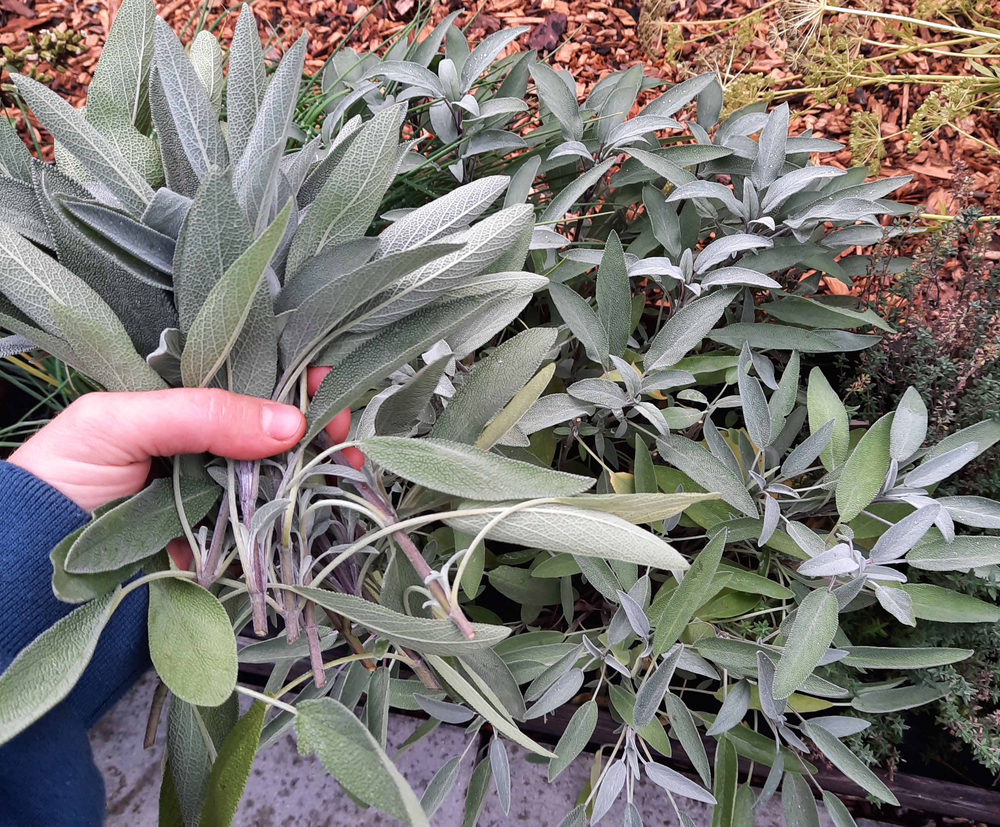
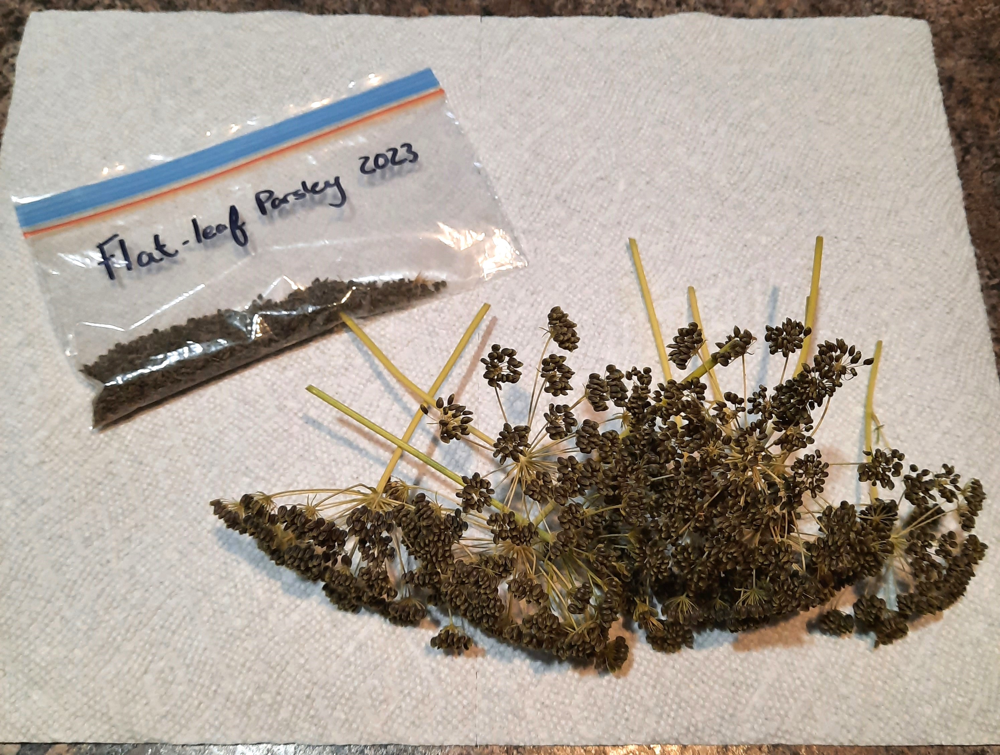
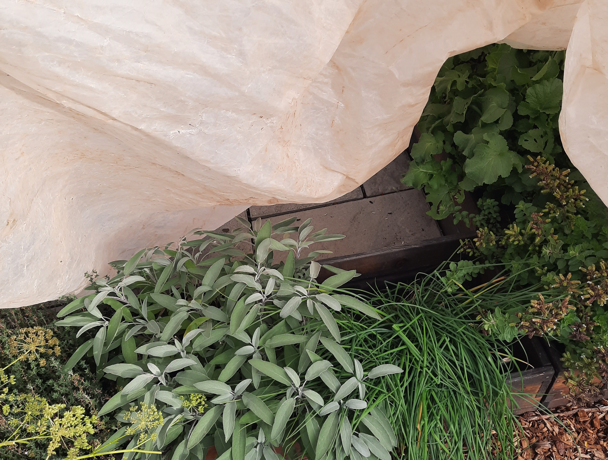

+++
draft = true
title = "What to Do with Your Herb Garden Before Winter"
slug = "herb-garden-winter"
date = 2023-11-01T23:50:31.487Z
author = "Erin Thomson"
plants = ["rosemary", "basil", "thyme", "oregano", "sage", "parsley", "dill", "cilantro", "marjoram", "mint", "tarragon", "chervil", "lemon balm", "lemon verbena", "stevia"]

[cover]
relative = false
image = "herb-garden.jpg"
alt = "Various herb plants in a raised wooden garden bed"
+++
The peppers are done. The tomatoes, long-gone. But your herb garden is still chugging along into the depths of fall. The first night that a hard frost rolls in you might find yourself half-frantically wondering “what should I do with my herbs?” Because herb plants are diverse, there’s different techniques you can use either to save the plants or to salvage a final harvest!

### Harvest your herbs

Your first instinct might be to just hack down every little bit of greenery that’s left on your herb plants. Before you do, note that some herbs are perennial and some are annual. Annual herbs such as basil and cilantro will typically die off in cold winters. Biennials such as dill and parsley may come back next season, but they are typically grown and harvested as annuals. Perennials such as thyme, oregano, mint, and sage can often survive a winter, depending on the variety, how cold your winters get, and the soil conditions. Since annuals die off in winter, you might opt to harvest them out completely when freezes are in the forecast.

You might also be tempted to hack back your perennial herbs, but you’ll want to proceed more cautiously. While perennial herbs can often benefit from pruning in early fall several weeks before your first frost, if you mow them down just before winter they might not be able to heal and come back next season. A good general rule of thumb is to not harvest more than ⅓ of the plant and don’t cut too far down on the stems.

Harvesting your herbs is probably the simplest approach, although you might end up with a glut of herbs to use up. Try drying your excess herbs or chopping them up and freezing them in ice cube trays topped off with water or oil.

### Save herb seeds

If your herb plants have formed mature seed heads, take advantage and save seeds for next season! Dill, cilantro, and parsley are all examples of herbs that are fairly easy to save seed from. To save seeds from your herbs, be sure the seed pods on the plant are fully mature- they should be light brown, not green. Cut off the seed heads and allow them to fully dry out before storing them (this can take up to a couple weeks). Remove the fully dry seeds from the heads, then store them in paper sachets, airtight containers, or plastic baggies and label them with the plant/variety and the year. If you’re interested in learning more about seed saving, be sure to check out [Seed Saving 101](https://blog.planter.garden/posts/seed-saving-101/).

### Cover your herbs

Herbs can be surprisingly cold-hearty, with some notable exceptions such as basil. If you cover your herbs with [row cover](https://www.amazon.com/s?k=row+cover+frost+protection) or clear plastic sheeting you can potentially keep harvesting them well into winter. Annuals can still die off if temperatures drop too low, but covering them offers a few degrees of frost protection that can let you keep harvesting them just that little bit longer. Perennials keep their leaves through winter- so long as they are accessible under the cover and you have the willingness to get out there, they can potentially be lightly harvested through winter. Even if you don’t intend to harvest them in winter, covering your perennial herbs, along with applying a thick layer of [organic mulch](https://blog.planter.garden/posts/mulching-a-must-for-your-garden/), can help increase their chance of survival. For information on protecting plants from the cold check out [Season Extension Techniques: Keep the Growing Going!](https://blog.planter.garden/posts/season-extension/)

### Bring herbs indoors

If your herbs are growing in containers you might be able to easily transition them indoors. In fact, it may be best to bring them indoors as even hardy perennial herbs may not survive freezing temperatures outside in a container. If you do bring your container herbs inside, check the plants thoroughly for pests and consider refreshing the soil to avoid bringing in unwanted nasties. Otherwise, you can take cuttings from your herbs and root them in water (this works well with basil, oregano, rosemary, sage, and thyme to name a few). Herbs prefer full sunlight so to grow them indoors you’ll want to consider using [grow lights](https://www.amazon.com/s?k=grow+lights) to keep them as healthy as possible. If your herb cuttings fail to take root all is not lost- just start new herbs from seed as a fun indoor winter project!

### Do nothing

Last but not least, you can simply let nature take its course. Without any extra effort you might find that your herb garden mostly bounces back come spring. Perennial herbs can make a comeback, semi-tender herbs might surprise you with their resilience, and some herbs might have self-seeded so you get brand-new plants as soon as the weather warms up! As mentioned, keep in mind that herbs left in containers outside are less likely to survive winter unaided (depending on the size of the container and the temperatures). Also be aware that some herbs, such as lavender, are fairly cold-hardy but will rot and die if they are left in wet, poorly-drained soil. Doing nothing is a bit of a gamble, but if you happen to end up with holes in your herb garden next season consider it an excuse to try growing some brand-new herb varieties!

Herbs can be sturdy winter warriors, but they are not all created equal! Decide what you want to do with each plant as the snow approaches, then hunker down and start planning in [Planter](https://planter.garden/gardens) for an abundant herb garden next year!

<<{ affiliate }>>