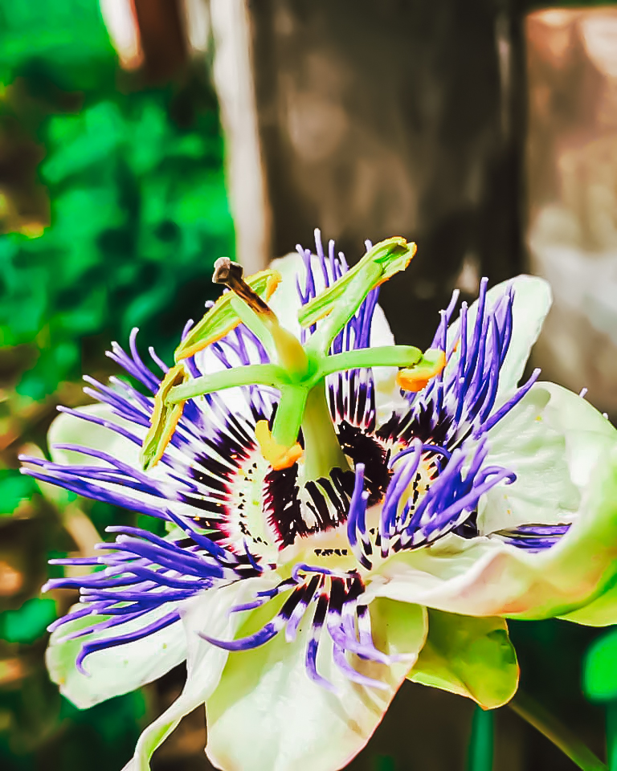
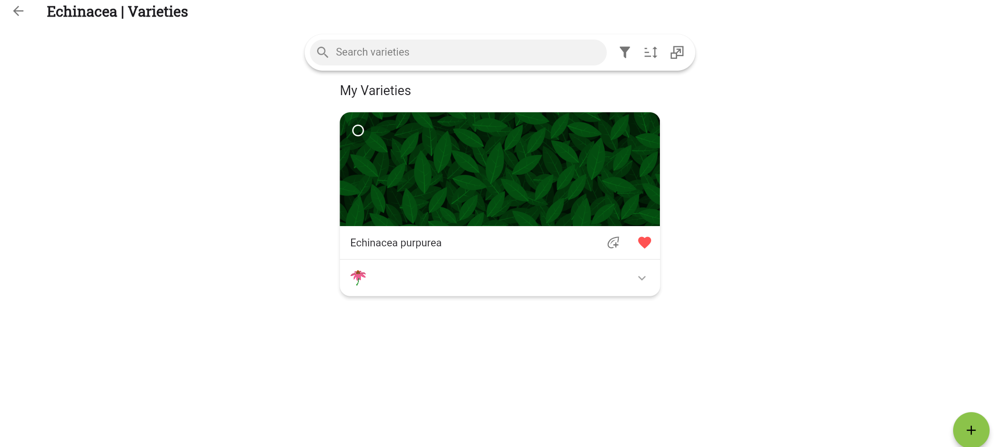
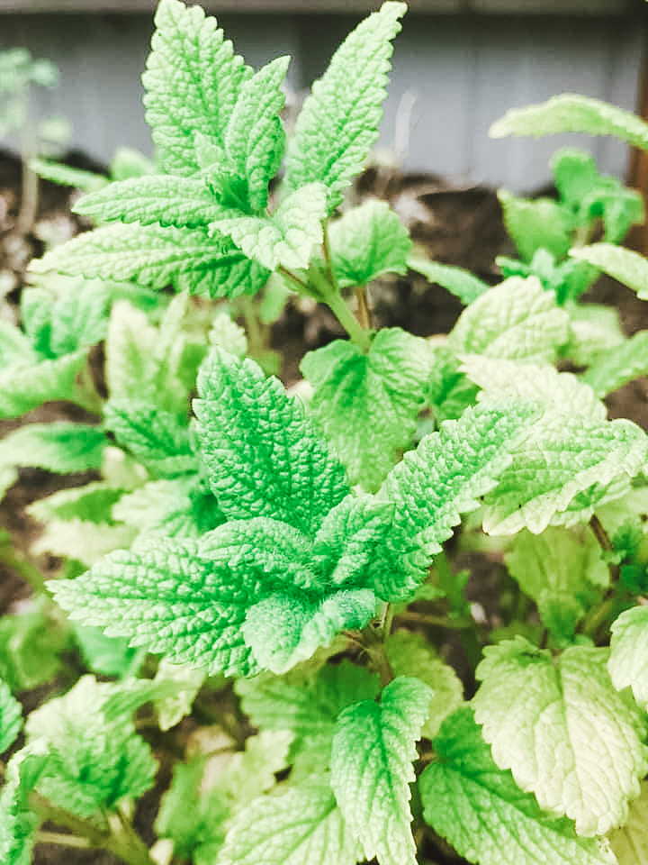

+++
draft = true
title = "Herbs and the Importance of Knowing Botanical Names"
slug = "Herbs-and-botanical-names"
date = 2024-01-09T18:29:28.710Z
author = "Samantha Togstad"
plants = ["Elderberries", "Echinacea", "Lemon balm"]
series = ["Herbs"]

[cover]
relative = false
image = "20240110-dsc08187.jpg"
alt = "Learning botanical names from an herbal book"
+++
Spring is right around the corner and you’ve been planning your new herb garden. You know where it will be and you’ve got it all laid out in your Planter app. You decide to check out your local garden center for some more inspiration. You see a beautiful witch hazel named ‘Jelena’ that would look good in your garden. Then you see another one named ‘Rubra'. 'Jelena' is labeled as *Hamamelis x intermedia* and 'Rubra' is labeled *Hamamelis japonica.* You begin to wonder which type should be used as an herb. When it comes to herbs, knowing the traditionally used variety and its botanical name is very important. 

### Why Plants Have a Botanical Name

With hundreds of thousands of known plant species, and over 2,000 new plants being discovered every year, it’s a good thing we have a universally recognized naming system. The botanical name, also known as the scientific name or Latin name, is made up of two names, the genus and species. If you see a third name with quotations, that means it’s a cultivated variety. The botanical name is the same worldwide. You can run into confusion if a plant has a lot of common names. In England, using the common name Aaron’s rod could refer to mullein, but in Scandinavia, it could refer to rose root. Using the botanical name ensures everyone is on the same page.

### Learn the Botanical Names of Herbs

With your vegetable and flower garden you are free to choose by color, size, or even by name. Who can resist a ‘Teddy Bear’ sunflower? A pumpkin named 'Warty Goblin' deserves a spot in the fall garden.  With herbs, however, you need to have knowledge of specific varieties. In the case of the witch hazel shrub, *Hamamelis virginiana* is the preferred type for herbal use. Not always, but usually cultivars, like 'Jelena', do not have a history of traditional use. Finding a good book on herbalism will help you learn which varieties are the ones you want to use. Another good reason to learn is because some herbalists and books will only refer to a plant by its botanical name.

### Safety First

Many herbs have different species and each species can have different levels of the plant's active ingredients. All elderberries’ leaves, stems, roots, and seeds have some level of toxicity from the cyanogenic glycosides they have. *Sambucus racemosa*, or the red elderberry, has the highest levels of these compounds so it’s best to avoid it for herbal use. The black and blue elderberries, *Sambucus nigra*, *Sambucus canadensis*, and *Sambucus caerulea*, are preferred, as they have the least amount of cyanogenic glycosides, and with proper preparation, are the safest elderberries to use.

Passionflower is an herb known for its sleep-enhancing qualities. Many nurseries have passionflower for sale. But there are over 400 species of passionflower! *Passiflora incarnata* is what’s used most in traditional medicine.  *Passiflora edulis* is where we get passionflower fruit from, but isn't used as an herb as much as *incarnata* is. Other types might be toxic. Knowing the botanical name is very helpful in this case.

### How Planter Can Help

Planter lists the botanical name in the information section of a plant. You can enter a specific variety yourself too.  Check out this link on how to [create a custom variety](https://info.planter.garden/plant-information/custom-varieties/). 

Labeling your herbs in Planter is also helpful for when some perennial plants disappear in the winter. Let Planter be your garden map and you won’t confuse your *Echinacea purpurea* with your *Echinacea angustifolia* in the spring. 

It might seem overwhelming to learn the botanical names, but it’s an important part of having an herbal garden. With a little studying and the help of Planter, you’ll be inviting friends over for a cup of homegrown *Melissa officinalis* tea in no time.

