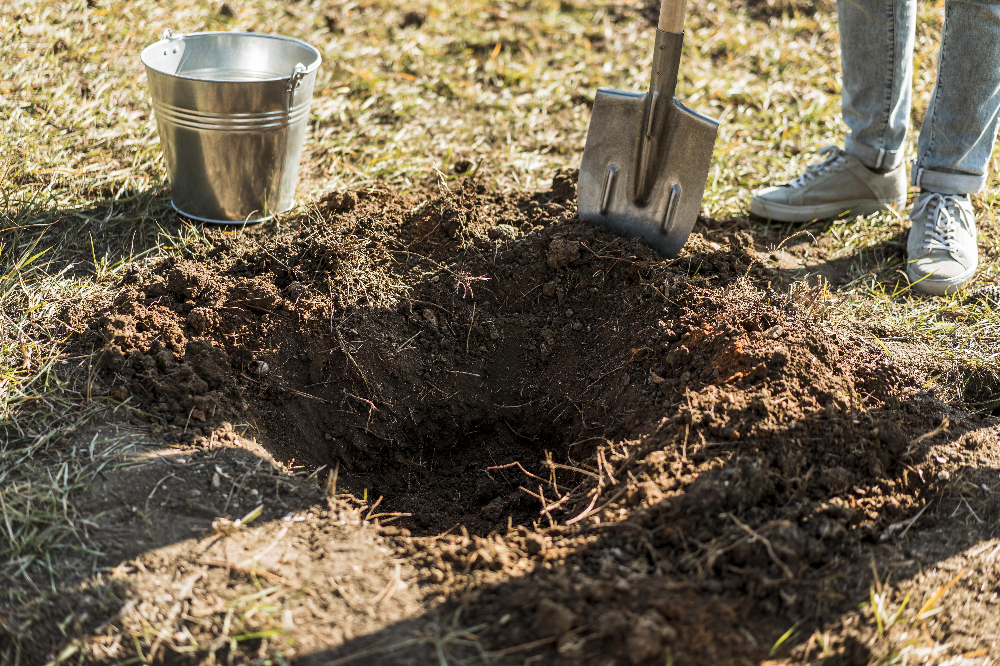

+++
draft = false
title = "How to Improve Poor Soil Drainage"
slug = "How to Improve Poor Soil Drainage"
date = 2023-05-18T10:00:04.367Z
author = "Jessalyn Krenicki"
weight = 5

[cover]
relative = true
image = "compost-still-life-concept.jpg"
alt = "Gardener holding soil in gloved hands, over a bucket of soil."
+++
Have you noticed that your plants have been struggling in your soil? Maybe when you water your garden, it doesn't seem to soak in, or your plants leaves seem sad and limp despite the rain? Your garden might be having issues with water drainage! But never fear- 

### What is the main cause of poor soil drainage?

**Compaction!** The weight of machinery, vehicles, garden equipment, and people pushes the particles of soil together tightly, reducing the spaces of air in the soil. Clay-heavy soils are particularly prone to this, because clay particles compact together easily due to their size.

Plant roots need air as well as water to thrive. If there's not enough spaces in the soil, this can negatively impact plants in several ways; roots will struggle to establish, breathe, or possibly even get water. If the water is allowed to sit without a way to drain, it will also result in root or crown rot.

### How to test soil drainage:

* Dig a hole 12 inches deep and 12 inches in diameter.
* Fill it all the way up with water so that the soil can be well saturated; the next day, fill the hole all the way up again with water.
* If your dirt is well-draining, all of the water should drain out within eight hours of that second filling. If it drains out in less than half the time, your soil is very sandy, and you might have to rely on watering your garden more thoroughly. If it drains at a rate less than 1 inch per hour, you're dealing with poor drainage!
* For best results, you should repeat the test several weeks later to determine if you have a seasonal drainage issue (spring runoff, for example) or an overall poor drainage issue.

### Options for fixing poor draining soil: 

#### Additives!

* The best practice to improve and maintain soil drainage is by adding organic matter (leaves, mulch, or compost). You may have to add compost for the next few years to improve drainage over time.

  * A good rule of thumb for this is to spread around a two inch layer of organic matter over your soil, and work it in about six inches deep with a spade or till. Over-tilling will make your problem worse, and may have caused the issue in the first place.

* Perlite or Vermiculite: these are two kinds of volcanic rock that will help break up soil and absorb water well. Sand can also help in a similar way, but not recommended (tricky) 
* Sand is very fine, and while it might break up soil clods in large amounts, it can also just fill the few spaces there are in the clay-heavy soil and slow drainage further.

#### Try Aerating the Soil!

Loosen and aerate heavy and compacted soils with a garden fork. Push the fork in and gently rock the soil forward and backward. Lift the fork out, move 8-12 inches, and repeat. This can work well in garden beds but may not be practical over large areas.

#### Plant in raised beds instead of directly in the ground!

 

Then you don’t have to dig up bad dirt, you can just raise your garden up!

Soil supplies plants and soil organisms with water, air, and nutrients. Ideal garden soil is loose, deep, and crumbly. It holds water for root uptake and allows excess rainfall to percolate downward quickly.

The organic matter content in a raised bed containing garden soil, should be 25%-50% by volume or 5%-15% by weight (as measured by a soil testing lab). 

#### Prevent the soil from compacting in the future

 

Try not to dig, cultivate, till, or walk on soil when it's wet. There’s a good test for garden soil to determine when it’s dry enough to work with: Gather a handful of soil and gently squeeze it into a ball, then bounce it up and down in your hand. If the soil ball breaks apart, it’s dry enough to work with!
In fact, tilling less is a great way to avoid compacting your garden soil further! Using no-till techniques with things such as cover crops sowed in the fall and then cleared out in early spring.

To sum it up, if you want your plants to thrive and contribute to a healthy ecosystem, you need to give them good soil with proper drainage. Compacted soil that doesn't drain well can cause problems for your plants and the environment. But don't worry, there are ways to improve soil drainage. You can use smart planting methods, choose the right soil additives, and maintain your soil on a regular basis. By taking these steps, you'll help your plants grow strong and healthy and make a positive impact on the world around you.