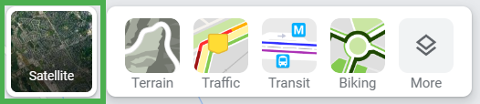
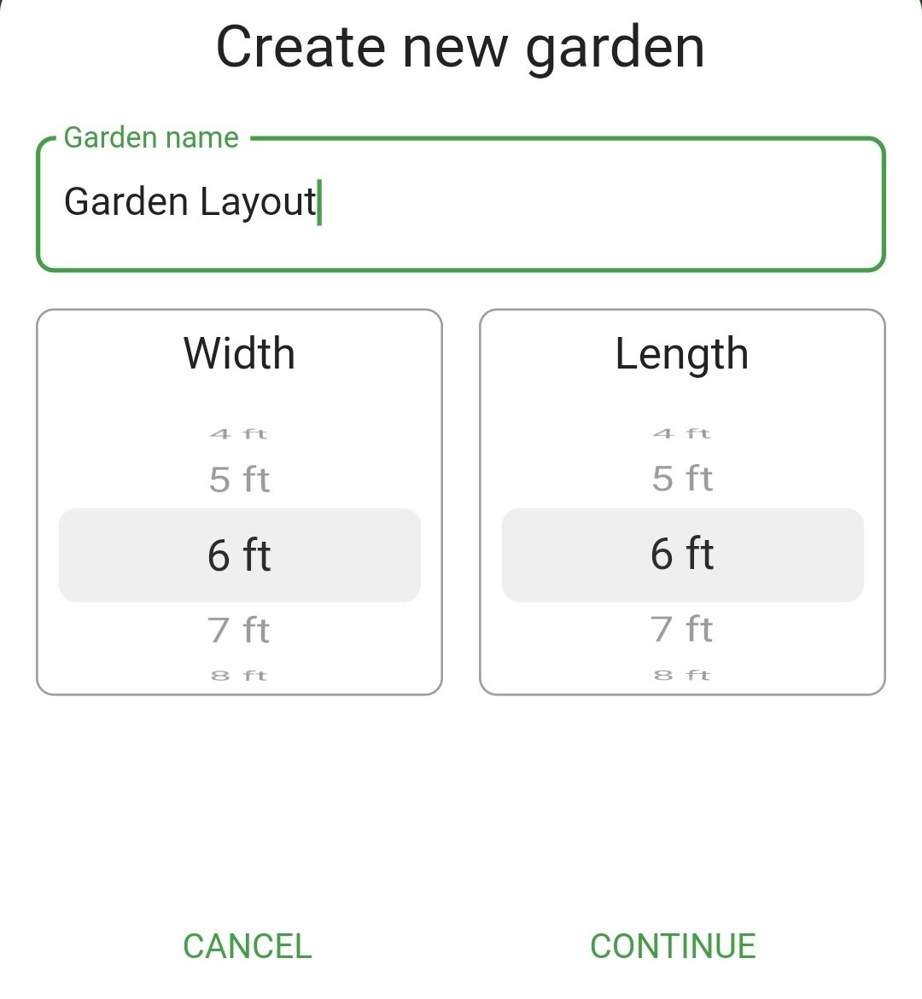
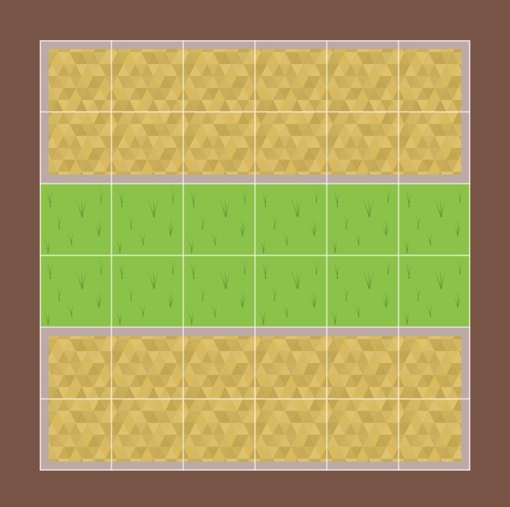
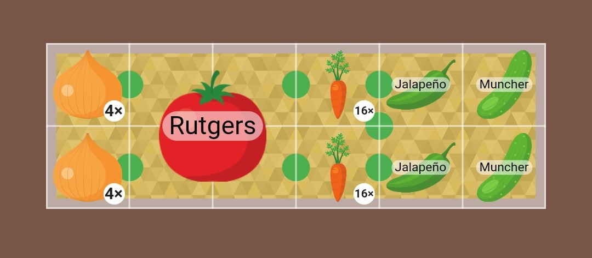

+++
draft = false
title = "How to Plan a Veggie Garden"
date = 2023-03-19T19:12:46.916Z
author = "Erin Thomson"
weight = 5

[cover]
relative = true
linkFullImages = true
image = "veggie-garden.jpg"
alt = "Swiss chard and other plants in a veggie garden"
caption = "A productive veggie garden starts with a plan!"
+++
Are you starting your first veggie garden this year? Or are you an avid gardener that just doesn’t like to plan? No matter your experience level, it's important to start the gardening season off right with a garden plan. Creating a garden plan will save you from having to find spots to cram in all your plants after a spontaneous trip to the garden center (not that we’ve ever done that…😅)

### Measure your garden space

To create a garden plan the first step is to understand how much garden space you have to work with. Usually this involves measuring your garden space with a [long tape measure](https://www.amazon.com/AmazonBasics-Open-Reel-Fiberglass-Measure/dp/B07TGWZMVW/ref=sr_1_7?crid=2NVJCGSYWQSF7). But garden planning often starts in winter, and if you live in a cold region the idea of trouncing around in the snow with a tape measure might not appeal! Instead of waiting for spring, use [Google Maps](https://www.google.com/maps) to estimate the size of your garden space:

1. Look up the address on Google Maps
2. Hover over the “Layers” tile in the lower-left corner then click ‘Satellite’

3. Use the **+** button in the lower right corner to zoom in as much as possible
4. Right click on one corner of your garden space then select ‘measure distance’
5. Click on another corner of the garden and make note of this measurement
6. Click X in the pop up window at the bottom and repeat these steps to measure the other side (length or width)

After doing this you’ll have two measurements to work with- your garden length and width. Since this is an estimate, you may want to shave a few feet off each side to ensure your garden plan will ultimately fit into the space.

Before investing in materials and building new beds it's still a good idea to get out there with a tape measure to confirm your estimates (after the snow melts!)

### Plan your garden bed locations

Once you know how much space you’re working with, you can start planning where your garden beds will go.

Plug your garden measurements into [Planter](https://planter.garden/) to start visualizing your garden bed layout. For the best performance, we suggest creating one garden to plan your garden layout then creating separate gardens for each bed to add plants.

*(Garden customizations and the ability to create multiple gardens are [Premium features](https://info.planter.garden/account/premium-subscription/))*

A few things to think about when deciding where to place your garden beds:

* **Sunlight:** most veggie plants need full sun to grow properly, so it's important to note which parts of the garden get full sun. If you haven’t already mapped the sun in your garden in the summer, try [Shademap.app](https://shademap.app/). Enter your garden address and pick a summer day to simulate the sun and shade from dawn to dusk.
* **Access and pathways:** make sure the size of the garden beds will be comfortable to reach across for working and harvesting and leave enough space between beds to walk with tools and a wheelbarrow.
* **Vertical structures:** some crops, such as pole beans and peas, indeterminate tomatoes, and cucumbers, perform best when grown vertically. Think about where you’ll place trellises and other structures, and how they could cast shade on your plants (this shade may be desirable or undesirable depending on the plant).
* **Drainage:** if there are areas of your garden where you know the soil stays soggy most of the time, you might want to avoid placing garden beds there or plan on building raised beds.

### Decide which plants to grow

Now that you’ve planned your garden bed layout it's time for the fun part– picking the plants you want to grow! To decide which plants to grow ask yourself a few questions:

* **What veggies do you and your family like to eat?** If you grow veggies that you don’t end up eating that often, your gardening efforts might end up going to waste.
* **What grows well in your area?** Review the **[How to Grow](https://info.planter.garden/plant-information/how-to-grow/)** information in [Planter](https://planter.garden/) to see which plants you’ll need to start indoors (or buy from a garden center) and to get a sense of which plants will grow well in your climate.
* **What plants are space and cost efficient?** If you have a small garden, growing large pumpkin plants might not be a good use of space. Consider growing premium lettuces, dwarf tomatoes, and herbs that will produce a worthwhile harvest in a small space.
* **Are the plants perennials?** Perennial plants that come back every year need to be selected and placed thoughtfully to make sure they’ll have the right growing conditions and enough space to reach their full size.

If you haven’t created your garden plan for this year yet, now is the time! A successful garden starts with a solid garden plan, and [Planter](https://planter.garden/) makes garden *planning* as fun as *planting*!

