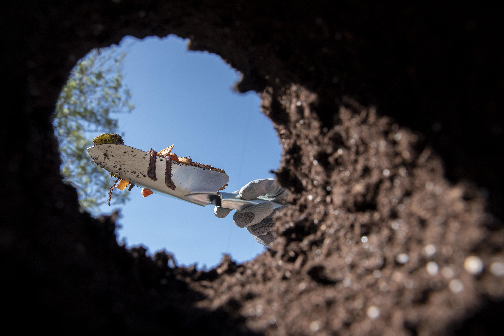

+++
draft = true
title = "How to Plant Trees and Shrubs in Your Garden"
slug = "plant-trees-shrubs"
date = 2023-06-12T10:00:31.021Z
author = "Jessalyn Krenicki"
weight = 5

[cover]
relative = true
image = "man-plating-ground-small-tree.jpg"
alt = "Gardener comparing tree to hole"
+++
Planting a tree or a shrub can be a long-term commitment, but it can be a great way to expand your gardening horizons. Once planted and mature, though, your new plant (or plants) will offer up harvests for years to come and bring environmental benefits as well. 

### Location, Location (and Time, too!)

Where you plant your tree is very important, because it will dictate both what you can plant there as well as how well it will do there. Your climate is the primary concern, however you may want to consider certain trees over others depending on variables such as size. A large tree will need room away from things like buildings so that it can put out a good root system. Similarly, different shrubs and trees will have different light needs. Your soil may led itself to certain plants better than others, depending on its nutrients or pH. All of these are important factors to consider when you're looking to introduce a major new addition to your garden!

Tree in hand, it's important to choose the right time to plant. The best time to plant is during dormant seasons: after leaves fall in autumn, or before buds emerge in spring, while the weather is cool. Certainly not in the summer- the amount of sun will promote growth of leaves, while a new transplant needs to invest in a strong root system first!

**Make sure you know what is under the ground before digging!** There may be underground utilities that you do not want to bother. If you live in the US, you can call 811; that's our national call-before-you-dig number.

### The Plant for You

Make sure to research the type of plant you’re hoping to grow. Fruiting plants may need to be planted in pairs, if they are not self-fertilizing, but some varieties don’t need a partner in order to produce fruit. Depending on the area you have for it as well, you may prefer a dwarf variety, or if you're hoping to plant some sun-sensitive plants in a few years you might be looking for a large tree to provide shade.

### Now We Prepare!

It's important to prepare the planting area to avoid transplant shock, which can occur due to root damage

* Rake away ground cover like mulch and leaf litter
* Dig a hole 2-3 times wider than the root ball or container, and as deep. 
* If the tree or shrub roots have a covering of some kind, make sure to remove it! It can restrict root growth very severely if you leave that on.
* Carefully shake off excess dirt from the plant, and if there's any circling roots you can carefully straighten them out. Plants container-grown are particularly prone to becoming rootbound, so be sure to pay special attention to such plants.

### Time to Plant

* When you lower your plant into the hole, make sure to hold it by the root ball, not the stem or branches.
* Make sure the top of the root ball (for shrubs) or the trunk flare (for trees, the place where the trunk flares out at the base of the tree) is not beneath the soil- it should be at around the same height as the soil. You can fill in or dig out the hole more if necessary to make sure!
* Before you fill in the hole with your new green neighbor, make sure that it's just the way you'd like it. Make sure it's straight, and its best side is facing the way it will be most often viewed!
* Finally, fill in the hole, making sure to lightly pack down the dirt to make sure of not too many air pockets.  If the root ball is visible once the dirt is filled in, you can taper soil up to cover it, but you should not bury a tree flare at all!
* You shouldn't fertilize at this point- a newly transplanted plant may have damaged roots, which can be burned by fertilizer. Similarly, adding anything but the soil you dug out to the hole as you fill it in can cause drainage problems.
* If you need to stake, a 3-stake system is ideal! However, unstaked plants will develop stronger root systems and trunks to support themselves, so think carefully whether your new addition needs it!

### Maintaining Your New Addition

* Water thoroughly once the soil is all in place, then **keep the soil moist** with at least a weekly soak. Be sure to water more often in hot weather, and less often in cold weather. It may need a lot of water to fully soak; soaker hoses can be very useful for this! It's very important that you don't let your new plant dry out until it's fully established.
* Mulch is a great addition for these plants- a couple inches of bark mulch can help to stop too much water from evaporating, control weed growth, and insulate the soil.
* Monitor your plant. While there may not be a lot of growth up top (which is exactly what we want), the leaves will still tell you plenty about the plant's water needs, which is the most important thing to watch for after transplanting. If leaves are going brown or crispy and start to fall off, increase the watering; if leaves are limp or yellow, decrease the watering.

Remember, planting trees and shrubs is a long-term commitment. Ensure your leafy companions thrive by providing proper care and maintenance. Keep a close eye on their growth, water them regularly, and give them a trim as needed. By following these essential tree and shrub care practices, your green beauties will flourish and bring beauty to your garden for years to come. Happy planting!