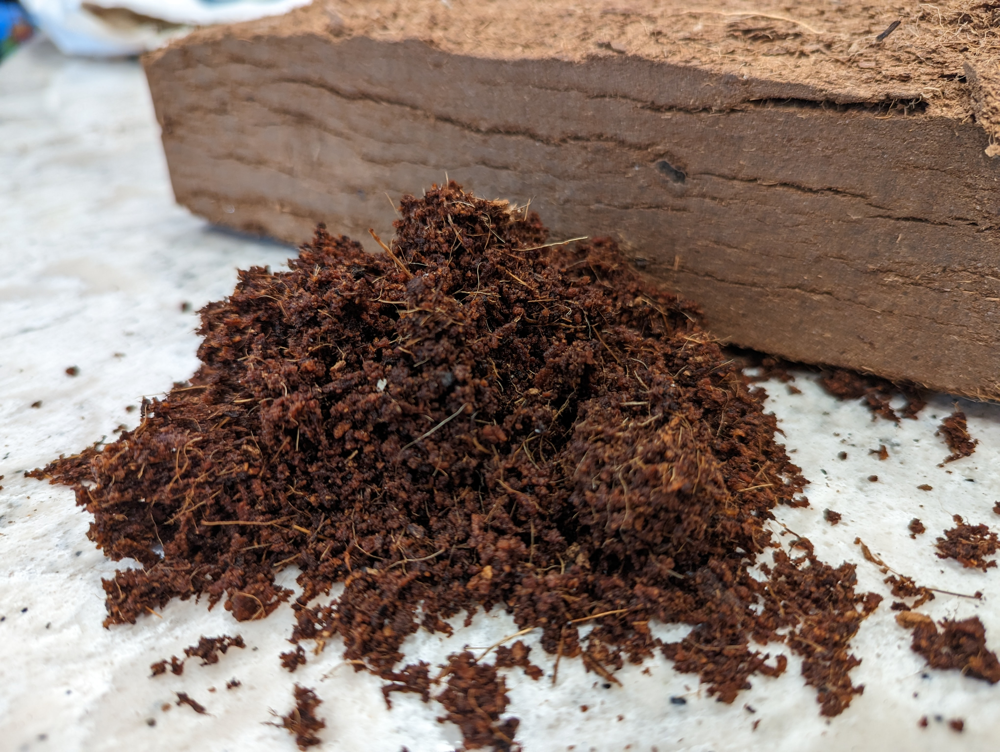

+++
draft = true
title = "Peat Moss - Good or bad?"
date = 2023-03-24T12:23:06.690Z
author = "Peter Keefe"
weight = 5

[cover]
relative = true
image = "sphagnum_divinum_158671021.jpg"
alt = "Green shovel in garden soil"
caption = "Live sphagnum moss. Marcel Hospers, [CC BY-SA 4.0](https://creativecommons.org/licenses/by-sa/4.0), via Wikimedia Commons"
+++
Peat moss has been getting a bad reputation lately, due to its environmental impact. But is it really that bad? Let's explore this question, and you may learn that it's not as simple as you thought.\
\
But first, what is peat and where does it come from?

## Peat Moss

**Peat** is partially decomposed organic matter that forms in wetlands. It is made up of mosses, sedges (think tall grasses), and other plants that have died and accumulated over time. Peat is a dark, brown or black material that is often used as a soil amendment.

 and peat moss (right)")

To make things confusing, there is also **sphagnum moss**. Adding to the confusion, sometimes peat moss is referred to as sphagnum peat moss 🤯. Both sphagnum moss and peat moss begin life the same way, from the same plant. Sphagnum moss is simply the living top layer of moss from peatlands. It is then dried out and sold without much more processing. On the other hand, peat moss is sourced from the lower, dead layers. It is then ground up into finer particles and is typically sold in compressed bags.\
\
**Peatlands**, or peat bogs, are a type of wetland that are home to a variety of plants and animals. They also play an important role in the water cycle. Peatlands store massive amounts of carbon, so when peatlands are drained for agriculture or development, the peat decomposes and releases carbon dioxide into the atmosphere. This contributes to climate change.

**So peat moss is terrible and we should never use it...**

Not quite! It depends ***where*** your peat comes from. Most of the bad rap for peat comes from the peat bogs in the UK, where peat bogs are being depleted at an alarming rate. However, peat moss that is harvested from Canada, which is what you'll find at stores in the United States, is replenished at a rate higher than it is harvested, so it is actually a renewable resource. And according to the Canadian Sphagnum Peat Moss Association (CSPMA), they are working to restore peatlands that have been damaged by harvesting. The CSPMA also claims to be educating the public about the importance of peatlands and how to protect them. As with any industry group, you'd be right to be skeptical of these claims. However, the claim that Canadian peat moss is renewable is backed up by ***independent studies LINK***.

## Coconut Coir

Coconut coir has been touted as a sustainable alternative to peat moss. It is a byproduct from the husks of coconuts. Like peat, coconut coir is also a good soil amendment, as it is absorbent and helps to retain water. However, coconut coir is also not without its environmental impact. The production of coconut coir can be energy-intensive. Additionally, the transportation of coconut coir from the tropics to your doorstep can also have a significant environmental impact.

## Benefits in the garden

When choosing between peat moss and coconut coir, it is important to consider the following factors:

* Cost: Peat moss is generally more expensive than coconut coir.
* Environmental impact: Peat moss has a greater environmental impact than coconut coir.
* Availability: Peat moss is more widely available than coconut coir.
* Use: Peat moss is better suited for seed starting and raised garden beds, while coconut coir is better suited for potting soil.

Here are some tips for using peat moss and coconut coir in your garden:

* Use peat moss in seed starting mix to help provide a moist, acidic environment for seeds to germinate.
* Use coconut coir in raised garden beds to help improve drainage and aeration.
* Use peat moss or coconut coir in potting soil to help provide a moist, well-drained environment for plants.

## Which to choose?

So, is coconut coir really a better alternative to peat moss? The answer is complicated. Coconut coir does have some environmental benefits, but it also has some environmental drawbacks. Ultimately, the answer depends where your peat comes from.