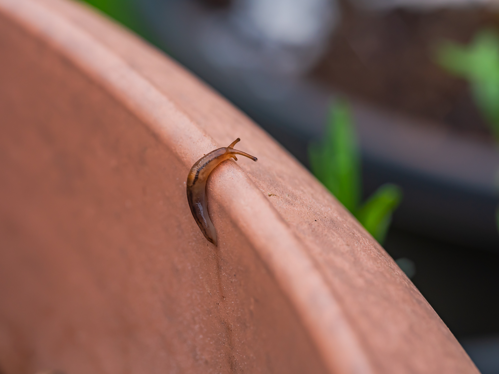
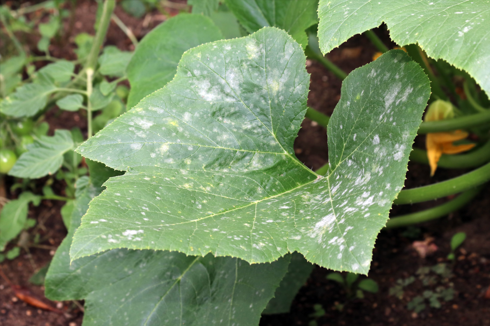

+++
draft = true
title = "Pests and Diseases to Watch Out For (in Fall!)"
slug = "pests-fall-2023"
date = 2023-09-25T01:18:54.417Z
author = "Erin Thomson"

[cover]
relative = false
image = "magnifying-glass-bean-plant.jpg"
caption = "A hand holding a magnifying glass in front of a bean plant leaf"
+++
In some ways growing a fall garden can be easier than a summer garden. Extremes of heat, and drought often give way to more moderate conditions (that is, until frosty weather hits!) While some pests and diseases are less problematic in fall, there are some that can become more active. With time in the growing season running short, you might not have time to replant plants that succumb to pests and diseases. So even if you’re not out in the garden watering every day be sure to get out there to keep an eye out for these fall garden pests!

### Squirrels

Squirrels become extra active garden thieves in fall as they’re on a mission to store food for winter. While they’re well-known for smuggling nuts, seeds, and fruits, squirrels will also nibble on many fruiting crops and can dig around and damage newly planted seeds and seedlings. There might be some level of squirrel damage that is tolerable but if you tend to take heavy harvest losses from squirrels you’ll need to take action. There are edible-garden safe [repellent sprays](https://www.amazon.com/Bonide-REPELS-ALL-Animal-Repellent-Sprayer/) available that can keep squirrels at bay. You can also try sprinkling cayenne pepper around your plants and in your bird feeder (if you have one) as the spice will deter squirrels- just be sure not to dust it directly on a plant you’re about to eat! If all else fails, you might need to resort to building a squirrel-proof enclosure out of sturdy chicken wire- for inspiration check out this post on building a [rabbit (/squirrel) proof fence](https://blog.planter.garden/posts/garden-fence/).

### Slugs

Slugs are a garden pest that can make a season-round appearance, however they prefer damp, cool conditions - so fall (and spring…and wet summers) are prime time for slugs. Slugs like to hide in the shade of plants and debris during the day and come out to feed at night. Because of this, one of the best ways to control slugs in the garden is to remove potential hiding spots- clear away excess mulch, remove plant debris, and stay on top of pruning. To go on the anti-slug offensive you can either get out there at night with a flashlight to handpick slugs off plants, or leave a trap of damp boards or newspaper and remove any slugs hiding underneath in the morning.

### Winter Cutworms

While there are many types of cutworms that can be active in other times of the year, particularly spring, the winter cutworm larvae can be found feeding into late fall and warmer parts of winter. Like other cutworms, winter cutworms literally cut down the base of the plants they feed on (smaller plants are most susceptible), and they can move up the plant and defoliate it as well. Prevention is the best medicine for cutworms- be sure to keep your fall garden clear of weeds and debris that could provide enticing hiding spots for cutworms. If you happen to find cutworm larvae, squish or drown it (it can be hard to spot as they hide in the soil during the day). While no-till gardening methods have risen in popularity, if you’re having an especially hard time with cutworms you may want to consider tilling the soil to help kill larvae. Using bacillus thuringiensis may also help to control cutworms (along with other caterpillar pests). 

### Grubs

Grubs are usually thought of as a lawn pest, but did you know they can also attack your veggie garden? Grubs are the larvae of several insects such as Japanese beetles and June bugs, which can be equally destructive in their adult form. Grubs tend to be most active in spring and fall whereas beetles tend to be more active in summer. Grubs usually feed on plant roots, resulting in stunted growth and death, although they can feed above ground as well. If you’re seeing birds or animals digging in specific parts of your garden as well as struggling plants, you might have a grub infestation. Before treating for grubs, dig up a test patch in the area to see if several grubs are present. If there is a significant grub population, consider applying beneficial nematodes or Bacillus thuringiensis products designed for grub control (just double check that any product you select is safe for use in veggie gardens).

### Mildew

Downy and powdery mildew are both plant diseases that can flourish in cool, humid environments. While the names sound similar, they are different pathogens and they look quite different. Downy mildew is a ‘water mold disease’ that can easily be confused with a nutrient deficiency or a viral disease. First, a gray-ish fuzz may appear on the undersides of the leaves. As the disease progresses more noticeable yellow spots will appear on the upper leaf surface, often with black flecks on the underside. Eventually the leaves and flowers can die off. Powdery mildew looks like a white powder spread in circular spots on the leaf surfaces. Affected leaves can eventually turn yellow and wilt. While it’s not as immediately destructive as downy mildew, powdery mildew can stunt the plant and dramatically reduce yields. Similar to blight, it’s best to use preventative measures to try to avoid or at least slow the progression of downy and powdery mildew. Ensure your plants are grown in sunny locations with proper spacing and good airflow, and try to avoid splashing water on the leaves when watering. If a plant is afflicted, remove affected leaves where possible.

Don’t take your eye off the ball in your fall garden! Even if you’re not watering and harvesting as regularly as in summer, be sure to keep an eye out for these and other fall pests and take action as soon as you spot them to protect your precious fall harvests!

