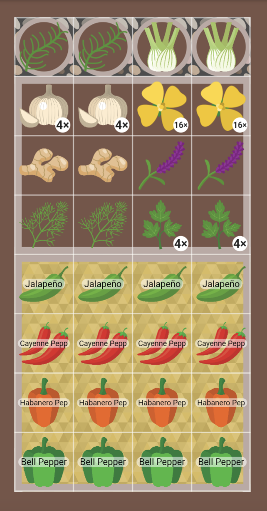
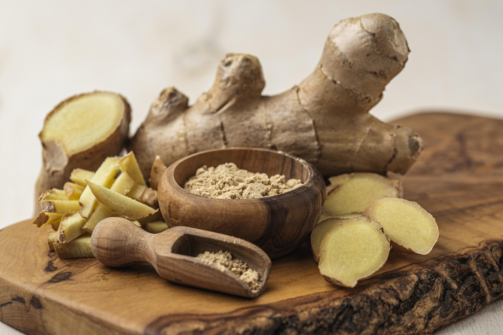
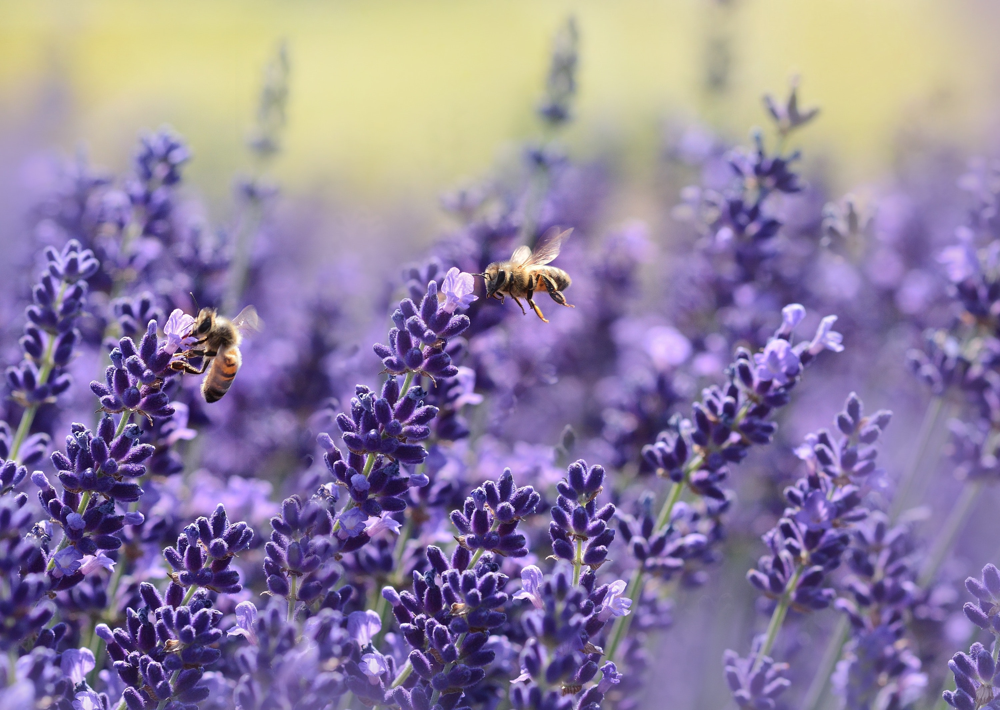

+++
draft = true
title = "Plan Your Spice Garden"
slug = "spice-garden"
date = 2023-12-30T11:00:39.723Z
author = "Jessalyn Krenicki"
plants = ["Cilantro", "Fennel", "Ginger", "Peppers", "Mustard", "Garlic", "Rosemary", "Lavender", "Dill"]
series = ["Plan Your Garden"]
tags = ["planning"]

[cover]
relative = false
image = "spices-herbs-large-assortment-spices-indian-cuisine-wooden-table-top-view-free-space-text.jpg"
+++
### What Exactly are Spices?

In broad terms, both herbs and spices come from plants, but herbs are usually the fresh leaves. On the other hand, spices are typically dried, and they make use of many other parts of the plant- root, stalk, seed or fruit. Both herbs and spices add flavor to the dish, however herbs are more subtle while spices have a much stronger flavor. 

### [Plan Your Garden with Planter!](https://planter.garden/)

This time, we're growing a plan centered around spices! This plan is pretty pepper-heavy, simply because of how useful and diverse they are; as usual, this plan is not an exhaustive list of spices, only a suggestion! 

If you're ever looking to grow a spice that isn't present in Planter, you can add custom plants through the app, or as a premium desktop member! [You can find more information about that by clicking here!](https://info.planter.garden/plant-information/create-plants/)

Companion/Combative Info

* Onions, while not featured in this post, are a great companion plant to peppers (which make up a large part of our example garden!) Peppers are particularly prone to aphids, and are protected by the pungence of onions and shallots!
* Fennel and dill will play just fine together normally, but if you are looking to harvest the *seeds*, you might want to give them some healthy space. Some accidental cross-pollinating can cause some strange flavors in both.
* Fennel shouldn't be planted by peppers- it releases chemicals in the soil to inhibit the growth of competing plants, so your peppers will pay the price. In this plan, we put them in a container of their own to ensure they don't cause any trouble! [If you'd like to learn how to customize your garden view like this, click here!](https://info.planter.garden/garden/customize/)

### Commonly used spices:

#### Coriander

The seed of the cilantro plant, which is also used as an herb! These seeds are often used in a variety of cultures, including Indian and Middle Eastern cuisines. Their mild flavor is put to good work alongside other spices in curries, masala, soups, or even pickles. Heating the seeds before using them will bring out their flavor, so be sure to toast them before grinding them up!

When your plant bolts, let it dry out, and then the coriander should be easy to shake from the seed head!

#### Fennel

Fennel is used usually as a root veggie, but you can also grow it for the seeds and use them as a spice! 

Raw fennel seeds have a fresh licorice flavor, but bringing heat to the table sparks brand new flavors. When they're cooked, the seeds offer a more sweet and caramelized flavor. These work well as an interesting sweetener for soups, broths, or oils; all you have to do is simmer them in the dish and strain. When ground, they can be a great rub on meats, particularly pork or lamb.

#### Ginger

Ginger, like many on this list, is a strong and showy participant in dishes! You have to be very careful about how much you use, but its warm flavor compliments many sweet or savory dishes. Try it ground in baked dishes like cookies gingerbread, add it to broth for a delicious ginger noodle soup, or add it to marinades for fish or chicken. No matter how it's used, it will often take the show due to its strong and bright sweetness. My personal favorite salad dressing is made of carrot and ginger, and is a staple in most hibachi restaurants. This root can also be candied for an explosively spicy-sweet treat!

#### Peppers

Chili peppers and the like can be considered a spice! When dried, their spiciness takes a whole new level.

Paprika and Cayenne are both made from powdered, dried peppers. However, their spiciness levels are leagues apart- paprika is made with mild peppers like bells, and isn't very flavorful by itself, but when smoked it can be a great pairing to tomatoes or meat. On the other hand, Cayenne uses much hotter peppers, and should be used MUCH more sparingly, with care not to touch your face or eyes!

#### Mustard seed

Did you know- mustard seed is the largest selling spice in the world? It's included in so many household condiments and pickled foods! 

You can grind up the seeds with vinegar or oil to make your own mustard (the condiment), or you can roast the seeds to bring out earthier flavors and rub them into chicken or fish! It's also key in pickling, and an essential ingredient in relish. 

#### Garlic

Fresh or dried, powdered or minced or crushed, garlic is a very hearty powerful spice great in curry or most savory dishes. This spice is, dare I say, as useful as salt or pepper. After all, what *can't* you use garlic in? It's a staple in italian cuisine, incredible on any kind meat, and it's even good raw in salsa. Something I've seen done before that I really want to try is roasting the cloves (which makes them really sweet) and then spreading them on toast. The only downfall of this pice is its strength- it's very easy to go overboard.

#### Rosemary

Rosemary is sort of a grey area- while you typically use the leaves, like an herb, its woodiness would classify it as a spice just like bay leaves. Regardless, rosemary is a warm addition to many dishes. Make sure to mince the needles finely, as their woodiness makes them tough even after cooking.

You can make a rosemary butter that flavors steak, or rub it into rich meats like lamb... or you can bake it into bread (focassia is the popular choice) or even gnocchi. It pairs well with cheese, too, or lemonade. Its warm flavor and smell can add a new dimension to many different dishes, so don't be afraid to make use of it!

#### Lavender

Lavender is typically used an herb, but you can use the flowers, buds, or seeds as a spice! Seeds can be steeped in tea, or you can steep them in milk for lavender ice cream. The buds and flowers can be very powerful when dried, and their floral flavor naturally pairs well with sweet flavors and baked goods; however, lavender isn't a one-trick-pony! When paired with other herbs and spices, they can revolutionize tomato sauces or roasted potatoes.

#### Dill

These seeds are a key ingredient in an important process- Pickling! But that's not their only use. Unlike the leaves, dill seeds are enhanced by heat. Toasting these bundles of goodness brings out their flavor and aroma, and they make a good substitute for caraway in breads. Alongside spices like pepper, onion, and garlic, ground dill seed also makes a great rub for pork or steak!

### In Conclusion...

Cultivating a spice garden is a delightful journey that brings a spectrum of flavors to your fingertips. From the mild allure of coriander to the bold zest of peppers, each spice adds its unique character to culinary creations. Let your spice garden be a testament to your culinary taste, turning every meal into a celebration of your harvest and the rich tapestry of spices you've nurtured. And let [Planter](https://planter.garden/) be your planning companion, so your garden ideas grow to fruition! Happy growing and savoring!