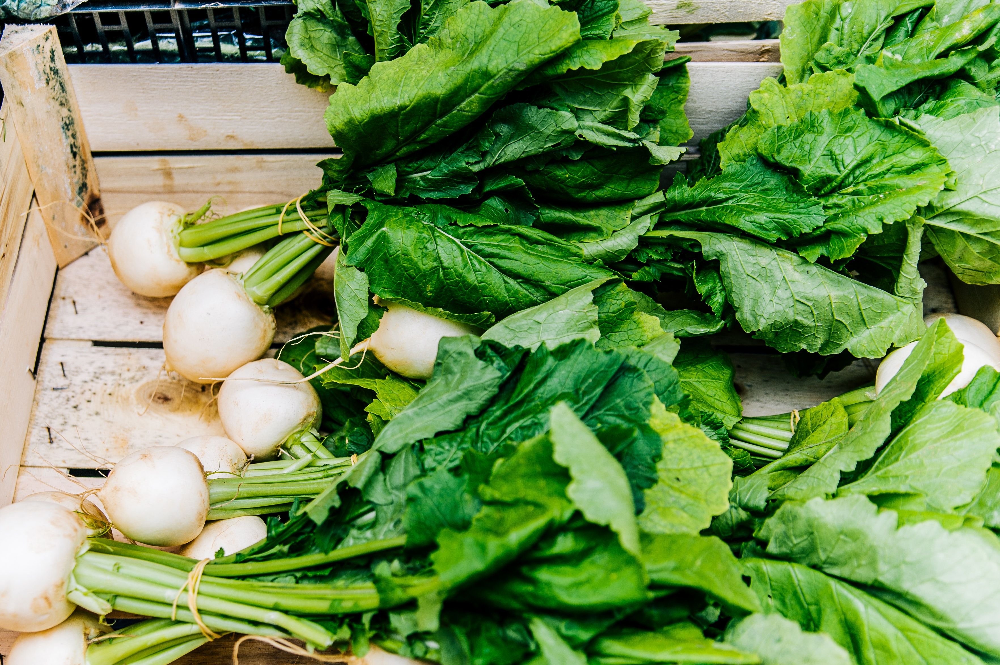

+++
draft = true
title = "What Can I Plant in Early Fall?"
slug = "plant-in-early-fall"
date = 2023-08-28T00:19:41.645Z
author = "Erin Thomson"
plants = ["Spinach", "Kale", "Radishes", "Lettuce", "Arugula", "Bok choy", "Turnip"]
series = ["Plant Picks"]
weight = 5

[cover]
relative = true
image = "what-to-plant-in-fall.png"
alt = "A collage of plant images"
+++
As back-to-school approaches it can feel like planting the garden was all but a distant memory. But with the cooler temps comes a whole new potential garden season. While some plants like broccoli and cabbage commonly need to be started in the summer to be ready in time for a fall harvest, there are still plenty of plants you can start growing in early fall! Of course what you can plant in early fall depends on your location, so as a first stop be sure to check the [Calendar](https://planter.garden/calendar) in Planter to see which plants can be grown now in your local area. This article covers a few favorite, cold-hardy crops that can be planted in early fall.

### Spinach

Considering spinach is often harvested for its tender baby leaves, it’s amazing just how cold-hardy it is. Depending on the conditions, spinach can still be going strong with minimal frost protection and snow on the ground! With added protection, some cold-climate gardeners are even able to overwinter spinach for harvests right through winter and into the following spring. Spinach is also a super fast-growing crop that can be ready to harvest in as little as 35 days- so even if you don’t feel like using season extension techniques you can still get a solid fall crop of spinach. And as the weather cools down there is less risk of your spinach [bolting](https://blog.planter.garden/posts/plant-bolting-a-seedy-situation/), meaning you can get a prolonged harvest if you only pick the outermost leaves. 

### Kale

Kale is about as cold-hardy as plants come, which makes it a potential candidate for early fall sowing. That being said, like most every plant kale’s growth will slow to almost a standstill once the temperatures approach freezing. To get a fall (and potentially winter!) harvest of kale you’ll need at least 55 days for the plants to reach maturity. If you don’t have that long left in your growing season, you still have options to grow kale. You can look for pre-started kale transplants at your local garden center (although they might be hard to come by), or you can seed intensively and harvest [baby kale](https://blog.planter.garden/posts/spice-up-your-salad/#baby-kale) leaves as a delicious delicacy!

### Radishes

Radishes are a classic crop for fall planting as they grow so quickly and are also quite cold-hardy. Radishes can reach maturity in as little as 25 days, meaning you can keep on planting [successions](https://blog.planter.garden/posts/succession-planting-for-nonstop-harvests/) of radishes almost right to the bitter end of your growing season. Radishes grown in cooler weather tend to be less spicy than their summer-grown counterparts so if you’re not a fan of the typical radish bite you might like fall (and spring) grown radishes. If your radishes do not bulb up as your first frost date approaches you can also harvest them for their green tops, which can be cooked up in stir-frys and soups. If you’re after the radish greens you will want to pull your radishes before frost comes or otherwise use season extension techniques to protect them as the greens do tend to get droopy with the frost.

### Lettuce

While lettuce does not at all enjoy the heat of summer, it's good to plan for multiple plantings of lettuce throughout the growing season (this is called [succession sowing](https://blog.planter.garden/posts/succession-planting-for-nonstop-harvests/)). Lettuce is generally a quick-growing crop, especially if you are growing it as [cut-and-come-again](https://blog.planter.garden/posts/harvesting-how-to-and-when/#how-to-harvest-lettuce) lettuce rather than full lettuce heads. Lettuce planted in the summer may need a little TLC to produce a harvest. [Shade cloth](https://www.amazon.com/s?k=shade+cloth) can help block out too much searing heat from the sun, and consistent watering can help to avoid stress to the plant that could accelerate [bolting](https://blog.planter.garden/posts/plant-bolting-a-seedy-situation/). And once cooler temperatures hit, your lettuce crop will be even more prolific!

### Arugula

Also known as rocket or rucola, arugula is a delicate leafy green that packs a peppery punch. If you don’t mind salad with a kick you can use arugula as the sole green, but it also makes a great addition to mesclun mix where its spiciness is balanced out with lettuce and milder greens. Or, skip the salad and sprinkle it on top of homemade pizza or sandwiches for a gourmet touch! Arugula can tend to [bolt](https://blog.planter.garden/posts/plant-bolting-a-seedy-situation/) easily so be sure to keep it well-watered to avoid drought stress, and consider sowing in regular successions to be able to continue harvesting throughout the season.

### Bok Choy

### Hakurei turnips

Thinking about turnip might conjure up memories of mushy puree served exclusively over the holidays. But you might not know that there are some types of turnips that are deliciously sweet, crispy, and can be eaten raw or cooked. ‘Hakurei turnips’ are a farmer’s market favorite that are super easy to grow. They look like a jumbo-size white radish, and grow similarly to radishes, but the taste is fresh and juicy without any of the signature radish kick (radish haters love them!) The greens are also excellent for stir-frying. Even if adding turnips to your garden has never crossed your mind, be sure to give hakurei a try!