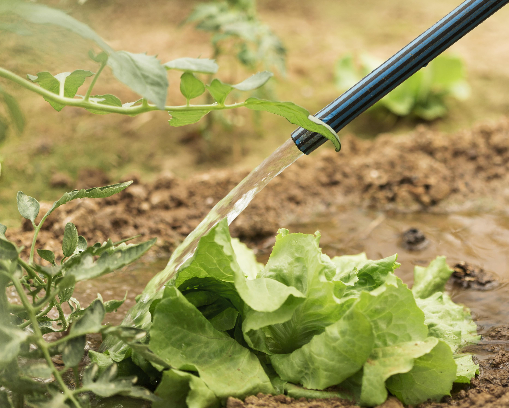
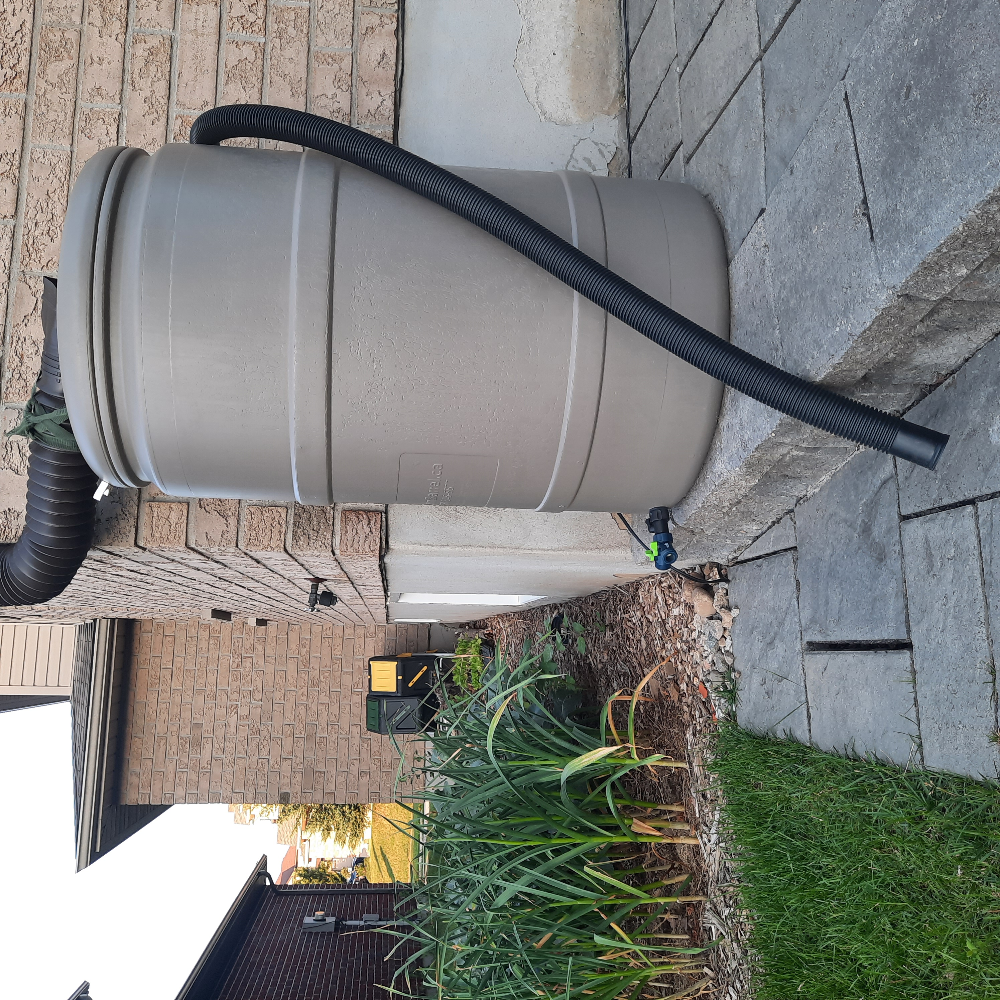

+++
draft = false
title = "Rainwater Harvesting for Veggie Gardens"
slug = "rainwater-harvesting"
date = 2023-07-07T23:49:45.478Z
author = "Erin Thomson"
weight = 5

[cover]
relative = true
image = "rain-hand.jpg"
alt = "Raindrops being caught in an open hand"
+++
Summertime often brings feast-or-famine rain patterns that can be frustrating for us gardeners. For weeks there’s not a drop of rain to be had and then a month’s worth of rain gushes down in a few days. Rather than just hooking up to the tap every time you need to water your veggies, you might want to consider harvesting rainwater to use in the garden. Rainwater harvesting can be beneficial for your plants, your wallet, and your local water supply- but before you install a rain barrel there are some important considerations to bear in mind.

### Why harvest rainwater?

Harvesting rainwater to use in the garden can offer several benefits. First, it's economical- instead of paying to use city water, using rainwater is free once you have your system installed. Some cities may even offer stormwater rebates on your water bill if you have a rain barrel- as collecting rainwater helps to divert stormwater runoff. Harvesting rainwater can also be environmentally-friendly, as it saves precious treated water that can be better used for drinking, cooking, and bathing. And rainwater is ideal for plants as it is naturally soft, has a slightly acidic PH that plants appreciate (unless its acid rain), and doesn’t contain water treatment by-products. 

If your region has outdoor watering restrictions in the summertime, harvesting rainwater can help ensure your plants still get the water they need. But be aware that in some regions where rain is especially scarce there can be rules that limit or prohibit harvesting rainwater. It's important to fully understand the regulations that apply in your area before getting started.

### Is it safe to use water from a rain barrel on edible plants?

There is not a clear-cut answer as to whether it is safe to use collected rainwater on edible plants. Some sources recommend avoiding the use of water from rain barrels on edible plants, while others consider it to be generally safe with some precautions.

The two primary potential safety concerns when it comes to using collected rainwater on edible plants are pollutants and bacteria. Pollutants can be accumulated as the water runs along the roof of your house, potentially picking up chemicals used in the roofing materials. Bacteria such as *E. coli* can also be picked up if there are bird or other animal droppings on the roof.

The Washington State Department of Ecology looked at pollutant levels in rainwater runoff from various types of roofing materials ([study link](https://apps.ecology.wa.gov/publications/documents/1403033.pdf)). The study wasn’t specific to collecting rainwater for a veggie garden; it was concerned with levels of contaminants that could be entering the environment. It found that some types of roofing materials released elevated levels of pollutants into the rainwater runoff while others did not. It also noted that the age of the roofing materials could impact the levels of pollutants released over time. So before collecting rainwater from your roof you may want to check the type of roof you have and consider its age.

Rutgers University specifically looked at the question of whether it is safe to use rainwater from asphalt shingle roofs for vegetable gardens, considering both pollutants and bacteria ([study link](https://njaes.rutgers.edu/fs1218/)). This study concluded that “...rain barrel water can be safely utilized to irrigate a vegetable/herb garden. Pathogen treatment should be conducted and best practices utilized when applying the water.”

Be sure to review research from several reputable sources for yourself before deciding whether you’re comfortable with using water from a rain barrel on your edible plants. Also be aware that local regulations may limit the use of harvested rainwater for irrigation at school or community gardens, or gardens where the produce will be sold.

There are several precautions that you should consider taking if you do choose to use harvested rainwater on your veggies:

* The “first flush” of rainwater after a dry spell can be the most contaminated- you may want to empty it out and discard it or use it on ornamental plants
* Add ⅛teaspoon of bleach per gallon of water once a month, or more often if there are frequent rains, then wait 24 hours before using it to irrigate (recommendation per Rutgers University)
* Consider testing your rain barrel water for *E. coli*
* Water the soil and not the plant itself (this is a good practice anyways to help prevent plant disease)
* Do not harvest produce immediately after watering
* Most importantly, always wash garden produce thoroughly before eating it!

If you decide not to use rainwater on your edible plants, It’s still worth installing a rain barrel to water your ornamental plants.

### How to collect and use rainwater

To set-up a rain barrel you’ll first need to identify a good location for the barrel. You’ll want to place it on firm, level ground by a downspout close to where you’ll use the water. Some rain barrels can be connected together so when one fills up the water will divert into a second or third barrel- if you want to go this route be sure the site has enough space for multiple barrels. You’ll also want to consider where to divert overflow from the barrel so it doesn’t pool near your house foundation.

Then you’ll need to select a barrel. There are many different sizes and styles of barrels. Consult your local regulations to see if there are limits on how much rainwater you can collect and choose a barrel size accordingly. Your rain barrel should have a debris screen to filter out solid materials from the water- in some cases these are required by regulation. Some barrels can be opened from the top to allow for easy filling of a watering can, while others are fully enclosed.

There are many different ways to install a rain barrel but it will typically involve cutting (and potentially re-supporting) the downspout then attaching a flexible or rigid pipe that directs the water into the top of the barrel. Consult online video tutorials to find step-by-step instructions that are specific to the type of downspout and barrel you have. Be sure to have a clear plan and all the necessary materials before starting- you won’t want to leave the project half-finished then have a rainstorm hit!

Rain barrels work with gravity; the more full the barrel is the more quickly water will flow from the spigot at the bottom. The higher up the barrel the higher the flow rate will be- and the easier it will be to get a watering can under the spigot. Use concrete blocks or wood to build a strong, solid platform to raise the barrel up, or buy a ready-made rain barrel stand. Using an additional water pump or purchasing a barrel with a built-in pump can help to get more water pressure from the barrel especially when the water level is low.

To make use of water from a rain barrel you can use a watering can or a gravity-fed drip irrigation system that is specifically designed for the low water pressure from a rain-barrel. If you have a water pump you may be able to use a sprinkler system with the barrel.

A note for those of us living in cold climates- before winter hits you’ll want to be sure to drain your rain barrel completely and store it in a garage or shed where it will not be exposed to temperature extremes that can cause cracking.

Using rainwater in your veggie garden is something that needs to be carefully researched and considered before diving in. There are many benefits to using rainwater but also some potential risks, and local regulations to keep in mind. Even if you decide to use rainwater strictly on ornamental plants, setting up a rainwater harvesting system can be a fun and rewarding project to use water more efficiently in the garden!