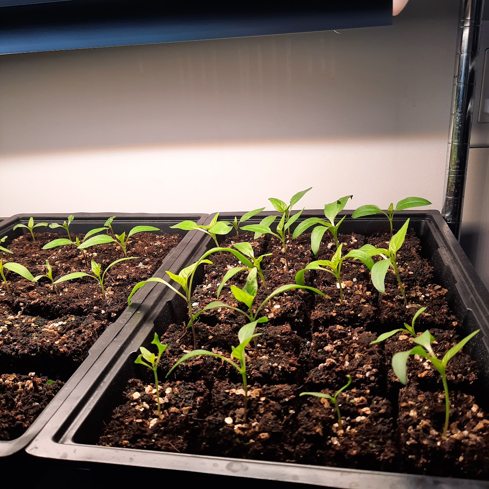
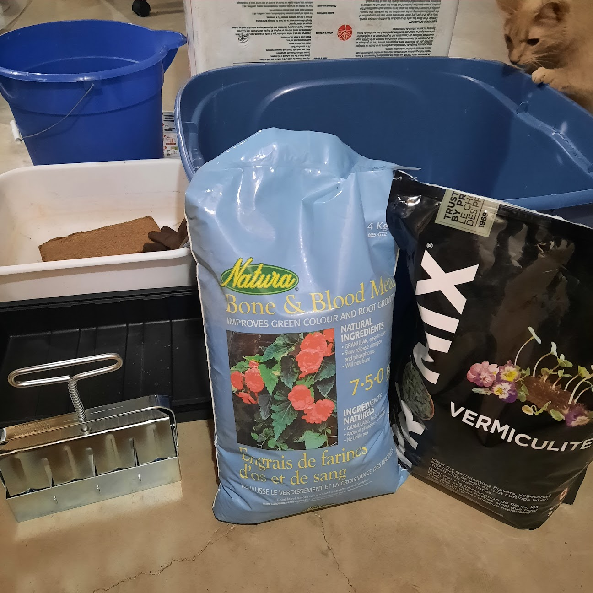
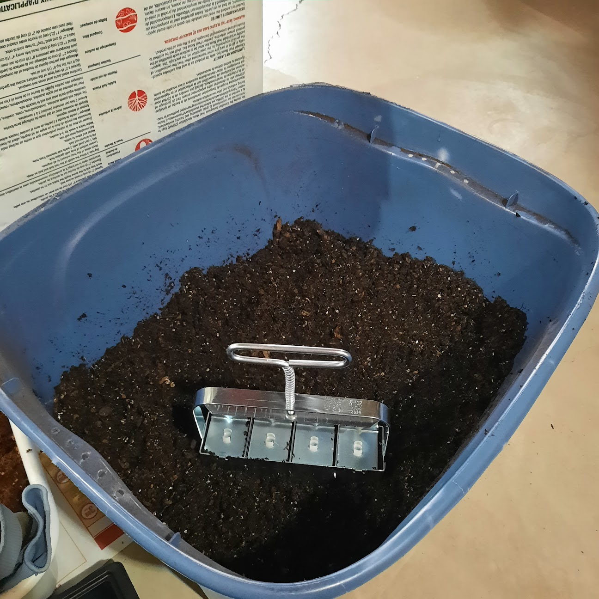
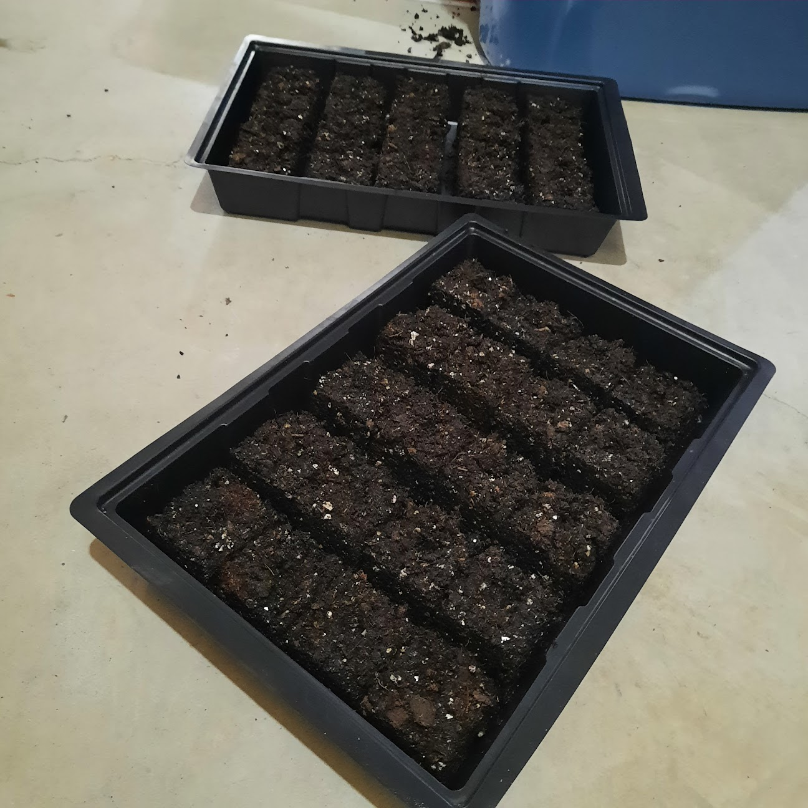
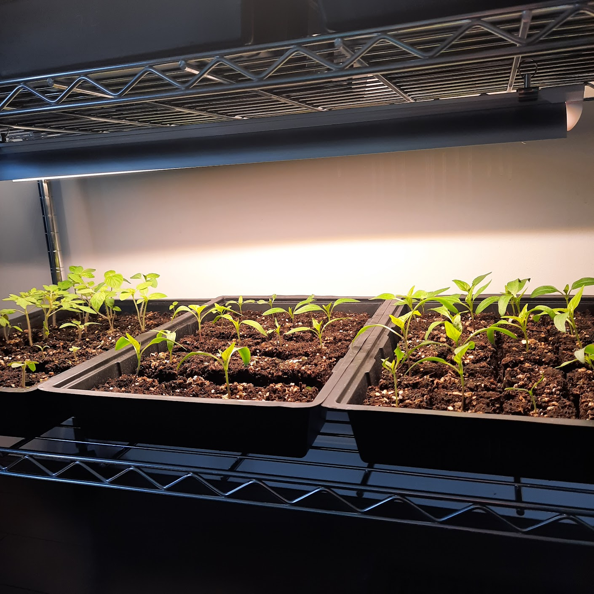

+++
draft = false
title = "Revolutionize Your Seed Starting with Soil Blocking"
date = 2023-04-12T13:00:00.000Z
author = "Jessalyn Krenicki"
series = []
weight = 5

[cover]
relative = true
image = "20230312_113940.jpg"
alt = "Pictured are two shelves lit brightly from behind/above, each filled with trays filled with soil blocks."
+++
Have you been curious about the technique of soil blocking? Wondering why you might want to try soil blocks instead of the usual seedling trays? Well then, you’ve come to the right place!

Soil blocking is a seed-starting technique that can be a bit baffling for many gardeners who aren’t familiar with it. The beauty of this technique is that it’s a versatile option for gardeners who have troubles with seedling roots or simply want to cut down on their hobby’s waste. It’s not a difficult task, but it does require some preparation and a bit of a learning curve, so if you only plan to work with small numbers of seedlings, this method may not be the best for you. If you’re interested, but don’t want to invest in a soil blocker tool, there are also many DIY methods that you can use to make soil blocks right at home. If soil blocking sounds like something that might fit in with your gardening plan, read on!

### What are the benefits of soil blocking?

#### 1. Fewer Rootbound Seedlings

The primary benefit of soil blocking is that plants won’t get rootbound, like they would in a container! If a plant’s roots reach out and find a solid blockage, they’ll start turning to find space to grow out. In a small container, those roots will just keep on turning until they fill up the space: that’s called being rootbound. Rootbound plants, even when you transplant them, will take a few days to get their roots redirected to point outwards again.

Why doesn’t soil blocking do this? Well, it’s because roots react differently when they come in contact with air instead of a barrier! If a plant’s roots reach out and meet and find open air, they’ll stop growing out in that direction, putting energy into different branches of roots. This is called air-pruning, and when the roots that have met air are transplanted into the ground or a larger soil source, they will start to grow straight out again! 

#### 2. Less Transplant Shock

Hand-in-hand with the reduction of rootbound plants, is the reduction of transplant shock! When you transplant out of a seed tray, you may be familiar with the fact that roots can become damaged when you have to shake and squeeze and jostle the seedlings out of the containers. No need for any of that with a solid, standalone block of soil- just pop it in the soil, and it’ll grow readily from its little cube!

#### 3. Less Material Waste

Many seedling trays are pretty fragile, and break down quickly. With soil blocking, you can make just about any container into a seedling tray! Seed trays also may result in more rootbound seedlings, if seeds are allowed too much time in the container, but we’ve covered that particular topic plenty up above. If you're looking for places in your lifestyle to cut down on plastic waste, this is an excellent place to start!

### What tools will I need?

When it comes to deciding on the size of soil blocks to use for germinating seeds, there are a few factors to consider. Small seeds or those that require warmth to germinate would do best in smaller blocks, such as ½ inch cubes. Using smaller blocks helps with heat absorption, especially if a heat mat is being used. For most other seeds, 2 inch blocks should work just fine. 

If you're unsure, ½  inch blocks are a safe bet as long as you aren’t using seeds that are particularly large. Most ½ inch blocks will also transplant easily into larger cubes if needed!

If you're feeling crafty, you can even make your own soil block maker at home using items like tin cans, PVC piping, or even pill bottles. [You can click here for an example of such a project!](https://www.theprairiehomestead.com/2014/04/diy-soil-block-maker.html)

If you're ready to arm yourself with a quality soil blocker, there are many good options available for purchase online, such as the highly-rated soil blockers from Ladbrooke: 2" blocker ([Amazon](https://amzn.to/43euC5L), [BootStrap Farmer](https://collabs.shop/o5gco5)) and mini blocker ([Amazon](https://www.amazon.com/Ladbrooke-Genuine-Mini-Soil-Blocker/dp/B0793MDSKT), [BootStrap Farmer](https://collabs.shop/ggjycm)). 

### How do I get started?

1. If you're doing soil blocking indoors, make sure to have a good area to work in where you don’t need to worry about dirt on the floor. You’re also going to need a large container to hold your mix in; two would be better if you can manage it, in case you end up needing to sift a chunky mix.
2. You’ll need a soil blocker of course, but also a tray to hold the blocks that you make. Seed starting bottom trays will work nicely, but even cookie sheets or other containers could work well. 
3. Next, the soil itself. A block made of just garden soil will fall apart- so, we’ll have to get mixing! Soil blocking works best with a certain mixture - there are many ratios that gardeners swear by, but the common ground between them is that there is a large amount of peat moss (or a peat moss substitute), some nutritional addition (such as compost), and a material to help with drainage (such as sand or perlite). Some mixes will also include a mineral fertilizer, so you don’t have to worry about fertilizing later on and burning the seedling roots.

Here’s an example of a blocking mix, but you can find many different options if you do some research!

* 3 parts peat moss or coconut coir (*If you use coconut coir, it’ll likely need a good hearty soak ahead of time. If you’d like to learn more about coconut coir, you might want to check out [this article by CocoAndCoir!](https://cocoandcoir.com/blogs/coir-compost/how-to-use-coconut-coir-in-gardening))*
* 2 parts garden soil
* 2 parts perlite or sand
* 1 part compost

4. Mix your ingredients in a large tub. You might have to sift the whole mix at this point if there’s too many large chunks; seeds might have trouble germinating well in a particularly chunky mix. You can also sterilize your mix with boiling water if you’ve had problems with pests such as fungus gnats in the compost or dirt you've added.\
5. Once your components are all mixed and sifted, you can add about 1 part water to 3 parts mix. Once you’ve got that all combined, water shouldn’t drip from the mix when you squeeze it, but it should be close.
6. When your mix is made, the procedure is pretty simple! Press your soil blocker into the potting mix by pushing your blocker down into your soil mix a few times, rocking it back and forth in the mix to really get the soil packed in well before scraping off the excess with your hand or the edge of the soil container. You can hand-pack your blockers if you find your blocks aren’t quite dense enough and keep falling apart.

7. Once it's packed full, move your blocker over to the tray and dispense the blocks. Most soil blockers have a spring-loaded handle that you push, and when you lift the blocker after depressing the handle the blocks should be sitting pretty all in a row! Clean your soil blocker off between each set, to make sure subsequent blocks can be ejected smoothly.
8. Finally, it’s time to put seeds in their little beds. Depending on how deep of a divot your blocker leaves, you may need to fill it up a little with vermiculite so that smaller seeds don’t get lost in the block. We found that covering the seeds lightly with vermiculite rather than more soil mix worked better; the soil block mix is made to hold its shape, so seedlings struggle to push their first leaves through it if they’re covered with the soil.

### What do I need to do with my seeded blocks?

Freshly-made soil blocks will probably not need watering for a few days, but after that, bottom watering or misting are the best ways to go about rehydrating them! We want to make sure not to tear apart our little blocks, so watering from above has to be with water that isn’t under a lot of pressure, and watering from below should be with only a little flow to not erode away the soil. Wait for your blocks to be dry on top before watering again to avoid algae growth on top!

### Our takeaways:

Soil blocking does have a learning curve- its a skill to take your gardening game to the next level. It would be good to be fairly comfortable with the fundamentals of starting seeds before moving to soil blocking. 

It might not make sense if you're only starting a few seeds since you are going to the extent of making your own mix, etc.- in that case it’s probably much more time and cost effective to just use a few containers.

It is more labor intensive than using plastic containers or trays, but there are so many benefits for the plant, and it’s nice to save the plastic and to not have to sanitize containers every year. 

Transplanting does go a bit faster since you don't have to pop the plants out of containers so you do recoup a bit of time there.

Gardeners should weigh the pros and cons to decide if soil blocking is right for them!

If your first attempt at soil blocking fails, try and try again! It’s going to take some practice to get the right soil moisture, the right amount of soil packed in the tool, etc. But once you’ve got the hang of it, soil blocking will elevate your seed starting game and help to reduce waste all at once! It’s a really rewarding experience once you start to get the hang of it, so if soil blocking is something that you’re interested in, give it a try!