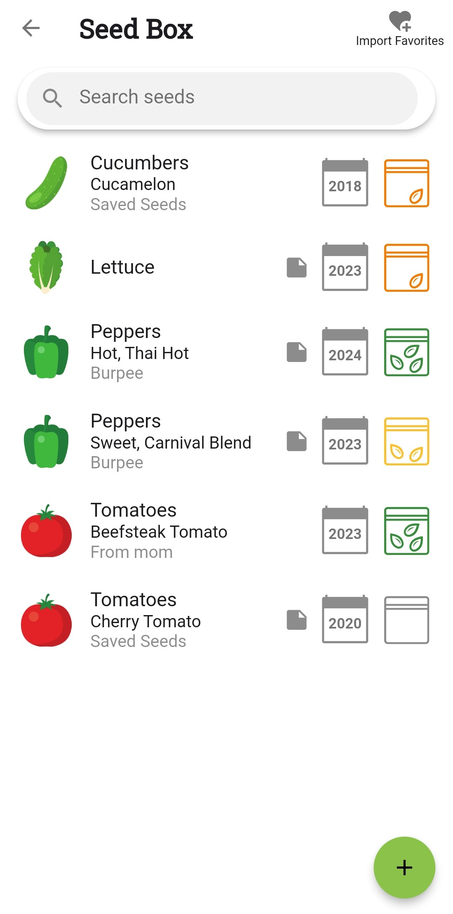
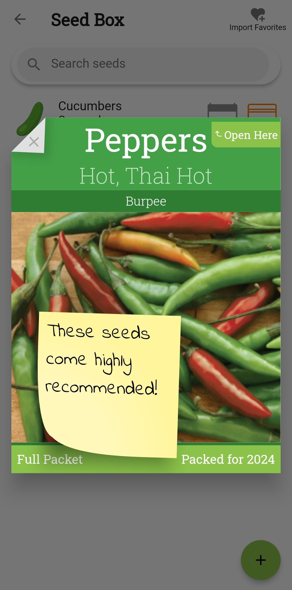

+++
draft = true
title = "Feature Launch: Introducing the Seed Box!"
slug = "seed-box"
date = 2024-01-21T14:57:18.325Z
author = "The Planter Team"

[cover]
relative = false
image = "seed-box-cover.jpg"
alt = "Screenshot of the Seed Box feature in Planter"
+++
To kick off the 2024 garden planning season, we're announcing a brand-new Planter feature: the **Seed Box**! The Seed Box lets you keep track of all the seeds in your seed collection. No more buying too many seeds every year! (Or at least…no more excuses😉)

> **Note:** If you are using Planter on Android or IoS, be sure to update to the latest version to be able to access the Seed Box.

[Add seed packets](https://info.planter.garden/track-seeds/how-to-add/) to your Seed Box along with information about when you bought them (or saved them), how full the packet is, where you sourced them from, and any other notes about the seeds.

If you’ve already [favorited varieties](https://info.planter.garden/plant-information/favorite-varieties/) that you have seeds for, the easiest way to get started is to [import your favorite varieties](https://info.planter.garden/track-seeds/how-to-add/#import-favorites). Otherwise you can easily add seed packets [from the varieties view](https://info.planter.garden/track-seeds/how-to-add/#from-the-varieties-view) or right [from the seed box](https://info.planter.garden/track-seeds/how-to-add/#from-the-seed-box).

We hope you find the Seed Box handy to catalog your seed inventory and for planning your seed purchases. We’ll be continuing to roll out some very cool enhancements to the Seed Box to make the garden planning to seed purchase process super-slick!

> If you have ideas for how we could improve the Seed Box or any other Planter features use the [Feature Request list](https://planter.garden/requests) to upvote requests or submit a new request!