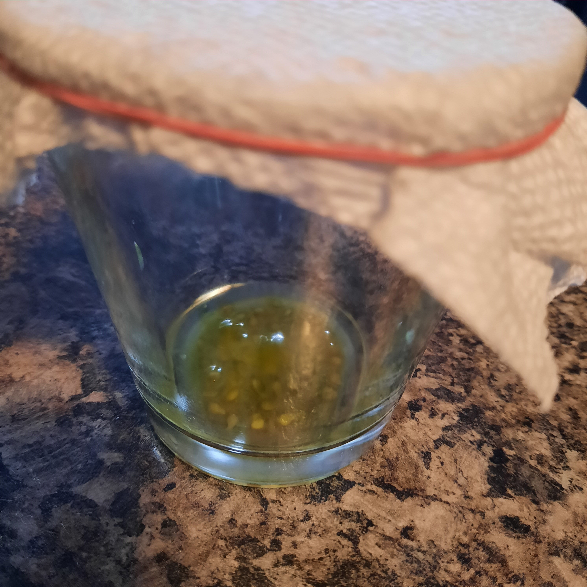
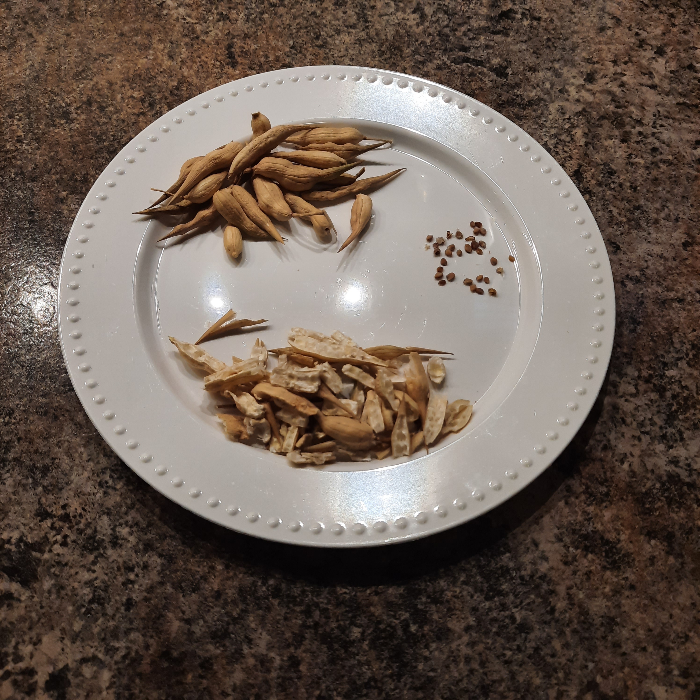

+++
draft = false
title = "Seed Saving 101"
slug = "Seed-Saving-101"
date = 2023-09-11T21:07:35.201Z
author = "Erin Thomson"

[cover]
relative = false
image = "seed-saving.png"
alt = "Brown paper seed packets with seeds coming out onto soil and the text 'seed saving 101'"
+++
Have you ever wondered if it's possible to save seeds from your plants, instead of buying new seeds every year? With a bit of knowledge you can absolutely save seeds to grow next year! While seed saving can be a complex topic, don’t let that deter you from attempting to save seeds to use in your own garden. Read on to learn the basics of seed saving, so you can get started with saving your own seeds!

### Seed saving considerations

On the surface, seed saving is as simple as harvesting the fully-mature seeds, drying them, and storing them for future planting. The trick is you might not get the plant variety that you expected growing from those seeds. To understand why this could happen, we need to know a bit about how pollination works in different plants:

* Some plant species have male and female flowers on separate plants (such as asparagus and spinach),
* Some have male and female flowers on the same plant (such as cucumbers, squash, and pumpkins), and
* Some have flowers that have both male and female parts, known as ‘perfect flowers’. Some of these plants can pollinate themselves (‘self-pollinating’), while others cannot (peas, peppers, tomatoes, and eggplant are examples of self-pollinating plants with perfect flowers).

So why does this matter? It has to do with the likelihood of ‘cross-pollination’. If a flower happens to be cross-pollinated with pollen from a different variety of the same plant, the resulting seeds can have wildly different combinations of traits passed down from the parent plants. You might discover a pleasant-tasting new variety, or you might end up with something totally unappetizing. In plants with ‘perfect flowers’ that can also self-pollinate, the chances of cross-pollination are much lower compared to plants that rely on pollinators to move pollen around from flower to flower.

Avid seed savers use many techniques to reduce the chances of cross-pollination. They maintain minimum separation distances between different varieties of the same plant, they grow different varieties at different times, and they may even pollinate flowers by hand and cover the flowers with baggies. Even if you don’t want to go to this extent you should still consider giving seed saving a try, especially from self-pollinating plants with perfect flowers.

Another consideration when saving seeds is whether the plant varieties you are growing are heirlooms or hybrids. Heirloom plants, so long as they are not cross-pollinated by other varieties, will consistently produce seeds that are ‘true-to-type’ - that is, plants grown from the seeds will have the same traits as the parent plant. Hybrid (“F1”) plants on the other hand are genetically unstable and because of this, even if they are not cross-pollinated, the seeds could still produce plants that are wildly different from the parent plant. For more detailed information on the differences between heirloom and hybrid plant varieties check out [What Are Heirloom Varieties?](https://blog.planter.garden/posts/what-are-heirloom-varieties/)

### How to save seeds

The first step in saving seeds is keeping accurate records of which plant varieties you have growing where in your garden, so you know which varieties you are saving seeds from (this is where [Planter](http://planter.garden/gardens) comes in!)

Next of course is to let your plants go to seed. In fruiting plants this means letting the fruits achieve full ripeness (in some cases, going beyond the ripeness you would normally eat them at). In non-fruiting plants this means leaving the plant in the garden until it produces flowers and seed pods. Be sure to account for this in your garden plan, as leaving plants to go to seed means you won’t be able to make use of that space for some time.

The seed saving process varies widely depending on the plant you are saving seed from- you’ll want to do some research to determine when to harvest seeds from each type of plant and how to process them.

Once your seeds are harvested and completely dry (emphasis on *completely*; they will rot if not), store them in airtight containers or baggies in a cool, dark place. Label them with the variety name and the date you harvested them, to keep track of how fresh the seed is for planting.

### Easy plants for seed saving

**Dill:** dill is a great candidate for seed-saving because it self-seeds so readily! If you want to keep growing dill in the same spot, simply leave the dill to flower and form seeds. More than likely it will drop seeds that will sprout and grow new dill plants next season. If you want dill in other parts of your garden you’ll want to collect the seed heads when they are brown, hard, and dry. Harvest the entire head of seeds carefully as they readily drop their seeds; then shake or rub the seeds off into a container.

**Cilantro:** cilantro is another great plant to save seed from, as it tends to go to seed very quickly! Cilantro seeds are ready to harvest when they are round, brown, and dry. Cilantro seeds are saved similarly to dill- you can cut off entire seed heads then shake or rub the individual seeds into a container. It’s handy to have an ample supply of cilantro seed on hand so you can sow multiple successions of cilantro throughout the season without having to stress if it bolts early!

**Tomatoes:** saving seeds from tomatoes can seem daunting but its not too tricky. To save seeds from tomatoes first cut them in pieces so you can scoop out the gel along with the seeds. It's recommended to ferment your tomato seeds for the best longevity and germination. To do this, scoop the gel and seeds into a glass container then add enough water to cover the seeds. Put a piece of paper towel on the container and secure it with an elastic band. Leave the seed mixture in a warm place (ideally not within smelling distance!) for about two weeks. After this time, dump the mixture into a fine mesh sieve and rinse the gunk off the seeds with running water. Spread the seeds out on a paper plate to dry completely, then store them in a container.

**Peppers:** saving seeds from peppers couldn't be easier- just cut the pepper open and there are infinite seeds inside! Remove the seeds from the inner membrane and leave them on a paper plate to dry completely before storing. Be aware that if you grow hot peppers and mild peppers close to each other, there is a small chance that you could end up with a mixed variety. If some unexpected heat could pose a problem for you and your family, be sure to follow minimum isolation distances between pepper varieties so you don’t end up with a spicy surprise!

**Radish:** radish is another crop that readily goes to seed. If you are concerned about cross-pollination in your radishes, you may want to sow different varieties at different times. To save radish seeds, allow the pods to become large, brown, and dry on the plant. You can then pick or cut the pods off the plant. To get to the seeds inside you’ll need to crack the seed pods open and shake, rub or pick the seeds out. This isn't the most efficient task in the world, but it's a good project to tackle while watching some gardening videos on YouTube 🙂. The dried pods can be a bit prickly so you may want to protect your hands if they are sensitive.

**Lettuce:** when your lettuce bolts it can be quite disappointing- but if you let the process continue your lettuce plants will make beautiful flower stalks and eventually seeds. If you are worried about your lettuce varieties cross-pollinating, you can use a fine mesh bag or row cover to isolate the flower stalk. The seeds are ready when the flowers turn white and wispy (similar to what a dandelion would do). You can pick the seeds off of the flower heads and then fan them to blow away the flower whisps.

Try saving seeds from some of these plants, and if you find you enjoy seed saving then you can [read up on more advanced seed saving](https://www.amazon.com/s?k=seed+saving) techniques! If nothing else it’s a learning experience…and you might end up growing some truly unique plants!

