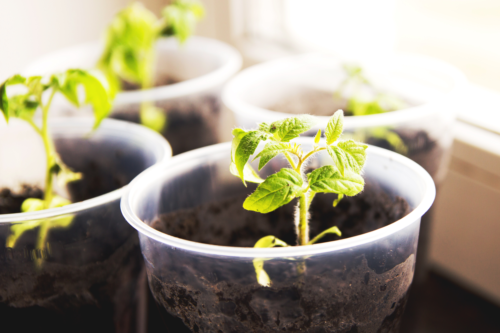

+++
draft = true
title = "Seedling Care and Troubleshooting"
date = 2023-03-28T16:00:13.388Z
author = "Erin Thomson"
series = ["Seed starting"]
weight = 5

[cover]
relative = true
image = "tomato-seedlings.jpg"
alt = "Four tomato seedlings in pots by a windowsill"
caption = "Healthy tomato seedlings growing in pots"
+++
*This is the fourth post in our [Seed Starting](../../series/seed-starting/) series.*

If you’ve been busy starting seeds indoors, you might already be at the point where your seeds have germinated and are growing into tiny seedlings (if not, be sure to check out our seed starting series to get going!) It's important to be aware that the conditions required for seeds to germinate are different from the conditions that seedlings need to thrive. This article will cover the basics of seedling care as well as how to troubleshoot common problems with your seedlings. Keep reading to get your seedlings off to the best start possible!

### Lighting and heat for seedlings

Seeds typically need warm, moist conditions for germination and most edible seeds do not require light for germination. Once the seeds germinate though, it's a whole different ball game! Seedlings need to have ample light applied as soon as they start germinating, and if you’re using heat mats you can turn them off once the majority of your seeds on the mats have germinated. Refer to these articles on [grow lights](https://blog.planter.garden/posts/grow-lights/) and [heat mats](https://blog.planter.garden/posts/heat-mats/) for more detailed information on using grow lights and heat mats for germination and seedling care. Also, if you were using a humidity dome for germinating your seeds, it should be removed as soon as they germinate as well.

### How to water seedlings

While seedlings do still need ample water to grow, you may not have to be quite as meticulous with watering and misting as when germinating your seeds - it's OK for the soil to dry out a bit. So how much water should you give your seedlings and how often? The frustrating answer is ‘it depends’ on many factors such as how fast your potting mix drains, the type of containers you are using, how hot and dry your house is, and many more. The best guidance is to check your seedlings often- ideally multiple times a day- and if the soil is starting to look dry give them some water. Many gardeners prefer to [bottom water](https://blog.planter.garden/posts/the-ups-and-downs-of-bottom-watering/) their seedlings, but no matter how you water it is important not to let the seedlings sit in water. Once the soil has absorbed enough moisture be sure to get rid of any excess to avoid drawing your seedlings and causing disease. As the seedlings grow they can start handling longer periods without watering - but again you never want to let the growing medium bone dry. You will start to get a ‘feel’ for how much water to give your seedlings over time.

### How to fertilize seedlings

Seeds and very young seedlings do not need any fertilizer- they have all the nutrients they need inside the seed and their seed leaves (‘cotyledon’ leaves). Because of this, seed starting mix often does not have any nutrients added (although some do). As the seedlings grow they will soon start to need added nutrients to be able to put on new leaves. It’s typically recommended to start fertilizing seedlings once their second set of ‘true leaves’ emerge (leaves that are not the cotyledon leaves). When fertilizing young seedlings it is very important to use dilute quantities of fertilizer- full strength fertilizer can easily burn tender seedlings. I prefer to use a liquid organic fertilizer such as fish emulsion fertilizer diluted to a half or quarter of the usual strength. Incorporate fertilizer into your watering schedule about once a week as the seedlings grow.

### Thinning and potting up seedlings

Thinning seedlings is the practice of removing extra seedlings so you end up with only one seedling per growing container. Gardeners often sow more than one seed per container in case not all the seeds germinate - it provides some insurance so you know every container should have at least one viable seedling. However this means that you’ll need to deal with the extra seedlings so that you don’t end up with crowded seedlings competing for water and nutrients. Typically gardeners will look at each container and select the seedling that appears to be the largest and most robust, and will cut off the other seedlings to kill them. Cutting is recommended versus pulling so as not to damage the roots of the seedling you want to keep. However if you don’t have the heart to kill the extra seedlings, or you have some germination issues and need the extras, you can very delicately use a small chopstick to dig down and tease out the individual seedlings for potting up. Again this has to be done with the utmost care to not damage the roots, otherwise you risk killing all the seedlings.

Potting up your seedlings refers to transitioning them into larger containers with more growing medium. This is done so they have enough room to continue growing without becoming stunted in a too-small container. To know when to pot up your seedlings, you should regularly check on the roots - as soon as you start to see roots poking out of the bottom of your seed starting containers, it’s time to pot up. To pot up, select a larger growing container, fill it with potting mix, then gently remove the seedling from its existing container and put it in the larger container. Cover well with potting mix. Once you pot up your seedlings they still need adequate light, so be sure to plan your space in your seed starting station accordingly!

### Common seedling problems and remedies

**Mold and damping off:** Mold on seedlings is often just an eyesore, but it can be a sign of a deeper problem. Mold forms in moist conditions - which is somewhat unavoidable when germinating seedlings. However ‘damping off’ is a mold condition that can actually kill your seedlings - to prevent this it's important to make sure you are not overwatering your seedlings. Turning on a fan on a gentle setting to circulate air can also help keep mold at bay.

**Fungus gnats:** Fungus gnats are small, black flying insects. On adult plants they are no more than a nuisance, but the larvae can inflict catastrophic damage on your seed if the infestation is heavy enough. There are many potential remedies online for fungus gnats; I find the most effective are to sterilize your seed starting mix with boiling water as a preventative measure or to apply a hydrogen peroxide solution at a 3:1 ratio (3 parts water to 1 part hydrogen peroxide).

**Leggy seedlings:** Leggy seedlings are weak seedlings that are stretched too thin. To prevent legginess in seedlings, make sure they are placed close enough to a light source to receive ample light, and use a fan on a gentle setting to help strengthen the seedlings.

**Root bound seedlings:** Root bound seedlings are seedlings that have been left growing in a container that is too small for too long. The roots become constricted and the plant’s growth can be permanently stunted as a result. Be sure to pot up seedlings or transplant them outside weather permitting before they become root bound. Using soil blocks or air pruning trays can also help prevent root round seedlings.

Taking care of seedlings is not complicated, but it does require a bit of attentiveness. The key to success is to keep a close eye on your seedlings- to make sure they are not underwatered, overwatered, and they have sufficient light and nutrients. Troubleshooting and taking action as soon as you spot a problem developing can help to save your precious seedlings so you don’t have to start all over again. You’ll be rewarded for your efforts caring for your seedlings when they turn into healthy plants you can transplant into your garden!