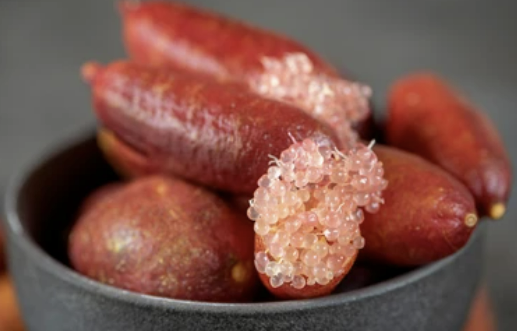
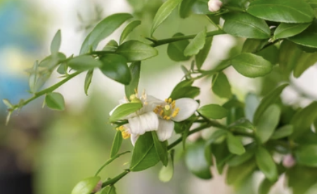
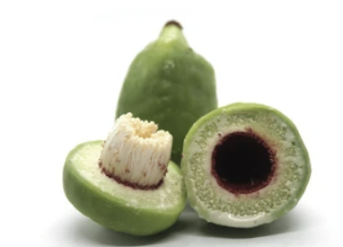
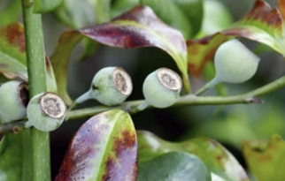
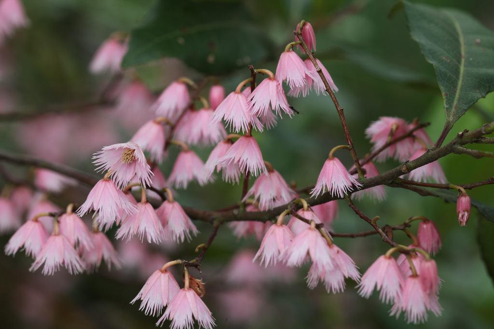
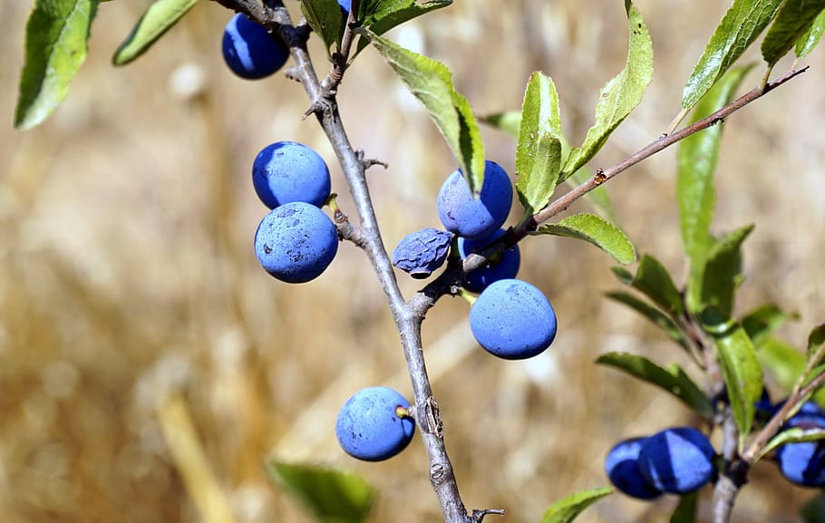

+++
draft = true
title = "Six Australian Native Trees to have in your Garden"
slug = "Six Australian Native Trees to have in your Garden"
date = 2023-09-02T07:57:17.137Z
author = "Elisha Redhead "
series = ["Southern Hemisphere"]
tags = ["Southern Hemisphere ", "Australia ", "Native Plants"]
weight = 5

[cover]
relative = false
image = "cover.avif"
caption = "Welcome to the first of the Southern Hemisphere series! This series seeks to explore all things related to gardening in the Southern Hemisphere, and the unique challenges presented. These articles are so far being written from Australia. "
alt = "An image displaying a large field and trees - it is bright and sunlit. "
+++
Native fruits and plants surround us all the time, on the sides of paths and in the depths of forests, but rarely do we think to include them in our edible gardens. But some truly astounding varieties of edible fruits are out there! From finger limes to Blueberry Ash trees, let’s explore six varieties of small native Australian trees that can provide fruit for your garden!

# **Finger lime (*Citrus australasica*)**  

The Australian finger lime – an underrated, underappreciated fruit tree that can easily be grown in most gardens. These hardy little shrubs are native to Queensland and New South Wales, and can grow anywhere between 2-6 meters tall. This tree grows slowly, and I do have to warn you, it has thorns! But it also produces the most lovely tiny white or pale pink flowers, along with the finger limes themselves – which can come in a variety of colours such as green, yellow, black, brown, and purple. These lovely little trees tend to flower in late autumn to early summer, with fruit ripening in May to June.

## Green Finger Lime

After the harvest season is over, I would recommend pruning your finger lime back a bit, so it has time to recover the energy it put into fruiting.

## **2)      Lilly Pilly (*Syzygium smithii*)**  

The Lilly Pilly – have you ever seen such vibrant fruit? Coming in shades of pink and red, these wonderful natural berries make amazing jams. These trees are fast growing, and with their thick, luscious leaves they make a wonderful privacy barrier. If you want something smaller, just keep it pruned down to size!

Flowering in summer and fruiting in winter, this evergreen tree is drought tolerant and not too fussy about soil – making it very easy to care for!

### **3)      Kakadu plum (*Terminalia ferdinandiana*)**

The Kakadu plum – if you haven’t heard of it, I wouldn’t be surprised! These trees produce a tiny pear-shaped fruit known to contain the highest amount of vitamin c in the world. These fruits are native and can be found over large swaths of Australia. The fruit themselves are sour, with a stewed apple/pear scent to them. Like most plums, they contain only a single central seed.

In contrast, the leaves of the Kakadu plum are large and spaced apart. This tree grows between 4-10 meters, and has been a cultural bushfood for Aboriginal peoples for years.

#### **4)     Kanagroo apple (*Solanum aviculare*)**

Kangaroo apple. I cannot think of a more Australian name. This little soft-wooded shrub is native to New Zealand and eastern Australia, and not only produces pretty flowers, but also small edible fruits that look remarkably like the centre of a boiled egg. These fruits come in a variety of orange to red, and are edible much like tomatoes.

Caution should be taken as the fruits are poisonous when unripe and green, so make sure to wait for coloration on your Kangeroo Apple.

These trees fruit in summer, and grow between 1-4 meters high, so perfect for a small garden!

In the past, these fruits have been used as an anti-inflammatory paste for joints!

##### **5)     Bolwarra (*Eupomatia laurina*)**

The Bolwarra plant, or a native guava, is a plant native to Australia and New Guinea that grows between 3-5 meters tall. In fact, if you’ve ever had a guava, you should already have some idea of what this fruit may be like – the creamy pulp inside is edible and sweet, although it does contain many small seeds. This fruit can be used in drinks, jams, desserts, or eaten on its own. If you truly want to try something new, it can even be dried and crushed into a spice!

This low maintenance tree flowers in the spring and summer, and sets fruit in winter. It’s also been known to attract butterflies!

###### **6)     Blueberry ash (*Elaeocarpus reticulatus*)**

The Blueberry ash is a small plant native to eastern Australia, perfect for a small garden. These lovely native rainforest plants are low maintenance and have a high tolerance for pests and diseases. Plus, they have the most gorgeous flowers! The smaller varieties grow 4-5m, and are slender in width – perfect for a small corner. The Blueberry ash is variation of native quandong, meaning that not only are they drought resistant, but they also produce an edible fruit – an incredibly bright blue berry! These berries can be crushed and made into jams, or used as a tea.

And that's all six! I hope this provides inspiration and insight into the amazing world of edible fruit our beautiful native plants can provide. 

Happy gardening!