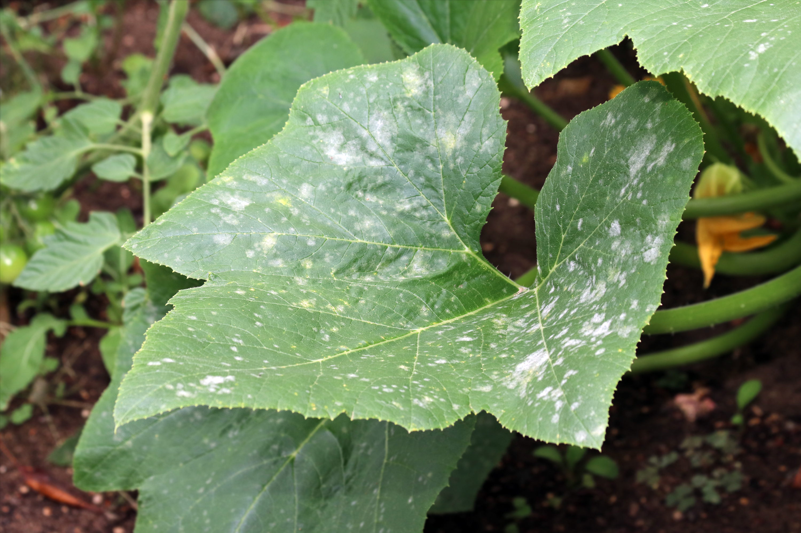

+++
draft = false
title = "Why Are My Plants Growing So Slow?"
slug = "slow-plant-growth"
date = 2023-08-07T23:18:48.722Z
author = "Erin Thomson"
weight = 5

[cover]
relative = true
image = "hands-with-pepper-plant.jpg"
caption = ""
alt = "A pair of hands holding an unripe pepper on the plant"
+++
Sometimes it feels like it's taking forever for your plants to produce a first harvest. This is especially true for warm-season crops like tomatoes and peppers that typically don’t produce a first crop until well into the growing season. But is the wait normal, or is there an underlying problem that’s causing your plants to grow extra-slow?

To figure this out, check the seed packets (or research the plant variety) for the ‘days to maturity’. Different varieties of the same plant can have vastly different days to maturity, so it's important to compare with variety-specific information. Think back to when you originally seeded the plant (if you’re using [notes and events](https://info.planter.garden/notes-and-events/how-to/) in Planter to keep track of your plantings this will be easy!) Has the plant been growing significantly longer than the expected days to maturity? If you used seedlings from a garden center you might have to estimate this. A small delay isn’t too concerning, but if you’re well past the expected days to maturity and the plant is not yet producing a harvest there could be an issue.

Be aware that different varieties perform best under specific conditions, so it might be typical for a particular plant to grow more slowly in your local climate. If you’ve ever grown this plant variety before, has it taken this long to grow in the past?

If you’ve concluded that your plants are growing too slow and it's not just gardener’s impatience getting the better of you, you’ll need to do some sleuthing to figure out what could be causing the delay.

### Weather

Weather conditions play a huge role in speeding up or slowing down plant growth. The impact of the weather depends on the plant, and on how consistent the weather pattern has been. For example, in my area the summer has been unusually cool, overcast, and rainy from July onwards. Some of the plants are loving it- the lettuce has never looked nicer for this time of year! But as for the tomatoes and peppers, the fruits have been slower to ripen than usual (although the plants are lush and green). In June, we had an intense heatwave and drought coupled with wildfire smoke that put just about every young, tender plant into survival mode and significantly slowed their growth. It’s important to talk with avid gardeners in your local area to understand the impact of the year’s weather on your plants. If everyone is experiencing unusually slow growth it's more likely that the weather is the main culprit rather than a deficiency in your garden.

While you can’t control the weather, there are things you can do to help your plants adapt to weather conditions:

* [Water consistently](https://blog.planter.garden/posts/watering-more-than-a-garden-chore/) throughout a drought to help avoid drought stress, and use [mulch](https://blog.planter.garden/posts/mulching-a-must-for-your-garden/) to lock in moisture.
* Use [shade cloth](https://www.amazon.com/s?k=shade+cloth) to help keep your plants cooler during heat waves.
* Make sure your soil has [good drainage](https://blog.planter.garden/posts/how-to-improve-poor-soil-drainage/) to help your plants ride out rainy spells.
* If you have access to one, use a plastic tunnel or greenhouse to accelerate the growth of heat-loving plants when the weather is cooler. But be sure to vent them if it gets too hot!

### Nutrient deficiencies & soil characteristics

Another reason why your plants might be growing slower-than-expected is because they are lacking nutrients. Stunted plant growth is one common symptom of nutrient deficiency, however nutrient deficiencies are often accompanied by other symptoms such as leaf yellowing and/or browning. There are specific patterns of leaf discoloration and distortion that can appear depending on the nutrient that is lacking. The West Virginia University Extension Office has [an excellent article](https://extension.wvu.edu/lawn-gardening-pests/plant-disease/nutrient-deficiencies-in-plants) that can help to identify which nutrient(s) might be missing based on the plant’s symptoms. A soil test is really the best way to know if there are enough nutrients available in the soil, but if you don’t want to do a test mid-season and the symptoms point to a possible deficiency you could apply a balanced organic fertilizer as a precaution. This isn't a super-precise approach to fertilizing, but by applying balanced organic fertilizer it's unlikely that you will cause a massive nutrient imbalance and it could help to remedy a potential deficiency.

If you’ve already been fertilizing regularly, it is unlikely that a lack of nutrients is causing slow plant growth. Problems with soil pH can prevent the plant from accessing nutrients even if they are available, which then causes stunted growth. If your soil pH is either too acidic or too alkaline, it will be difficult to remedy this mid-season. Be sure to get a pH test done so you can apply amendments ahead of the upcoming season. And if you are struggling with clay or sandy soil conditions, be sure to add compost to improve the soil for optimal plant growth.

### Inconsistent watering

Inconsistent watering can significantly slow down plant growth, as growth processes depend on the plant being able to access sufficient water as needed. It's important to note that overwatering can be as problematic as underwatering when it comes to slow growth. Overwatering can prevent the roots from uptaking oxygen and can lead to root rot, as well as leaching nutrients away. If you're experiencing extended periods of rainy weather, often the best you can do is to make sure you are growing plants in soil with good drainage (containers and raised beds can help with this) and avoid adding to the problem with additional watering. A plastic tunnel or greenhouse can be helpful to control how much water your plants receive, especially if you live in an area prone to rainy conditions. On the other hand, if you’re experiencing dry spells it’s important to water regularly and to use mulch to help prevent the soil from drying out (unless you’re growing one of a few edible plants that prefer drier soils).

### Lack of sunlight

Most vegetable plants require full sun to grow as quickly as possible. While the definition of full sun is at least 6 hours of direct sunlight each day, many vegetables prefer to have 8 hours of sunlight or more. While there are some vegetables that can [survive and even thrive in part-shade gardens](https://blog.planter.garden/posts/growing-vegetables-in-part-shade/), in many cases a lack of sunlight can cause the plant to grow slower. The best way to avoid this is to consider the sun exposure when planning your garden in [Planter](https://planter.garden/gardens), and place the most sun-loving plants in the sunniest spots available.

### Pest, disease, and weed pressure

Often the first obvious signs of pests or diseases are lesions, spotting, or holes in the leaves, but if your plant is growing slowly it might be worth a closer look to see if there is a pest or disease problem that went undetected. Pest and disease issues can sometimes be a secondary effect of the weather conditions or of nutrient deficiencies leading to weakened plants. While the specific course of treatment depends on the exact pest or disease, following proper plant spacing and pruning to improve airflow are two good ways to keep potential problems at bay. And if you know your plants are afflicted, sometimes the best course of action is to remove them and plant something new rather than waiting on that one last tomato or cucumber to ripen. It's a good idea to rotate locations to help reduce pest and disease pressure on new plantings.

And last but not least, weeds are a very common culprit behind slow plant growth. While a small weed here or there isn’t an issue, if your plants are being choked out with weeds they may not be getting the water, nutrients, and sunlight they need to thrive. For more info on how to manage weeds in the garden check out [Garden Weeds: Stem the Spread](https://blog.planter.garden/posts/garden-weeds-stem-the-spread/).

If your plants seem like they’re taking their sweet time to mature, be sure to dig a little deeper to see what the root cause might be. In some cases there might be factors outside of your control that you either have to mitigate or just understand and accept (at least for this season). In other cases there are actions you can take to reinvigorate your plants’ growth. Either way, it will be that much more rewarding when your plants finally produce a harvest!

{{ <affiliate> }}