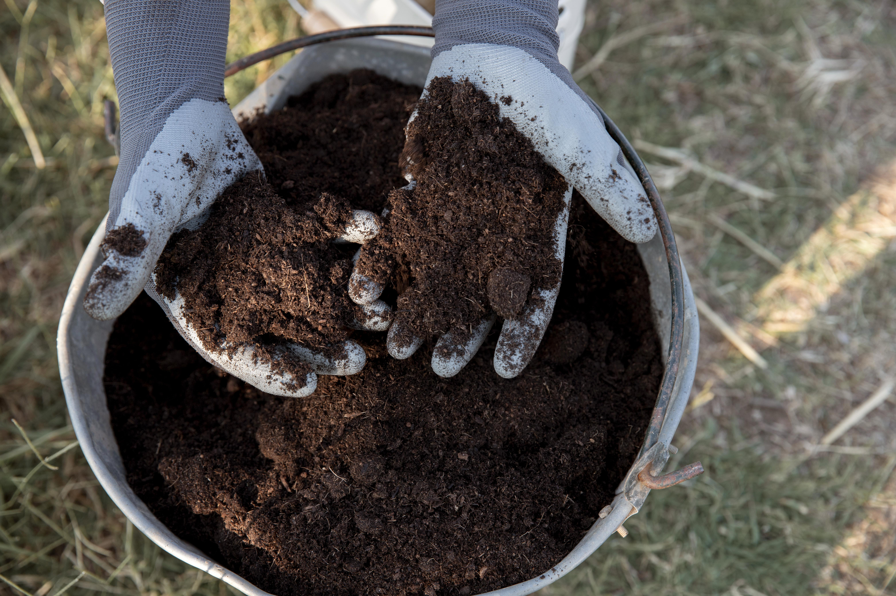

+++
draft = false
title = "Uncommon Soil Amendments for Your Garden"
slug = "soil-amendments"
date = 2023-06-22T10:00:12.921Z
author = "Jessalyn Krenicki"

[cover]
relative = true
image = "fertile-loam-soil-suitable-planting.jpg"
alt = "Gardener holding soil, which lists various elements held within"
+++
Are you looking to give your plants an extra boost and achieve that lush, thriving garden you've always dreamed of? Well, look no further! Welcome to our guide for anything you might want to put in your dirt; we're diving into the wonderful world of soil amendments. Whether you're a seasoned gardener or just starting out, these will revolutionize the way you nurture your plants. These special ingredients can fix nutrient deficiencies, soil compaction, alkaline/acidic soils, and the like!

## General Guidelines

* Before you start to add various different amendments to your garden, it's important to know what exactly your garden needs (and what it doesn't). Make sure to do a soil test to see if some of the issues you're having are related to drainage, nutrients, or pH, because different additives will target different needs for your garden! You can gather a sample of your garden soil and bring it to your local extension office to assess its quality- or do a DIY test!
* When using animal-based additives, apply them 9 months before harvest, or at least 2 weeks before planting! These amendments are typically used to improve soil structure and support beneficial organisms in the soil.
* Mineral-based amendments are easy to over-apply because they take time to break down, so make sure to do a soil test before you start adding them! These amendments are typically used to correct mineral deficiencies.
* Make sure your plant-based amendments aren't contaminated by herbicide, or they may cause more harm than good. These amendments typically are used to improve the soil structure.

### Blood Meal/Bone Meal

Both of these options are animal-based slow-release fertilizers. Blood meal is acidic, and high in nitrogen; it doubles as a repellant to some animals like deer, moles, and rabbits because of its smell. However, it can be overapplied, and may promote leaf growth on plants you're looking for flowers on. It also may attract carnivorous animals in place of the herbivores you're repelling. Bone meal is used very similarly, but adds calcium and phosphorus to your garden! This fertilizer may also attract carnivores, but it promotes non-leaf growth in plants instead of foliage growth. 

### Wood Ash

Wood ash is the residue left after burning wood. It contains potassium and can help raise soil pH levels if the soil is too acidic. However, it should be used sparingly as excessive application can make the soil too alkaline. On top of its effect on the pH, it also adds nutrients like potassium, calcium, and nitrogen!

### Perlite/Pumice

These two soil additives are used very similarly in garden soil; they both work to improve soil structure by counteracting soil compaction to allow air, nutrients, and water to reach *and* drain away from the roots. Perlite is lightweight, so it may over time work its way out of the soil; on the other hand, pumice is heavier, so it will stay in place more easily. Perlite is also very processed, while pumice is a naturally occuring volcanic rock, so it is more eco-friendly!

### Buried Scraps/Compost

'Buried scraps' simply refers to composting kitchen scraps or burying organic matter directly beneath your garden soil. This helps improve soil fertility, texture, and moisture-holding capacity as the organic material decomposes and releases nutrients into the soil. The exact nutritional benefits of this will depend on what scraps you use. As before, be careful of herbicides that may be in your kitchen veggie scraps!

### Epsom Salt

Epsom salt isn't actually a salt, but it's a compound of magnesium and sulfur. It supplements magnesium in the soil which is important for chlorophyll production. It's also sometimes used to help with germinating seeds, or on the leaves instead of in the soil!

### Worm Castings

These are an *extremely* rich fertilizer for nutrients and minerals! They help to improve soil structure, regulate water usage, and support beneficial microorganisms. They're so packed with good compounds that you could use them instead of potting soil, and a plant will process as much as it needs at a time so you don't have to worry about overapplying. This is a fertilizer you can make yourself, but we'll leave that for another Growing Guide!

### Inoculants

'Inoculants" may be a scary word, but it's a simple concept: an inoculant is anything that adds beneficial microbes to your soil. They can be used to enhance the soil's biological activity and improve nutrient availability for plants. For example, legume inoculants contain nitrogen-fixing bacteria that form a symbiotic relationship with legume plants, providing them with nitrogen. These nitrogen-rich plants can then be composted to pass those nutrients and microbes to the rest of your garden!

### Eggshells

Eggshells, like bone meal, are an excellent source of calcium. They have the added benefit of not attracting carnivores, and while they don't deter deer and such, they can deter certain pests like slugs or snails. 

### Borax

Borax is a mineral salt containing boron, which is an essential micronutrient for plants. It is used in small quantities to correct boron deficiencies in the soil, which can lead to stunted growth and poor fruit development in certain crops. However, if you use it in high quantities, it can also damage your plants- you can use it carefully to eliminate weeds, but there is a risk of harming the plants you want to survive.

### Manure or Guano

Depending on exactly *what* you're getting this amendment from, the results can vary wildly. If you use bat guano, it is a fast acting and very concentrated fertilizer with a lot of phosphor. Chicken manure is also very concentrated,  On the other hand, livestock manure (such as cow, sheep, goat or horse) is a slower-release fertilizer mainly providing nitrogen, and can help the soil's ability to hold water. Rabbit manure is also a popular choice, as it's a rich and well-rounded fertilizer that doesn't have too high of a nitrogen content, so it doesn't burn plants as often.

In conclusion, soil amendments are valuable tools for achieving a thriving garden. By understanding your garden's specific needs and using the right amendments, you can improve soil structure, address nutrient deficiencies, adjust pH levels, and enhance overall plant health. Whether you choose animal-based additives, mineral-based options, composting, or other amendments, incorporating them strategically will lead to a lush and vibrant garden. So don't hesitate to give your plants that extra boost they need with the power of soil amendments. Happy gardening!