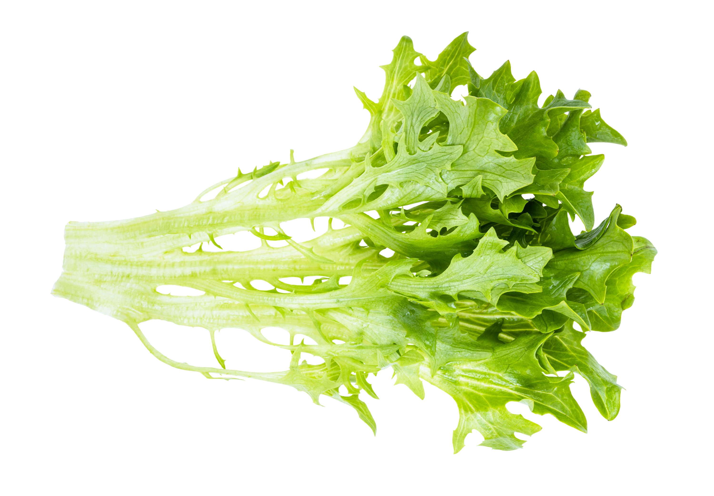

+++
draft = false
title = "Spice Up Your Salad: 5 Greens to Try"
slug = "spice-up-your-salad"
date = 2023-06-29T04:00:25.667Z
author = "Erin Thomson"
plants = ["Arugula", "Mustard", "Chard", "Beets", "Endive/escarole", "Kale", "Nasturtium"]
series = ["Plant Picks"]
weight = 5

[cover]
relative = true
image = "salad-greens.png"
caption = ""
alt = "A bowl of mixed salad greens with the words \"Spice up your Salad\" over top"
+++
The first salads of spring are always exciting- lettuce is at its most young and tender, and a fresh salad feels like a nice departure from the heartier winter veggies. But eating lettuce-based salads over and over again can get to be boring. If your daily salad routine is getting a bit blah, jazz it up by adding some new and exciting greens into the mix!

The greens we’ll cover in this article should be seeded quite densely to be grown for salad greens (roughly 1.5’-2’ between plants)- this helps the leaves stay salad-sized and makes it easier to harvest them with a knife as cut-and-come-again greens. So long as you don’t entirely cut off the top growing crowns of the plants, you can keep harvesting the greens as they regrow until they finally [bolt](https://blog.planter.garden/posts/plant-bolting-a-seedy-situation/). If you’re particular about bug-bitten leaves (or if you have some especially hungry pests), be sure to cover your greens with [insect netting](https://www.amazon.com/s?k=garden+insect+netting) to help keep the leaves intact.

### Arugula

Also known as rocket or rucola, arugula is a delicate leafy green that packs a peppery punch. If you don’t mind salad with a kick you can use arugula as the sole green, but it also makes a great addition to mesclun mix where its spiciness is balanced out with lettuce and milder greens. Or, skip the salad and sprinkle it on top of homemade pizza or sandwiches for a gourmet touch! Arugula can tend to [bolt](https://blog.planter.garden/posts/plant-bolting-a-seedy-situation/) easily so be sure to keep it well-watered to avoid drought stress, and consider sowing in regular successions to be able to continue harvesting throughout the season.

### Mustard

Mustard packs a good amount of spice- similar to arugula but arguably a notch more intense, and with a flavor all its own. Mustard greens are not necessarily green- there are red varieties available such as ‘Red Giant‘ that add a pop of color as well as flavor. Mustard leaves have unique crispy-juicy stems and serrated or savoyed leaves that add a really interesting texture to salad mixes. Mustard can be a bit intense as a sole salad green but if you’re needing a change from salad entirely it’s also excellent in stir-fries and soups.

*Tip: Mustard is listed under Herbs in [Planter](https://planter.garden/plants) as it can also be grown for mustard seed*

### Baby kale

Kale is often grown for full-sized leaves that can be turned into kale chips, chopped salads, and green smoothies. But if you sow kale seeds densely and cut off the leaves while they are young and tender you have ‘baby kale’ which is a wonderful salad green. Baby kale has the same strong flavor that fully mature kale does, but the texture is much softer so the leaves are pleasant to eat whole in salads without needing to chop them down first. Also, if you cease cutting the baby kale leaves and thin out the plants, the remaining plants can grow into fully mature-sized kale so you can harvest larger leaves (kale doesn’t tend to [bolt](https://blog.planter.garden/posts/plant-bolting-a-seedy-situation/) as easily as some of the other greens in the list).

### Baby chard (and beet) greens

Chard and beets are related plants that have very similar greens. Chard is often grown for full-sized leaves, while beets are often grown for their sugary roots- but they can both be seeded densely and grown for salad greens. Like beet roots, beet greens (they can often be purple-red in color) have an ‘earthy’ undertone to their flavor that may not appeal to everyone. Chard has a more neutral spinach-like flavor and the colorful stems and bright-green leaves are visually striking. Both can add a nice depth of flavor and pop of color to a salad mix.

### Endive/escarole

While endive and escarole can look like little lettuces, they are actually members of a unique chicory sub-group of plants (genus Cichorium). These greens are most commonly described as bitter- if you’re not a fan of bitter flavors they might not agree with you. Endive and escarole is typically blanched when growing- that is the growing stem is blocked from receiving sunlight to maintain a white color and a milder flavor. They can be used as the sole green in a salad, but the strong bitter flavor often needs to be balanced out by adding plenty of sweet, salty, and/or acidic ingredients. They can also be grilled first which adds a depth of flavor that works really well with the bitterness.

### Bonus: Nasturtiums

Nasturtiums are often added to edible gardens for their beautiful color and as companion plants that can attract pollinators and discourage pests. But did you know that all parts of the nasturtium plant are also edible? They have a mild peppery taste and they make for a stunningly beautiful salad with the flowers and the leaves combined together. Nasturtiums may look super-delicate, but they are surprisingly easy to grow in the garden! Direct-sow nasturtiums into any available nooks and crannies to add beauty and color to your garden and your salad plate!

Salads are a great way to enjoy garden veggies at their peak freshness! But if you start to get tired of the same old salad ingredients, don’t give up on eating salads entirely. Up your salad game instead by adding some of these unique and interesting greens to the mix!

