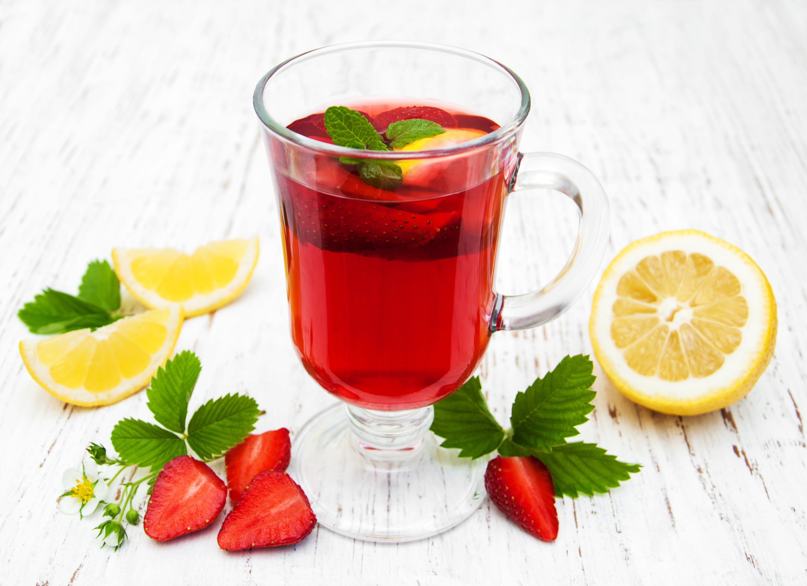
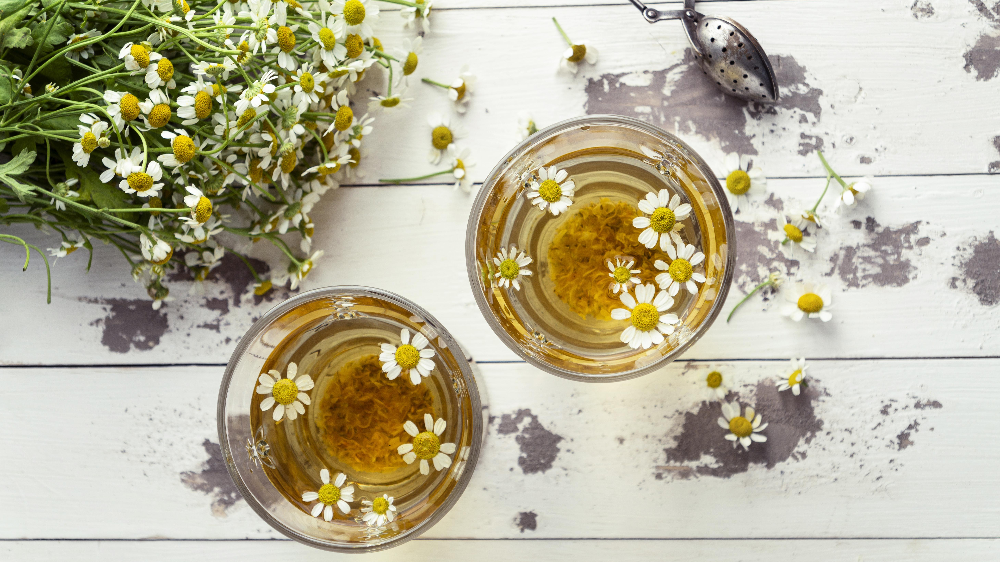

+++
draft = true
title = "Plan Your Tea Garden with Planter!"
slug = "tea-garden"
date = 2023-11-20T11:00:00.000Z
author = "Jessalyn Krenicki"
plants = ["lemon", "blueberry", "strawberry", "Raspberry", "Ginger", "Echinacea", "Cilantro", "Fennel", "Lavender", "Bee Balm", "Chamomile", "Basil", "Catnip", "Nasturium", "Lemon Balm", "Lemon Verbena", "Mint", "Lemongrass", "Sage", "Stevia", "Thyme", "Rosemary"]
series = ["Plan Your Garden"]
tags = ["Planning"]

[cover]
relative = false
image = "berries-wild-blueberries-lingonberries-plate-blooming-sprig-magical-forest-heather-with-forest-mushrooms-chanterelles.jpg"
+++
So begins our series of various garden plans to inspire you! 

Today, we're focusing on an assortment plants that we can use for tea. Whether it's the fruit, leaves, root, flower, or even the seeds themselves, there's incredible range in the kind of plants that can be used for a wonderful cup of tea! We'll be focusing on some of the more common plants in this Growing Guide.

#### Harvesting

* Some plants may taste better dried or fresh, so experiment! Fresh leaves will tend to make more mild flavored teas.
* The best time to harvest tea herbs is a dry morning; too late and the heat of the sun will dry out the leaves a bit, but also drive out some of their flavor.

#### Drying

* Just as there are many options for tea plants, there are also many methods of drying your plants! Most herbs will dry out plenty when hung in paper bags (with holes poked in) in a cool, dry place. 
* However, something as simple as a microwave or a low-heat oven could also do the trick- just make sure to keep an eye on them so they don't burn!

#### Storing

* The most important thing is to keep your harvest stored in an airtight container; whether that's in bags or containers, in the cabinet or the freezer in cubes, it doesn't matter too much! It may be useful to label your containers while you're at it, if you've dried similar-looking herbs.
* To see if dried herbs are still good for tea, rub them between your fingers and smell them. If they smell like nothing, or dusty, then the best thing you can do is toss them!

#### Steeping

* About 1-2 teaspoons of your harvest with 8 ounces of water should be enough for the perfect tea. 
* Most things will be ready after about 8 minutes of steeping. If your blend is too bitter after that time, try reducing the time; or if it's too weak, increase it.
* Some teas, such as green tea, go bitter when steeped in boiling water. If your tea is too bitter, and reducing steeping time only made it weaker, try steeping with hot (but not boiling) water!
* Some of your plants aren't going to fit in a tea bag, but you can use a sieve, french press, or a tea ball to separate out the solids from the tea.

### Example Garden Plans

This garden's plants had no combative or companion relationships in our database; however, future Plan Your Garden guides may feature plants that do interact! We'll be sure to let you know of any possible interactions, if that happens.

### Tea Plants Breakdown:

#### Blueberry

Whether you opt for fresh or frozen blueberries, both bring a burst of flavor to your cup. Consider experimenting with complementary notes by pairing blueberries with basil, hibiscus, or green tea for a unique twist. If you want to extract the full berry goodness, try mashing the blueberries directly into the water and then straining the mixture!

#### Raspberry

Get ready to dive into a world of raspberry goodness – and it's not just about the berries! Whether you opt for the juicy fruits or the leaves, raspberries bring a unique twist to your tea experience. If you like green tea, you'll love the raspberry leaf brew. On the other hand, the fruit themselves offer tartness, and pair exceptionally well with a squeeze of lemon or some black tea. 

#### Lemon

Lemon is something that may be tough to grow in a small garden, but its versatility is unmatched; it earns its place in this list. Whether you prefer squeezing in some fresh juice or tossing in slices of the fruit, lemons add a burst of brightness that complements not just herbal teas but even black tea. If you want lemon to be the star of the show, try it with honey- and if you want a drink to really rock your taste buds, pair it with ginger as well.

#### Strawberry

Get ready to sweeten up your tea game with fresh strawberries! For a classic touch, pair strawberries with black tea, and if you're feeling something a bit smoother, you can add milk for some strawberry milk tea!

If you want something more herbal, experiment with pairings like mint, basil, ginger, or anything citrusy. 

#### Echinacea

Known for its long history of medicinal use, the coneflower brings a unique pine flavor to your tea, creating a distinctive and invigorating brew. It's incredibly versatile, too; you can use the leaves, the flower, or even the roots. It's a strong flavor already, so it doesn't need much to support it- maybe honey and lemon, if it suits you!

#### Lavender

Whether you use the flowers or even the leaves, lavender brings a calm and sweet flavor to your cup that's not overwhelmingly floral. This versatile herb plays well with others, making it a fantastic companion to herbs, a drizzle of honey, or even in black tea. The variety English Lavender is particularly excellent for tea, with its compact flower heads.

#### Chamomile

Whether from dried buds for a relaxing experience or fresh ones for a fruitier note, chamomile is your go-to for a soothing cup. This versatile herb can stand alone, offering a gentle floral flavor, or blend seamlessly with other herbs for a delightful herbal harmony. So, whether you're unwinding or experimenting with blends, chamomile brings a touch of tranquility to every sip.

#### Bee Balm

Bee balm, a tea sensation in a small package! Whether dried or fresh, petals or leaves, this herb packs a punch with a robust mint flavor and subtle citrus notes. A little goes a long way, so use it sparingly for a refreshing twist in your tea. Whether solo or in a blend, bee balm is your shortcut to a bold, minty, and citrusy tea experience.

#### Ginger

Meet ginger, the flavor powerhouse for your tea adventures! Grab some dried ginger root, peel it with a spoon, and then slice or grate it up to unleash its bright and spicy kick. Ginger's robust flavor easily takes the spotlight, making it a solo act in your tea cup – a perfect alternative to coffee for an invigorating kick. 

Known for its digestive benefits, ginger pairs seamlessly with the sweet touch of honey and the zesty freshness of lemon. Spice up your tea routine with the bold and energizing essence of ginger.

#### Nasturium

Introducing nasturtium, a floral delight for your tea cup! Opt for dried nasturtium flowers to unlock their slightly peppery flavor, adding a unique kick to your brew. These blooms, bursting with personality, offer a distinctive note that can stand out on its own or complement other herbal blends. Spice up your tea ritual with the subtle warmth of nasturtium, making each sip a flavorful journey.

#### Cilantro/Coriander

Enter cilantro, a versatile herb ready to shake up your tea game! Whether you're working with dried seeds or fresh leaves, cilantro adds a unique twist to your brew. While the dried leaves may not retain much flavor, fresh ones bring a subtle citrus and peppery note, while the seeds boast a tangy and floral taste, even making appearances in the world of beer flavoring. This herb loves to mingle with lemony companions and a hint of honey, creating a fragrant tea rich in antioxidants and vitamin K. So, spice up your tea ritual with cilantro and savor a cup that's as flavorful as it is refreshing!

#### Fennel

Say hello to fennel, where the magic lies in the seeds! Steep these little powerhouses to unlock their licorice and anise symphony. Want to freshen it up? Mint is your go-to wingman. For a sweeter kick, introduce stevia or honey to build on that licorice goodness. But if you're feeling bold, toss in some ginger and lemon for a flavor explosion that'll redefine your tea experience. Fennel, the secret ingredient to a cup that's not just a drink but a journey through layers of aromatic delight.

#### Basil

Whether you fancy the flowers or the leaves, basil brings a subtle peppery note to your cup. Dive into herbal harmony by pairing it with mint for a refreshing twist, or let it dance with the bright zest of lemon or citrusy herbs. Feeling a bit traditional? Basil plays well with black tea, creating a blend that's both familiar and comforting. Elevate your tea ritual with basil, where every sip is a journey into tranquility and flavor.

#### Catnip

Enter catnip, not just a feline favorite but a soothing herb for your tea ritual! Whether it's the dried leaves or flowers, catnip can brew into a calming and mild mint tea that might just become your new go-to for relaxation. While your cats might go wild over this plant, for humans, it's a gentle remedy that can aid with headaches and provide a moment of tranquility. So, indulge in a cup of catnip tea and let its calming properties work their magic.

#### Lemon Balm

* Dried leaves, bright citrus flavor
* It's a refreshing way to relieve insomnia and anxiety.

#### Lemongrass

* Stalks, digestive and calming
* Can be dried, or used fresh
* Careful when harvesting, the stalks can be sharp!
* Intense lemon flavor, use sparingly; could go well with black tea over ice!

#### Mint

* Use the fresh or dried leaves, digestive and calming. Pairs well with other herbs like lavender, thyme, and rosemary.
* Fresh leaves make a more mild tea
* So many varieties of mint- each with slightly different flavors. Try out Chocolate Mint, or Apple Mint, or tried-and-true Peppermint

#### Lemon Verbena

* Dried leaves, lemony flavor, good for digeston

#### Sage

* Leaves
* Tastes very strongly of pine, which can be overwhelming by itself. Pairs best with stevia or honey, and lemon

#### Stevia

* Dried leaves
* It's very sweet, so use very sparingly! Treat it like sugar (because frankly, it is).
* Try it with with mint, lemon balm, and sage!

#### Thyme

* Fresh or Dried Leaves (the stems don't add much, but they do make it easier to 
* Slightly savory and very fragrent and great for a cough/soothing your throat. Goes well by itself or with a citrusy herb

#### Rosemary

* Dried leaves
* Slight pine taste with some citrus, an invigorating tea with interesting flavor. Pairs well with other citrusy herbs, and a little sweetener (stevia or honey)

As the air gains a chill, we tend to seek both warmth and a way to use our leftover harvest. Thankfully, you can do both by making some of these herbal teas! We hope this Growing Guide brings you some comfort and heat this season- keep an eye out for more pieces in this Plan Your Garden series!