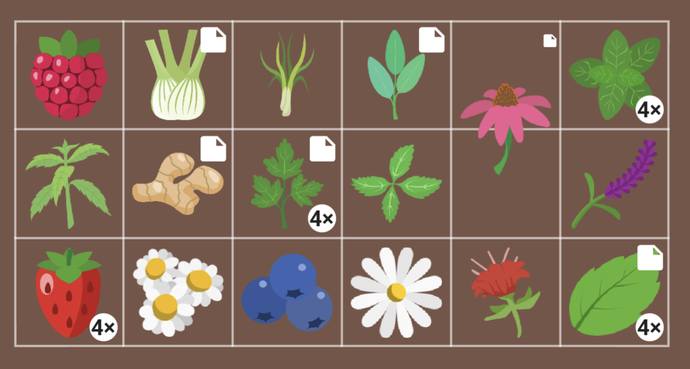
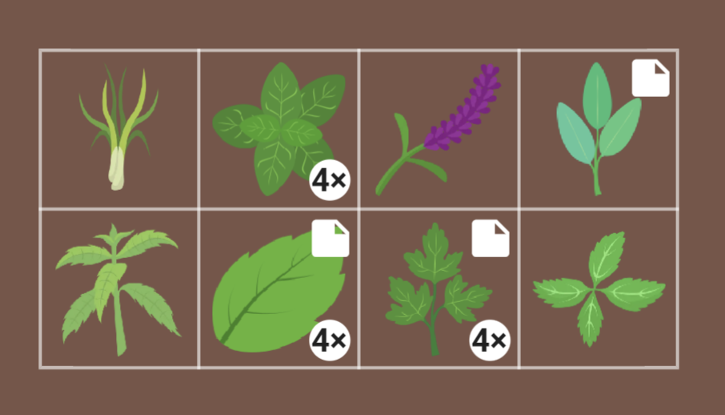

+++
draft = true
title = "Plan Your Tea Garden with Planter!"
slug = "tea-garden"
date = 2023-11-18T11:00:44.523Z
author = "Jessalyn Krenicki"
plants = ["lemon", "blueberry", "strawberry", "Raspberry", "Ginger", "Echinacea", "Cilantro", "Fennel", "Lavender", "Bee Balm", "Chamomile", "Basil", "Catnip", "Nasturium", "Lemon Balm", "Lemon Verbena", "Mint", "Lemongrass", "Sage", "Stevia", "Thyme", "Rosemary"]
series = ["Plan Your Garden"]
tags = ["Planning"]

[cover]
relative = false
image = "berries-wild-blueberries-lingonberries-plate-blooming-sprig-magical-forest-heather-with-forest-mushrooms-chanterelles.jpg"
+++
The 2023 growing season may be slowing down, but the cold months are the perfect time to start planning your new year's garden!

So begins our series of various garden plans to inspire you! 

Today, we're focusing on an assortment plants that we can use for tea. Whether it's the fruit, leaves, root, flower, or even the seeds themselves, there's incredible range in the kind of plants that can be used for a wonderful cup of tea! We'll be focusing on some of the more common plants in this Growing Guide.

#### Harvesting

* Some plants may taste better dried or fresh, so experiment!
* The best time to harvest tea herbs is a dry morning; the heat of the sun will dry out the leaves a bit, but also drive out some of their flavor.

#### Drying

* Just as there are many options for tea plants, there are also many methods of drying your plants! Most herbs will dry out plenty when hung in paper bags (with holes poked in) in a cool, dry place. 
* However, something as simple as a microwave or a low-heat oven could also do the trick- just make sure to keep an eye on them so they don't burn!

#### Storing

* The most important thing is to keep your harvest stored in an airtight container; whether that's in bags or containers, in the cabinet or the freezer in cubes, it doesn't matter too much! It may be useful to label your containers while you're at it, if you've dried similar-looking herbs

#### Steeping

*

### Example Garden Plans

This garden's plants had no combative or companion relationships in our database; however, future Plan Your Garden guides may feature plants that do interact! We'll be sure to let you know of any possible interactions, if that happens.

### Tea Plants Breakdown

* Blueberry

  * Fruit
* Lemon

  * Fruit
* Strawberry

  * Fruit
* Raspberry

  * Can use fruit or leaves
* Ginger

  * Root
* Echinacea

  * Can use root, flower, or leaves!
* Cilantro

  * Seeds
* Fennel

  * Seeds
* Lavender

  * Flowers or leaves, calming
* Bee Balm

  * Flowers or leaves
* Chamomile

  * Buds, relaxing and stomach settler
* Basil

  * Flowers or leaves
* Catnip

  * Leaves or flowers, calming
* Nasturium

  * Flowers
* Lemon Balm

  * leaves, calming
* Lemon Verbena

  * Leaves
* Mint

  * Use the leaves, digestive and calming
* Lemongrass

  * Stalk, digestive and calming
  * Careful when harvesting, the stalks can be sharp!
* Sage

  * Leaves
* Stevia

  * Leaves
* Thyme

  * Leaves
* Rosemary

  * Leaves