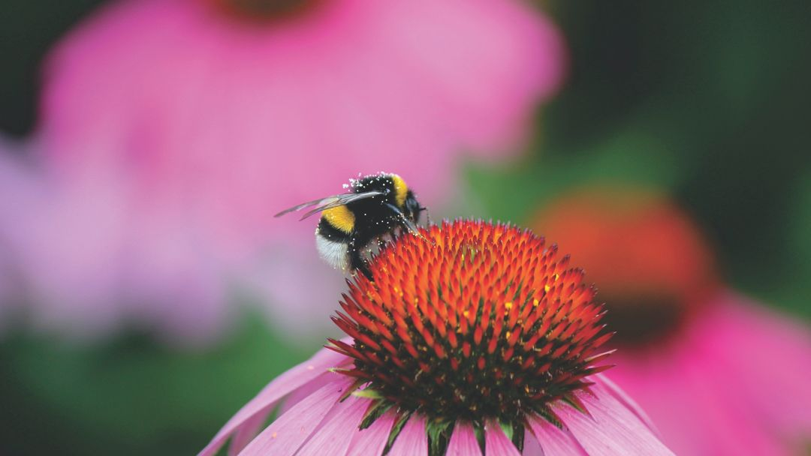

+++
draft = true
authors = []
title = "Test page bundles"
date = 2023-03-10T00:53:37.065Z
author = "Peter Keefe"
plants = []
weight = 5
override_position = false

[cover]
alt = "A holiday gift with a red bow surrounded by greenery"
caption = ""
image = "bee-on-echinacea.jpeg"
relative = true
+++
This is just a test

What about a page bundle image in the post?

