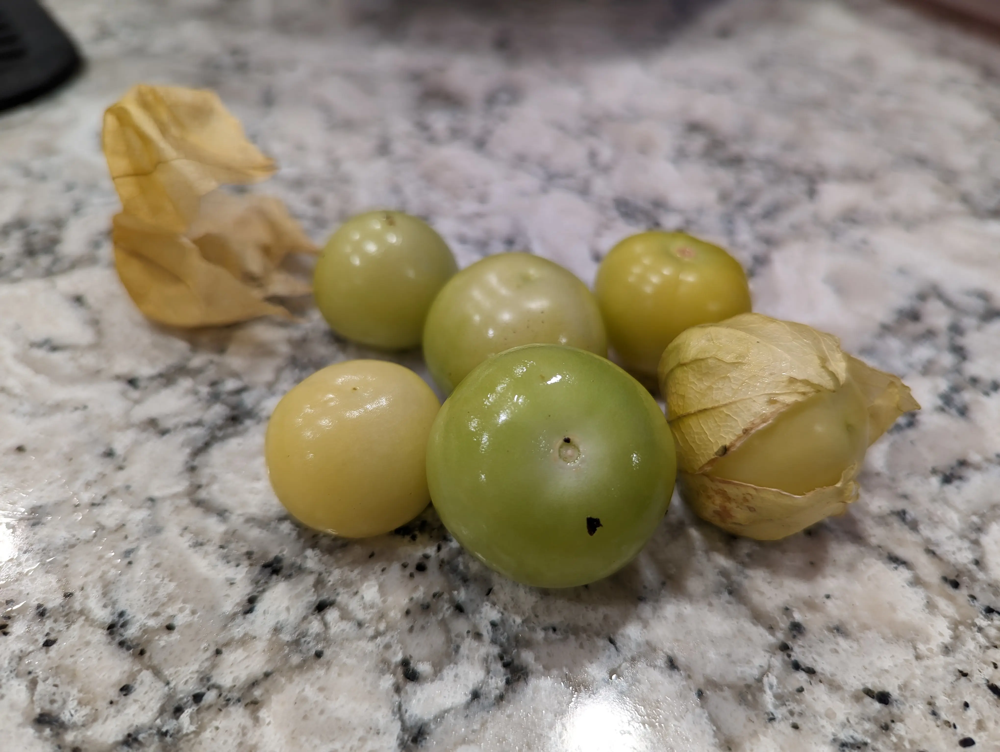
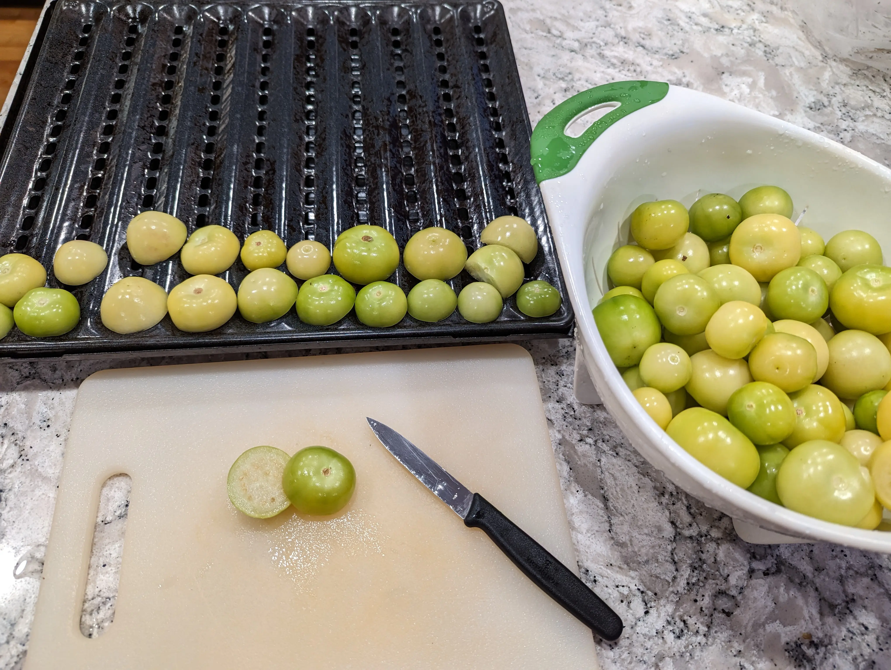
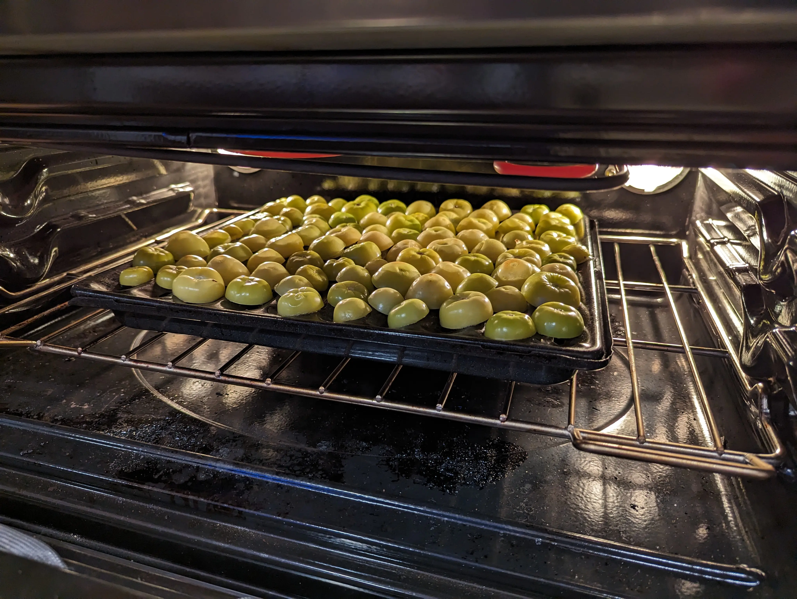
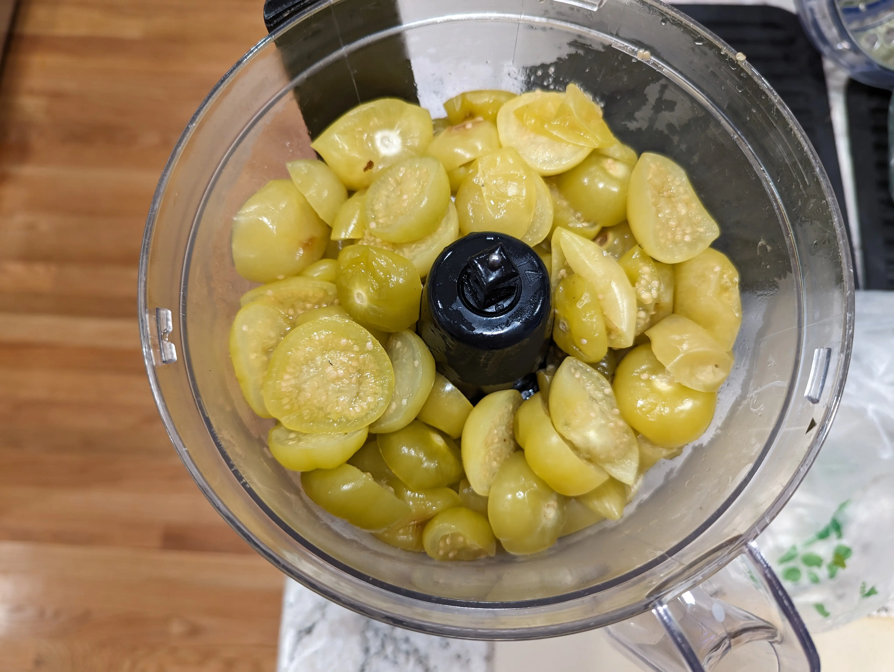
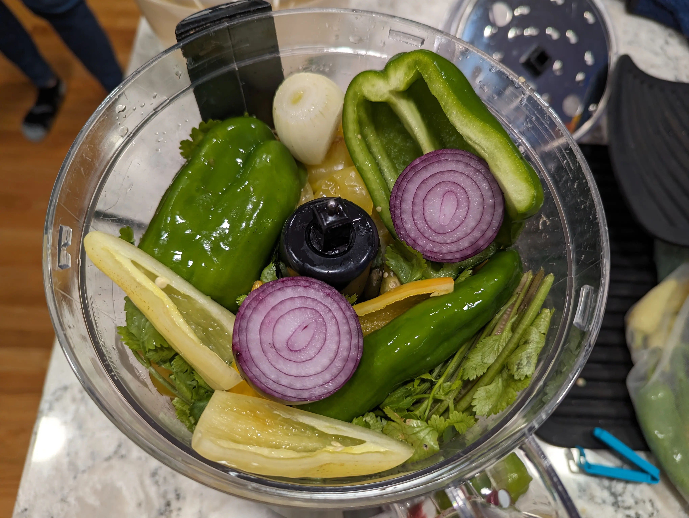
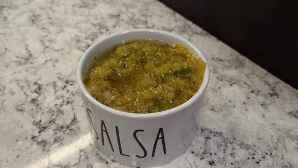

+++
draft = true
title = "Tasty Tomatillo Salsa"
slug = "tomatillo-salsa"
date = 2023-09-21T22:44:06.604Z
author = "Peter Keefe"
plants = ["Tomatillos"]
tags = ["Recipe"]

[cover]
relative = false
image = "pxl_20230921_221127362.webp"
caption = "Fresh tomatillo salsa!"
+++
### Growing Tomatillos

I tried growing tomatillos for the first time this year, and boy, did I get a bumper crop. I started 8 seedlings indoors in March and all survived. So of course I planted all 8 tomatillos. Afterall, it's so hard to *not* plant a seedling that you grew, isn't it!?\
\
The tomatillo plants took off FAST. By mid-summer, they were a pollinator's dream:

Here's a video of what my tomatillo plants looked like in August:

\
\
Tomatillos are now my favorite crop in the garden. Not only do they taste great as salsa verde, they are easy. In my case, **extremely easy**. After I planted them, they required no support besides a simple tomato cage. Even with the cage, some limbs still plopped on the ground but that didn't prevent them from growing fruit. And each fruit comes with it's own pest-resistant papery wrapper. I never noticed damage to any tomatillo that was still on the plant. Even tomatillos that had fallen on the ground lasted for about a week before the ants finally started to munch on them.

[Check out tomatillos in Planter](https://planter.garden/plants/tomatillos) for more growing information.

### Tomatillo Salsa Verde

If you've ever had Moe's green tomatillo salsa, this is it!

#### Ingredients:

* ~40 medium tomatillos (enough to fill a baking sheet when sliced in half)
* 1 medium onion
* 1 medium bell pepper
* 1 spicy pepper (optional)
* Handful of fresh cilantro
* Juice of a lime
* 1 tsp salt (or to taste)
* 1/2 tsp cumin

Start by husking your tomatillos. Unlike tomatoes, you don't need to cut out the area around the stem or core them or anything like that. Just husk them. If this is your first time dealing with tomatillos, you'll quickly notice how sticky they are. Just run them under some water to get rid of that stickiness.

Then, slice each tomatillo in half and place them cut-side-down on a foil-lined baking sheet or broiler pan. Broil on high for about 6 minutes.

Optionally drain any extra liquid. Then toss the tomatillos in a food processor with all the other ingredients.

Chop it all up and you're done. Enjoy! 

**"But I don't want to turn on my oven"**

That's okay! You can completely skip the broiling step and simply toss everything into the food processor. I've tried it both ways, and I've found that I prefer the broiled salsa a tad more. Tomatillos have a sweet but sour taste to them, and broiling takes some of the sourness away.