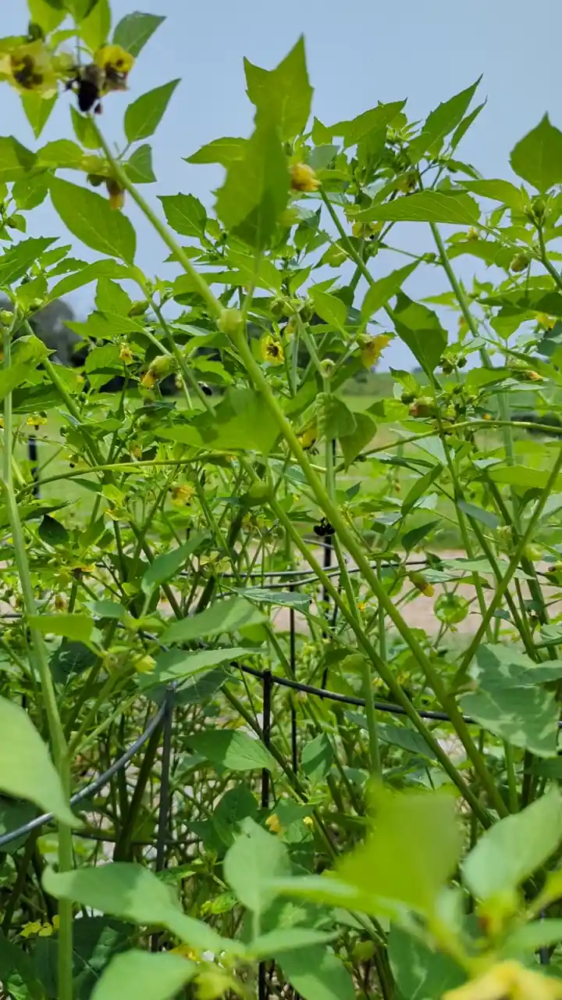

+++
draft = true
title = "Tasty Tomatillo Salsa"
slug = "tomatillo-salsa"
date = 2023-09-21T22:44:06.604Z
author = "Peter Keefe"
plants = ["Tomatillos"]
tags = ["Recipe"]

[cover]
relative = false
image = "pxl_20230921_221127362.jpg"
caption = "Fresh tomatillo salsa!"
+++
I tried growing tomatillos for the first time this year, and boy, did I get a bumper crop. I started 8 seedlings indoors in March and all survived. So of course I planted all 8 tomatillos. Afterall, it's so hard to *not* plant a seedling that you grew, isn't it!?\
\
The tomatillo plants took off FAST. By mid-summer, they were a pollinator's dream:

\
\
Here's a video of what my tomatillo plants looked like in August:

\
\
Tomatillos are now my favorite crop in the garden. Not only do they taste great as salsa verde, they are easy. In my case, **extremely easy**. After I planted them, they required no support besides a simple tomato cage. Even with the cage, some limbs still plopped on the ground but that didn't prevent them from growing fruit. And each fruit comes with it's own pest-resistant wrapper. I never noticed damage to any tomatillo that was still on the plant. Even tomatillos that had fallen on the ground would last for about a week before the ants finally started to munch on them.