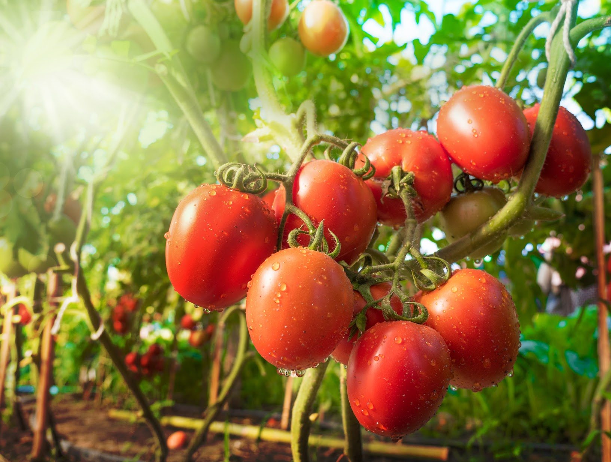

+++
draft = true
title = "Tomato Growing Tips & Tricks"
slug = "Tomato Growing Tips & Tricks"
date = 2023-08-11T10:00:00.000Z
author = "Jessalyn Krenicki"
plants = ["Tomato"]
weight = 5

[cover]
relative = true
image = "organic-food-farm.jpg"
alt = "Gardener harvesting Tomatoes"
+++
Tomatoes, those luscious gems of the garden, hold a special place in the hearts of many gardeners. While basic tomato growing practices are well-known, diving into advanced care techniques can elevate your tomato game to new heights. From strategic fruit removal to battling pesky diseases, let's explore a comprehensive guide that goes beyond the usual and takes your tomato cultivation skills up a notch.

\[image]

### Pruning for Vigor

Pruning isn't just about aesthetics; it's a strategic move. Pinch off suckers, those tempting side shoots that appear at the junction of the main stem and branches. This redirects the plant's energy towards fruiting, resulting in larger, healthier tomatoes!

### Thinning for Success

Similarly to pruning, thinning will help to promote larger tomatoes! Counterintuitive as it may seem, thinning out early fruits can boost your overall harvest. By removing some young tomatoes, you allow the plant to channel its energy into fewer, but larger and more flavorful, mature fruits. It's all about quality over quantity!

### Topping Techniques

### The Art of Tomato Trellising

Taming the tomato jungle involves trellising. Stakes, cages, or other supports keep plants upright, enhancing air circulation and reducing disease risk. A well-supported tomato plant is a healthy one. [If you're looking for an extensive guide to trellising your plants, we have a great tomato trellising guide here!](https://blog.planter.garden/posts/tomato-trellising-techniques/)

### Covering Disease Management

### Waging War on Pests

Pesky intruders like aphids and hornworms can wreak havoc on tomato plants. Employ natural predators like ladybugs and lacewings, and turn to organic insecticides when needed. Regular monitoring is key to keeping pest numbers down. [If you're interested in biological control in the garden, here's our blog post on pest hunters you can introduce!](https://blog.planter.garden/posts/16-of-your-garden-s-local-pest-hunters/)

### Wrapping up the Season

As the growing season winds down, clean up your garden bed. Remove all plant debris to discourage disease and pest overwintering. Consider sowing cover crops to replenish the soil during the dormant months.

### Embrace Crop Rotation

The last tip, but certainly not the least, is to rotate your tomato crops annually! This simple practice prevents the buildup of soil-borne pests and diseases, ensuring the longevity of your tomato-growing success. If you plan to garden long-term, and don't want to sign yourself up for future difficulties in severe soil amendments, crop rotation is only going to help you!

\[conclusion]