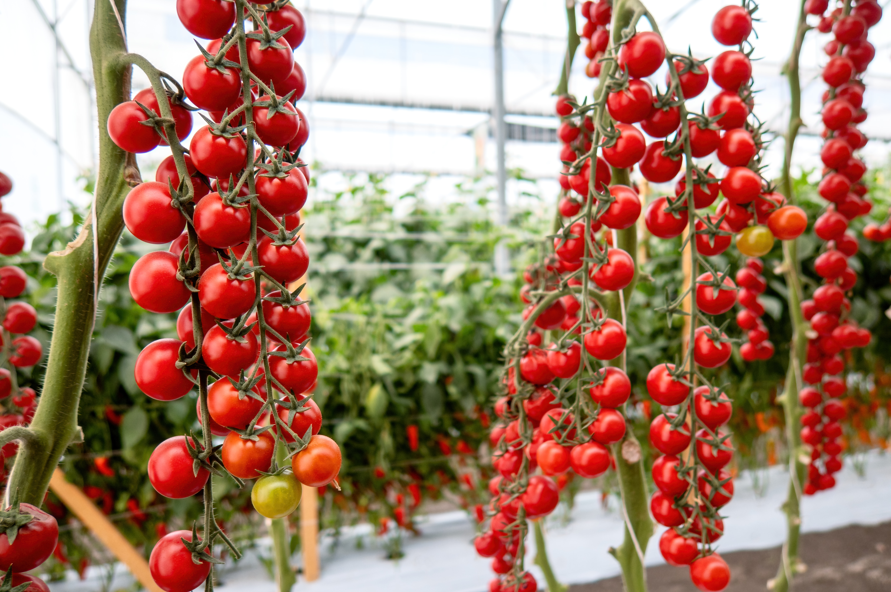

+++
draft = true
title = "Tomato Growing Tips & Tricks"
slug = "Tomato Growing Tips & Tricks"
date = 2023-08-11T10:00:00.000Z
author = "Jessalyn Krenicki"
plants = ["Tomato"]
weight = 5

[cover]
relative = true
image = "organic-food-farm.jpg"
alt = "Gardener harvesting Tomatoes"
+++
Tomatoes, those luscious gems of the garden, hold a special place in the hearts of many gardeners. While basic tomato growing practices are well-known, diving into advanced care techniques can elevate your tomato game to new heights. From strategic fruit removal to battling pesky diseases, let's explore a comprehensive guide that goes beyond the usual and takes your tomato cultivation skills up a notch.

\[image]

### Pruning for Vigor

### Topping Techniques

\[image?]

### Thinning for Success

### The Art of Tomato Trellising

Taming the tomato jungle involves trellising. Stakes, cages, or other supports keep plants upright, enhancing air circulation and reducing disease risk. A well-supported tomato plant is a healthy one. [If you're looking for an extensive guide to trellising your plants, we have a great tomato trellising guide here!](https://blog.planter.garden/posts/tomato-trellising-techniques/)

### Covering Disease Management

### Waging War on Pests

\[image?]

### Harvesting with Finesse

### Wrapping up the Season

\[image]

### Embrace Crop Rotation

\[conclusion]

\[image?]