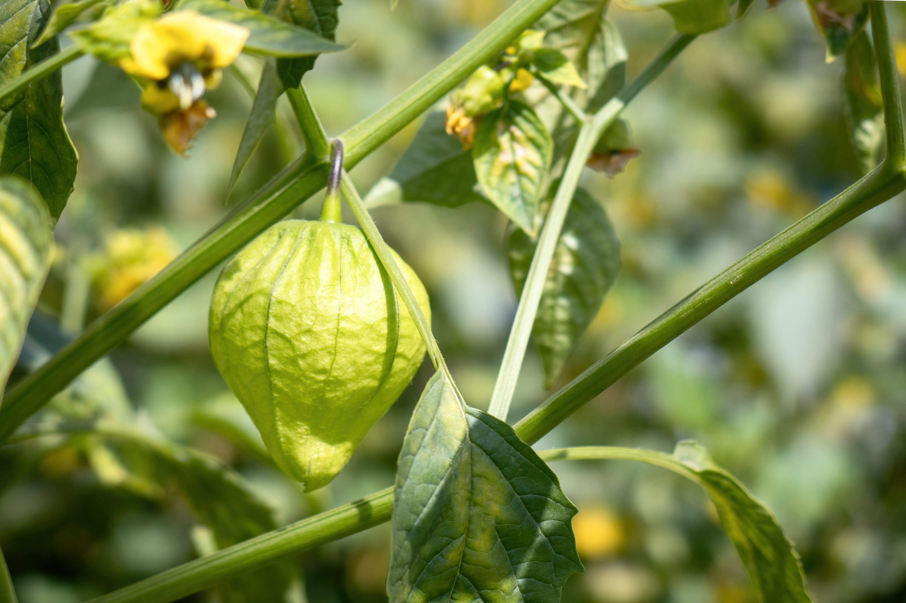
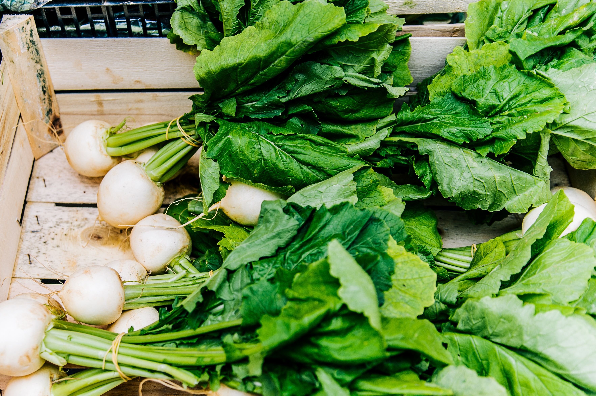
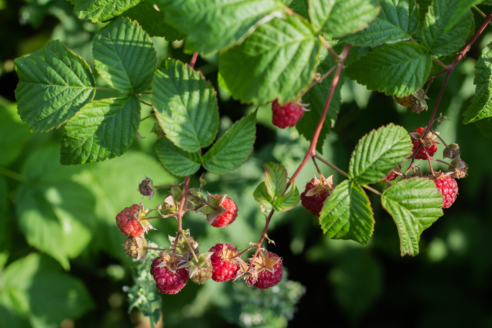

+++
draft = false
title = "7 Underrated Plants to Add to Your Garden"
slug = "underrated-plants"
date = 2023-06-05T00:50:01.908Z
author = "Erin Thomson"
plants = ["Tomatillos", "Potatoes", "Spinach", "Turnip", "Squash", "Raspberries", "Rhubarb"]
series = ["Plant Picks"]
weight = 5

[cover]
relative = true
image = "underrated-plants.png"
alt = "A collage of plant images with the words \"7 Underrated Plants for Your Garden\""
+++
Popular plants such as tomatoes, peppers, and beans often take center stage in the summer garden. It can be easy to fall into a routine of planting the same favorite crops over and over again. But even if you stick with the classics, it’s worth branching out and trying a couple new plants each year. There are some plants that can tend to be overlooked that can make excellent garden additions if you give them a chance. You might just discover a new favorite plant to add to the must-grow list!

### Tomatillos

If you've ever enjoyed ‘salsa verde’ at a Mexican restaurant, you should definitely give tomatillos a try in your garden! Tomatillos are in the Solanaceae (nightshade) family like tomatoes and peppers, but in many ways they are easier to grow. They enjoy heat and a long growing season, but as long as you get them up and growing in time they will produce like crazy until frost comes. They are relatively disease and pest resistant, and pruning or fancy trellising is not required! You can let your tomatillos bush out and offer them some support in a sturdy [tomato cage](https://www.amazon.com/s?k=tomato+cage)- then watch them take off!

### Potatoes

Potatoes are another Solanaceae family member that can be overlooked in the garden. Why bother using precious garden space to grow something that is so cheap in the grocery store? If you can eke out a few square feet somewhere in your garden (it doesn’t need to be prime real estate) it is worth giving potatoes a go. It is recommended to use seed potatoes purchased from a garden center for the best yields, but some success can be had by popping a few sprouting potatoes from your pantry into the ground Potatoes do prefer loose, fluffy soil and will appreciate sufficient moisture and nutrients, but otherwise they are a set-it-and-forget-it crop. Once you’ve tasted a garden-grown potato you’ll find space to grow them every year!

### Spinach

Lettuce is often the go-to when it comes to leafy garden greens, but spinach is a true powerhouse plant. It is hardier than lettuce and contains more vitamins and nutrients. It's also more versatile in the kitchen- you can grow lots of small spinach plants for tender ‘baby spinach’ that can be regularly plucked for fresh salads. Or you can let the plants grow larger for more substantial leaves that can be cooked or frozen. Like lettuce, spinach can be prone to bolting so you’ll want to consider[ succession planting for ongoing harvests](https://blog.planter.garden/posts/succession-planting-for-nonstop-harvests/). If you're looking to add more greens to your garden and your diet, swap spinach into the rotation!

### Turnip

Thinking about turnip might conjure up memories of mushy puree served exclusively over the holidays. But you might not know that there are some types of turnips that are deliciously sweet, crispy, and can be eaten raw or cooked. ‘Hakurei turnips’ are a farmer’s market favorite that are super easy to grow. They look like a jumbo-size white radish, and grow similarly to radishes, but the taste is fresh and juicy without any of the signature radish kick (radish haters love them!) The greens are also excellent for stir-frying. Even if adding turnips to your garden has never crossed your mind, be sure to give hakurei a try!

### Winter Squash

Summer squash such as zucchini often takes front row in the summer garden, but winter squash that can be stored such as butternut, acorn, and spaghetti squash let you enjoy your garden-fresh harvest well into the winter months when other crops have long since been eaten. ‘Winter squash' suggests a plant that should be grown in cooler weather, but they are in fact heat-loving plants that grow through the summer months (depending on your location). While winter squash plants can get large and ramble-y, one healthy plant can produce several squashes. And if space is tight, you can also trellis them vertically to free up precious square footage in your garden beds. Check out [Grow Super Squash](https://blog.planter.garden/posts/grow-super-squash/) to learn to to grow winter (and summer!) squash.

### Raspberries

While many gardeners jump straight into growing strawberries, raspberries are arguably the easiest berries to grow. And considering how expensive a small pint of raspberries can cost, they are well worth it! Red raspberry bushes do tend to spread over time- which can be a blessing but also can become a problem- so you'll want to think about how to contain them. Raspberries need pruning each year to maximize the harvest, and how you prune them depends on which type of raspberry you are growing. Be sure to research this before hacking away! Other than an annual boost of nutrients and the occasional haircut, raspberries are easy-peasy to grow! For more info on growing raspberries check out [Grow Bountiful Berries](https://blog.planter.garden/posts/grow-bountiful-berries/).

### Rhubarb

Rhubarb might feel like an old-timey (dare I say *boring?*) plant, but they are a cornerstone of home gardening for a reason. Once they’re up and growing rhubarb plants are hardy as anything and require almost no maintenance, with some plants living on for several decades. And while the stalks are typically processed for baking and preserving, there’s really nothing easier than chopping up some rhubarb and freezing it to be able to make delicious rhubarb crisp! If you have a spot anywhere in your yard that gets sun exposure- even at the side of your house, mixed in with landscaping plants- just stick a rhubarb plant in there! You’ll appreciate having it every time you whip up a sweet-tart rhubarb delicacy.

You don’t need to give up all your garden go-tos to make way for new plants. Just Keep an open mind and try at least one or two plants you may have never thought of growing. You might just find they end up in your regular garden rotation!

