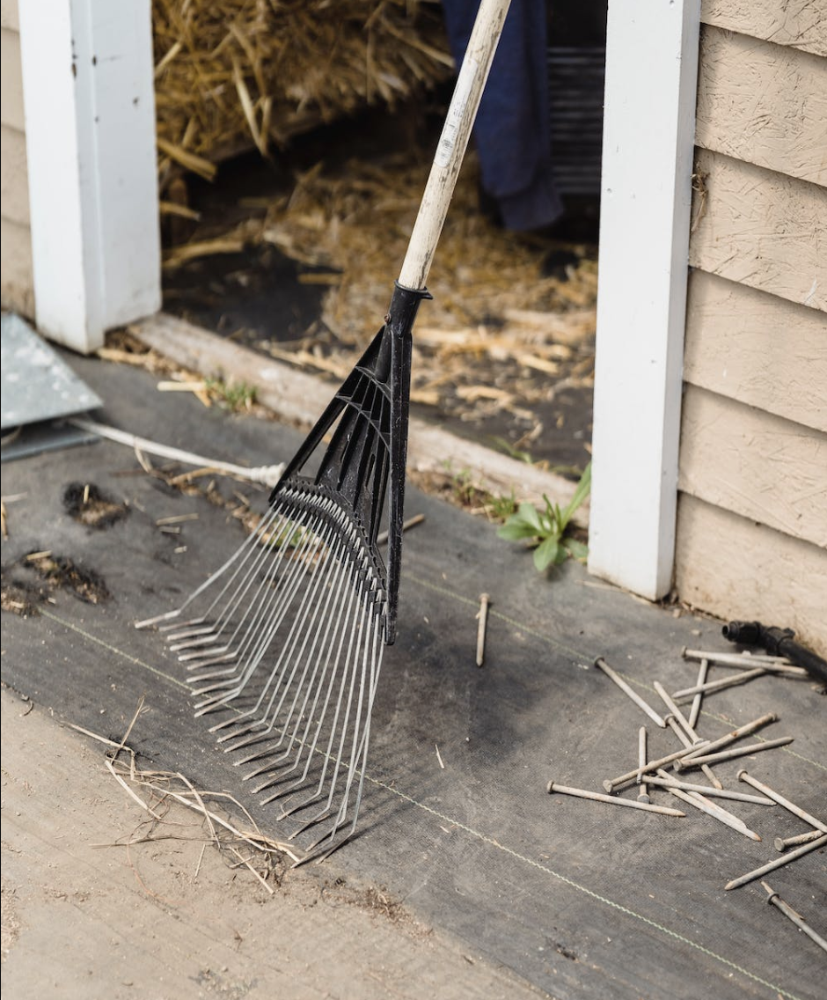
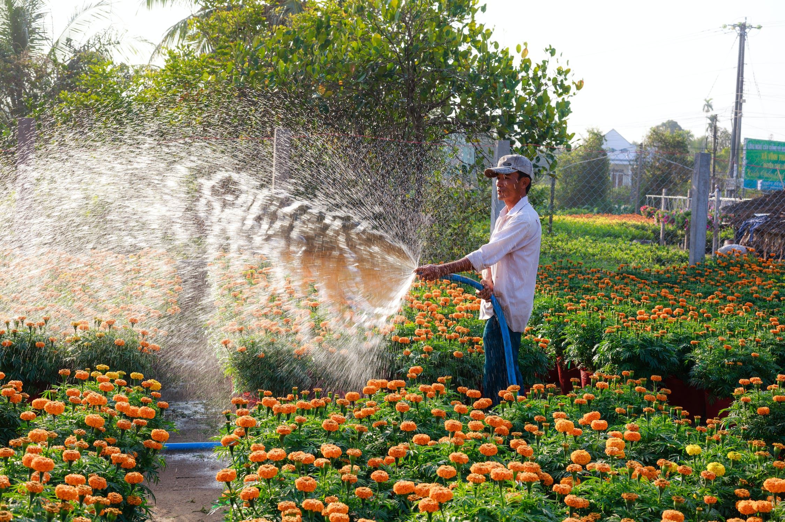

+++
draft = false
title = "Unlock Your Garden's Potential with the Right Tools!"
date = 2023-03-16T20:22:20.628Z
author = "Jessalyn Krenicki"
series = ["Garden Tools"]

[cover]
relative = true
linkFullImages = true
image = "screenshot-2023-03-14-at-6.48.58-pm.png"
+++
Are you looking to restock your gardening equipment? Maybe you’re starting up new and looking for the tools for the job you've planned on Planter? Or perhaps, you’re looking for gifts for a loved one who gardens? Well look no further! There’s a large variety of tools that could go to good use in your planting space; it all just depends on what you need done! So...

## **Let's start first with the basics!**

### Spades and Shovels

These two tools are very similar, but have some different strengths in the garden! A shovel has a pointed, rounded blade, and are great for general movement of soil; on the other hand, spades are squared off with straight sides, so are great for edging or for straightening the sides of holes!

### Trowels

Trowels are small, handheld shovels that are great for more delicate soilwork. If you’re planting in window boxes, pots, or generally working with small plants like seedlings, these will be your best friend! Some of them will even have a serrated edge for cutting roots, if you need!

### Rakes

You might have used a leaf rake before in your yard or garden, but there’s also another kind of rake that’s useful in the garden! Leaf rakes are lightweight, and great for removing light things from the top of your soil such as sticks or, of course, leaves. They’re also good for spreading mulch!

On the other hand, we have bow rakes! These rakes are more heavy-duty, and are very useful if you need to clear rocks from your soil or aerate and smooth over the top layer.

### Garden Hoes

This tool has a long handle like a rake, but with a wide flat blade instead of teeth. They come in various sizes and shapes, and they’re great for breaking up soil, making furrows, or pulling up shallow rooted plants! If you need to clear out an area of grass for a new garden plot, a hoe will come in handy!

### Cultivators

Hand cultivators are to rakes as trowels are to spades! This digging fork is useful for removing small weeds from your garden and roughing up soil.

### Hand Weeders

If you have some stubborn weeds that bounce back from pulling or cutting, try out a hand weeder! Push it under the soil, under the roots of weeds, and lever the whole plant out! It’s great for dealing with weeds like dandelions, which have pretty frustrating root systems to deal with.

### Pruning Shears

These handheld, specialized shears are great for work in the garden! They’re a perfect size for pruning and harvesting your crops.

### Gloves

Gloves seem like a simple thing, but they’re an important inclusion in any gardener’s repertoire! Keep your hands clean, and protect from thorns, rashes, scrapes, cuts, and blisters! Some gloves are even made with hard, claw-like fingertips made for digging with!

### Wheelbarrows and Carts

This tool will need some storage space itself, but a wheelbarrow is valuable for easy transportation of anything you need- plants, dirt, mulch, or other tools! If your garden is large, or a distance away from your mulch/shed/anything, this is for you!

### Hoses

A good hose is indispensable, if you have more plants than a couple trips with a watering can can cover! Cut down on your trips back and forth to water, and pair your hose with an adjustable spray nozzle to control the amount and method of water use!

Some hoses are made to be laid out in your garden, too; these are called soaker hoses, and act like sprinklers. Lay them out around your garden amongst your crops, and they’ll slowly and steadily release water through their porous material to keep your soil moist!

## Still looking for more?

Can't get enough of garden tools? Well, never fear! Keep an eye out next week for this post's partner, which will feature some less common and more advanced garden tools! If you're looking for something other than garden tools for your repertoire, we have another post you might like to check out: [2022 Gardener's Gift Guide](https://blog.planter.garden/posts/2022-gardeners-gift-guide/)! 

While you wait for Part 2, it's still a great time to start growing! Check out [Planter, on web or the app](https://planter.garden/#download), to find the growing calendar in your area!