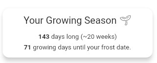
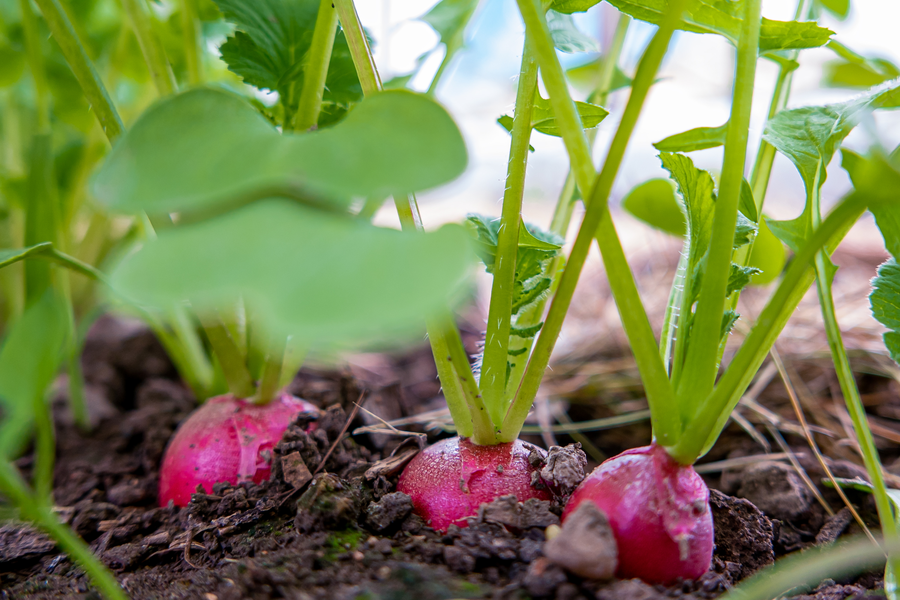

+++
draft = false
title = "What to Plant in Summer"
slug = "What-to-Plant-in-Summer"
date = 2023-07-21T23:16:21.883Z
author = "Erin Thomson"
plants = ["Chard", "Beans", "Radishes", "Lettuce", "Beets", "Carrots", "Cilantro"]
series = ["Plant Picks"]

[cover]
relative = true
image = "summer-plants.png"
alt = "A collage of plant images with the words \"What to Plant in Summer?\""
+++
Once midsummer hits it can feel like you’re in a gardening standstill. On the one hand you’re waiting for some of the longer-maturing plants to start producing a harvest, and on the other hand earlier spring crops are starting to fizzle out. But in midsummer many of us still have ample time to get new plants growing and get a substantial harvest before the season comes to an end. The first step is to check the [Growing Calendar](https://info.planter.garden/growing-calendar/how-to-use/) in [Planter](https://planter.garden/gardens) to see which plants you may still have time to grow in your area. It's important to keep in mind that different varieties of the same plant can have very different days-to-maturity. You’ll want to check how long it takes for that specific variety to mature (usually noted on the seed packet) versus how many growing days you have left in your season (you can find this under Settings in [Planter](https://planter.garden/gardens)):

Below are some common veggie crops that typically mature quickly enough to start from seed in midsummer and still get a solid harvest by season’s end!

### Beets

Beets are an excellent crop to seed in summer and grow into fall. Beets are sturdy plants that can grow in the heat but will also appreciate cooler fall temperatures, and they’re typically ready to harvest in 55-70 days. Don’t feel constrained to just growing plain old purple beets- there are beautiful golden, white, and ‘candy cane’ (pink-and-white striped) varieties that add visual interest in the garden and the kitchen! For beet growing tips be sure to check out [Grow Great Root Vegetables.](https://blog.planter.garden/posts/grow-great-root-vegetables/)

### Chard

Chard is a beet relative that is usually grown for its large, spinach-like leaves. Chard performs well in spite of the summer’s heat, and it can also handle some seriously cold temperatures. Chard typically matures in 40-60 days which means for many gardeners a midsummer planting will give ample time to reach maturity and continue to produce a harvest well into fall and even early winter. Harvest only the outermost chard leaves and it will keep on growing and producing harvests for weeks to come.

### Beans

Beans might be a surprising candidate for summer sowing, but they’re a quick-growing crop that does very well planted in midsummer for early fall harvests. Bush beans tend to mature faster than pole beans, so if your growing season is waning make sure to look for a faster-growing bush bean variety. Beans are a warm season crop that prefers full sun, so be sure to plant them in a sunny spot that will also receive maximum warmth as fall approaches. When cooler nights start to roll in you can use [season extension techniques](https://blog.planter.garden/posts/season-extension/) to keep your beans producing just a little while longer.

### Lettuce

While lettuce does not at all enjoy the heat of summer, it's good to plan for multiple plantings of lettuce throughout the growing season (this is called [succession sowing](https://blog.planter.garden/posts/succession-planting-for-nonstop-harvests/)). Lettuce is generally a quick-growing crop, especially if you are growing it as [cut-and-come-again](https://blog.planter.garden/posts/harvesting-how-to-and-when/#how-to-harvest-lettuce) lettuce rather than full lettuce heads. Lettuce planted in the summer may need a little TLC to produce a harvest. [Shade cloth](https://www.amazon.com/s?k=shade+cloth) can help block out too much searing heat from the sun, and consistent watering can help to avoid stress to the plant that could accelerate [bolting](https://blog.planter.garden/posts/plant-bolting-a-seedy-situation/). And once cooler temperatures hit, your lettuce crop will be even more prolific!

### Carrots

Carrots might seem like a plant-once-and-done crop, but there can be a massive difference in the days to maturity depending on the variety. ‘Early’ carrot varieties can be ready to harvest in as little as 50 days, whereas more substantial storage varieties can take up to 120 days to mature! So be sure to select carrot varieties for summer sowing carefully. Carrots can be tricky to germinate, and summer’s heat does not help matters. Water regularly to keep the soil consistently moist after sowing carrots- some gardeners even put down a piece of plywood over the soil to hold in moisture (be sure to check for germination every day if you go this route!)

### Cilantro

Cilantro is possibly one of the most [bolt](https://blog.planter.garden/posts/plant-bolting-a-seedy-situation/)-prone crops around, which means the only way to be able to keep harvesting it for fresh summertime salsas is to keep on planting it! Keep watering and harvesting your cilantro regularly especially in summer to try to stave off bolting as long as possible. Cilantro that does flower helps to attract pollinators and other beneficial insects that can help your summer crops along– if you have enough space just leave the flowered plants in and plant a new round. You can also easily save seed from cilantro for upcoming plantings!

### Radishes 

Radishes are an excellent crop to sow midsummer (or almost anytime, really) as they grow  extremely quickly. Radishes can reach maturity in as little as 25 days, and their compact size means that they can be tucked into almost any garden space that frees up as spring and summer crops kick the bucket. And if your radishes happen to [bolt](https://blog.planter.garden/posts/plant-bolting-a-seedy-situation/) before you get a chance to harvest them you can always let them continue growing- the green seed pods are edible (and delicious!) Then plant a whole new wave of radishes!

This is just a small sampling of our favorite crops to plant in summer- there are many more summer sowing possibilities to explore. Don’t let your garden dwindle down to just tomatoes and peppers as the season wears on- sow a fresh round of summer crops for full garden beds and abundant harvests!

