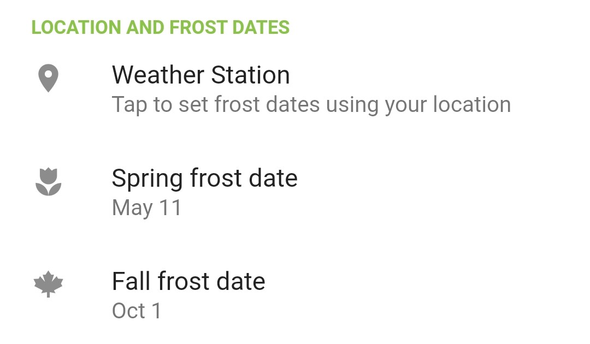
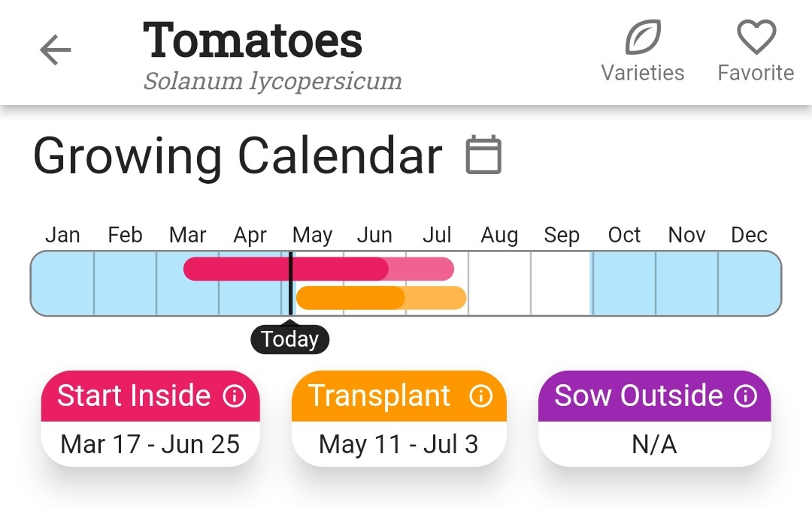
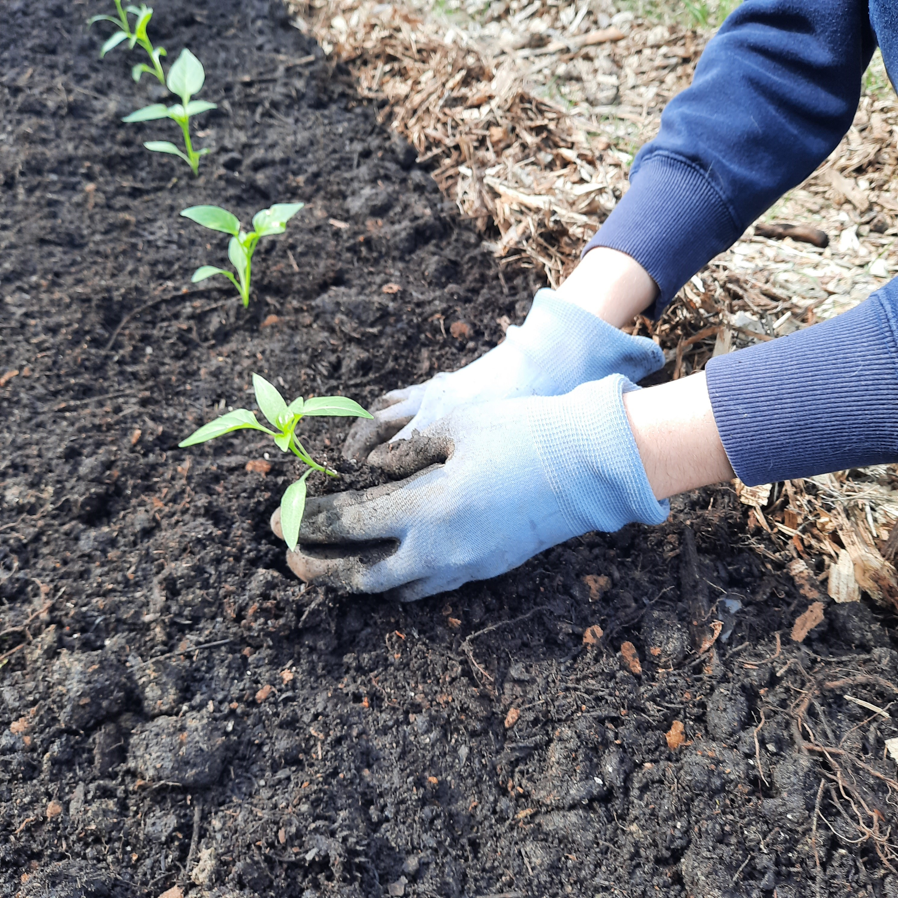

+++
draft = true
title = "When Can I Plant Outdoors?"
slug = "when-to-plant-outdoors"
date = 2023-05-06T01:09:38.295Z
author = "Erin Thomson"
weight = 5

[cover]
relative = true
image = "planting-tomatoes.jpg"
alt = "A pair of hands planting tomato plants"
+++
As soon as the sun starts to peak out in spring it's easy to assume *winter must be gone by now…right?* Unfortunately, the cold weather doesn’t give way to warmer days reliably. Gardeners can easily be tricked into planting too early, only to be caught off guard when the thermometer dips back down again.

While there’s no hard-and-fast rule for when it’s safe to plant outdoors, let’s dive into some considerations. In this article we’ll focus on deciding when to plant warm season plants that are more sensitive to the cold, but for more info about planting [cool season plants](https://blog.planter.garden/posts/cold-hardy-crops/) in springtime check out [How to Plant a Spring Garden](https://blog.planter.garden/posts/spring-garden/).

The first key piece of information that you’ll need to decide when to plant outdoors is your average last frost date. If you’ve already set your frost dates in [Planter](https://planter.garden/) you can quickly refer to them under **Settings** (if not- check-out our [how-to article on setting your frost dates](https://info.planter.garden/getting-started/frost-dates/)):

While the term ‘last’ frost date sounds final, it’s only an estimate of when you’ll no longer receive frosts in spring based on previous weather history in your area. There is a 50% chance that there will be no frost after your average last frost date…but there is also a 50% chance that there could still be frost! So if there’s still some risk of frost after your last frost date, why not just wait and plant in say, July? While you’d certainly avoid the risk of frost, the problem is your plants may not have enough time left in the growing season if you put them in the ground too late. Also they may start to become root-bound in their containers and struggle to get sufficient nutrients the longer they go unplanted. Deciding when to plant is a trade-off between being relatively confident that there is little to no risk of frost, but still planting early enough that your plants can get growing in a timely manner.

For each plant in [Planter](https://planter.garden/) you can refer to the [Growing Calendar](https://info.planter.garden/growing-calendar/how-to-use/) to see recommended date ranges for transplanting and sowing seeds outdoors based on your average frost dates:

]While frost dates are key in determining when you can start planting outdoors, each year can be dramatically different weather-wise and you’ll want to adjust your planting timing accordingly. As an example, if you're looking at the two-week forecast leading up to your last frost date and it's expected to be hot and sunny with nighttime temperatures well above freezing you may want to take advantage of the warm spell to start planting.

On the flip side, if you're near your last frost date and and seeing ominously cold weather in the forecast it may be best to hold off well past your last frost date just to be safe. Precipitation and wind are other considerations too- there is no sense putting your precious plants in the ground only to have them drown in a deluge of rain or get taken out in a windstorm. Take [Notes](https://info.planter.garden/notes-and-events/how-to/) in [Planter](https://planter.garden/) about the weather patterns and your planting timing, so you can refer to them in upcoming years. Keeping track of this information will help you to make better decisions about when to plant.

While the weather is important, how it affects your plants can vary significantly depending on your garden’s microclimates. Microclimates are small localized areas that have temperatures and weather that differ from the broader region. For example, you may have a sheltered area in your garden where heat radiates off a wall- keeping your plants protected and several degrees warmer. Whereas wide-open areas that are exposed to biting winds may not be safe for planting for some time. Become familiar with the microclimates in your garden and use that knowledge to your advantage- in some spots you may be able to plant earlier, in others you may need to hold off a little longer to be safe.

Even if the weather is cooperating and you have a nice sheltered spot in your garden, it still might not be a good time to start planting. If the soil temperature is too cold for the crops you intend to plant, it may be better to delay planting until the soil has a chance to warm up. Although the plants may survive if the weather above ground is decent, planting into cold soil could potentially stunt their growth. To check this use a [soil thermometer](https://www.amazon.com/s?k=soil+thermometer) to test the soil temperature, and research the preferred soil temperatures for the crops you’ll be planting.

And finally, deciding when to plant can also come down to how much work you’re willing to put in in case of extreme weather. If all systems are a go, and you’re ready to get plants in the ground on the early side, are you able to take steps to protect them if the weather happens to take a turn for the worse? If the answer is yes, you might be able to get away with planting earlier. If not, it would be better to err on the side of caution when timing your planting.

Don’t rush to get your warm-season plants in the ground as soon as the thermometer starts to sneak up. While planting late can put a damper on potential harvests, planting too early can be disastrous. Watch the weather patterns and draw from your own experience (and risk tolerance!) to decide the best time to plant in your own garden. The decision of when to start planting will be slightly different for every gardener!

