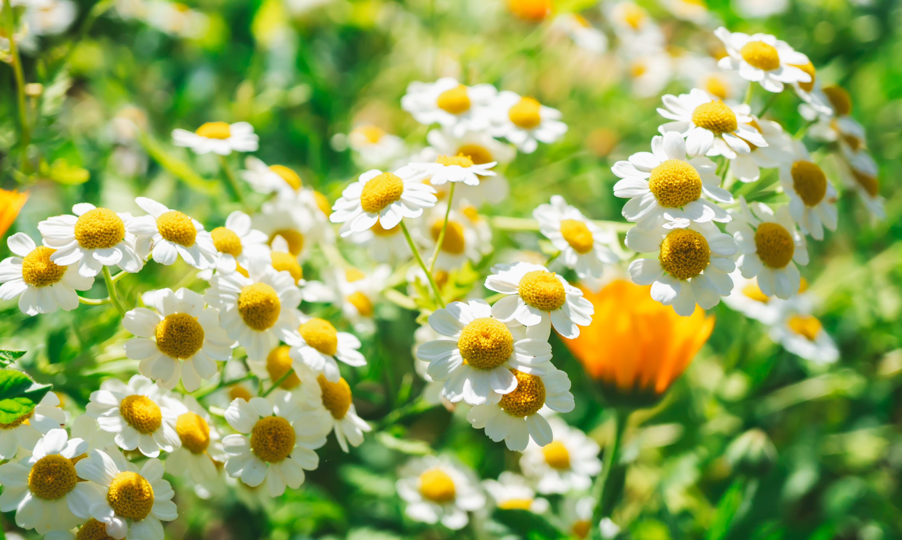
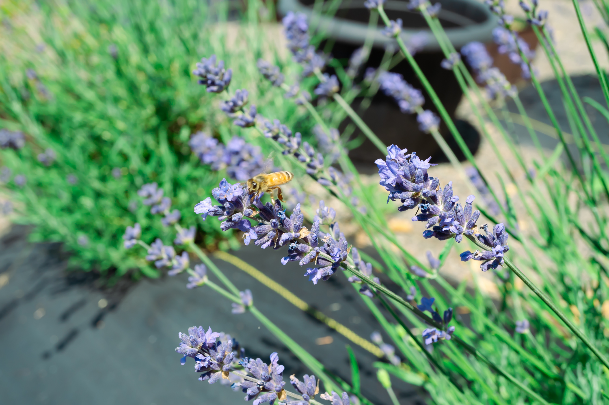

+++
draft = true
title = "Why Should I Grow Herbs in My Garden?"
slug = "Why Should I Grow Herbs in My Garden?"
date = 2023-12-12T17:23:03.947Z
author = "Samantha Togstad"
series = []

[cover]
relative = false
+++
<!--StartFragment-->

Years ago, the average garden grew plants for food, of course, but also for health and healing. Humans have had a relationship with herbs that goes back thousands of years. In today’s world, many of us turn to our gardens for food, but also peace and wellness. Bringing herbs into the garden is a great way to enhance that.

### What Makes a Plant an Herb?

So, first of all, what makes a plant an “herb”? The dictionary tells us an herb is: “a plant or plant part valued for its medicinal, savory, or aromatic qualities”. Herbs can be annuals or perennials. They can be shrubs or trees. They can be disguised as plants you always thought were just ornamental in the garden. Some common garden vegetables are considered herbs! For example, there are many studies on the heart health benefits of garlic.

There are many ways to enjoy herbs. It can be as easy as brewing a cup of tea or adding them to your meals. You can learn the art of making tinctures, salves, and infused oils. One of the best ways to enjoy herbs is just by tending to them and watching them grow. 

### Culinary vs. Medicinal Herbs

You already know that we use culinary herbs, like rosemary, to add flavor to food. And you probably know some herbs that are used as supplements, such as ginkgo biloba.  But people are often surprised to find out that a lot of the herbs sitting in their spice cabinet have a long history of use in traditional medicine! Thyme is an herb that is considered both culinary and medicinal.  Echinacea, on the other hand, is not quite as tasty and is usually only used for enhancing health. Some herbs are also too strong to use more than just a little bit at a time.

### The Benefits of Having an Herbal Garden

* A lot of herbs are great for bringing in pollinators 
* Many herbs help repel garden pests
* No need to buy herbs at the store for your cooking
* Plants like nettles can be used to make a garden compost tea for fertilizer
* You can make your own herbal preparations and save money
* Adds to the feeling of self-sufficiency 
* Connects you to your heritage and ancestors
* Helps you take charge of your well-being

  

 

### Herbs are Here to Stay

So, is learning about herbs only for those studying at a school of wizardry? Do you have to be a medieval monk to have an apothecary garden? Not at all! The interest in herbalism is growing quickly. Many countries around the world use plants as a form of complementary medicine. There’s no better time to start your herbal garden.

### How do I choose?

If you’re ready to start adding herbs to your space, you might be thinking about where to start. Here are some considerations: 

* How much space do you have? Do you have enough room to have herbs such as elderberries? Or do you need to stick to patio and container gardening? The good news is that a lot of Mediterranean herbs like thyme, rosemary, and lavender do excellent in pots!
* Do you want herbs mainly for flavoring your cooking?
* Do you have the time for annuals? Or are perennials that come back on their own preferred? 
* Do you want to [plan a tea garden](https://blog.planter.garden/posts/tea-garden-plan/)?
* Do you want to grow enough herbs to keep a well-stocked home apothecary?

Plants like rosemary, thyme, and sage are good beginner herbs and they tend to be available at most nurseries and garden centers. They are also pretty easygoing.   If you’re beyond the beginner herbs, chamomile, yarrow, parsley, and several types of mint are easy to find. For the more unusual herbs you might have to get them from a specialty shop or online. A quick internet search can point you to some medicinal herb companies.

No matter where you are on your herbal journey, [Planter](https://planter.garden/) has some great growing tips. You can check out these growing guides for more inspiration: 

[Grow Abundant Herbs](https://blog.planter.garden/posts/grow-abundant-herbs/)

[What to do with your Herb Garden Before Winter](https://blog.planter.garden/posts/herb-garden-winter/)

<!--EndFragment-->